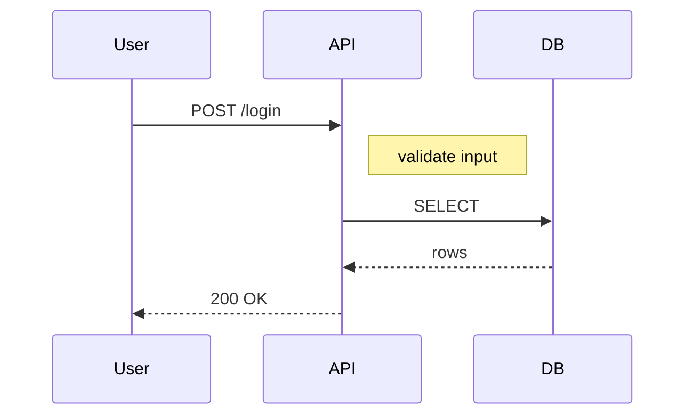
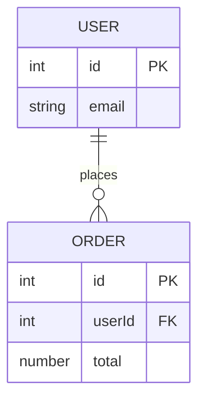

# Mermaid Migration Guide ... migrating from mermaid to cdl Text DSL v0.5

This page is a How-to (a practical guide) that explains how to rewrite existing diagrams written in mermaid (a Markdown-native diagram description library) into cdl Text DSL v0.5.
When you already have a mermaid `sequenceDiagram` / `flowchart` / `erDiagram` / `stateDiagram-v2`, the syntax mapping table and complete side-by-side examples here let you migrate 1:1.

## Table of contents

| Section | Mermaid syntax | cdl syntax |
|---|---|---|
| 1. Main syntax mapping | All four kinds | Per-preset tables |
| 2. Full sequenceDiagram example | `sequenceDiagram` | `type: sequence` |
| 3. Full erDiagram example | `erDiagram` | `type: er` |
| 4. cdl-only features | (not in mermaid) | animation / state / tween / verifier |
| 5. Which one to use | Selection criteria | Per-use-case comparison |

## 1. Main syntax mapping

### 1.1 sequenceDiagram mapping

For sequence diagrams (showing time-ordered interactions on the horizontal axis), this table shows how each mermaid construct maps to a cdl construct.
Replace mermaid syntax line by line to produce a semantically equivalent cdl document.

| mermaid | cdl Text DSL v0.5 |
|---|---|
| `sequenceDiagram` declaration | `type: sequence` |
| `participant Alice` | `- Alice` under `actors:` |
| `Alice->>API: call` | `- Alice -> API: "call"` under `flow:` |
| `API-->>Alice: response` | `- API -> Alice: "response" (success, dotted-flow)` |
| `Note over Alice` | Use the actor's `subtitle:` or a `kind: card` actor |
| `activate` / `deactivate` | Use `focus:` inside `animation:` |

The point is that mermaid's `participant` per-line declarations collapse into entries under `actors:` in cdl, and there is no direct equivalent of `Note over`.
Replace `Note over` with the actor's `subtitle:` or by introducing a `kind: card` actor.

### 1.2 flowchart mapping

For flowcharts, mermaid constructs map to cdl's `type: swimlane` (horizontal) or `type: flow` (vertical).

| mermaid | cdl Text DSL v0.5 |
|---|---|
| `flowchart LR` | `type: swimlane` |
| `flowchart TD` | `type: flow` |
| `A --> B: label` | `- A -> B: "label"` |
| `A -.-> B` (dotted) | `- A -> B: "label" (dotted-flow)` |
| `subgraph Title` | `groups:` block under `type: topology` |
| `class A foo` | `kind: "..."` (one of 29 visual kinds) |

The point is that mermaid's `class A foo` assigns a CSS class, whereas cdl picks from 29 visual kinds like `kind: actor`.

### 1.3 erDiagram mapping

For ER diagrams (Entity-Relationship, database table relationships), mermaid maps onto `type: er`.

| mermaid | cdl Text DSL v0.5 |
|---|---|
| `erDiagram` | `type: er` |
| `USER \|\|--o{ ORDER : places` | `- User -> Order: "places" { cardinality: "1:N" }` |
| `USER { id PK email string }` | `- User: { kind: entity, rows: ["id: PK", "email: string"] }` |

The point is that mermaid's crowfoot notation (`||--o{` for 1:N) becomes a `cardinality: "1:N"` string in cdl.

### 1.4 stateDiagram-v2 mapping

For state-machine diagrams, mermaid maps onto `type: state`.

| mermaid | cdl Text DSL v0.5 |
|---|---|
| `stateDiagram-v2` | `type: state` |
| `[*] --> Idle` (initial) | `- Idle: { kind: state, initial: true }` |
| `Idle --> Loading : submit` | `- Idle -> Loading: "submit"` |
| `[*] --> Done` (final) | `- Done: { kind: state, final: true }` |
| guard condition | `- Loading -> Done: "ok" { guard: "if attempts < 3" }` |

The point is that mermaid's `[*]` notation for start and end becomes the boolean flags `initial: true` / `final: true` declared through actor inline options.

## 2. Full sequenceDiagram example

Here is a 1:1 migration of a typical login flow from mermaid to cdl Text DSL v0.5.
The mermaid version below shows a three-actor sequence where User hits API and API selects from DB.



The same diagram in cdl Text DSL v0.5 looks like this.
Three `participant U as User` lines collapse into three entries under `actors:`, and `Note right of A` becomes the flow inline option `sub: "validate input"`.

```text
title: "Login Flow"
type: sequence

actors:
  - User
  - API: function
  - DB: storage

flow:
  - User -> API: "POST /login" { sub: "validate input" }
  - API -> DB: "SELECT"
  - DB -> API: "rows" (success, dotted-flow)
  - API -> User: "200 OK" (success, dotted-flow) { sub: "JWT" }
```

[preview:presets/seq-demo]

The point is that mermaid's `-->>` (dotted return) becomes the semantic attribute `(success, dotted-flow)` in cdl.
Where mermaid encodes style through symbols, cdl encodes meaning through tokens.

## 3. Full erDiagram example

Here is the ER-diagram migration, again 1:1.
The mermaid version below shows the typical User-Order 1:N relationship.



The cdl Text DSL v0.5 version looks like this.
The crowfoot symbol `||--o{` becomes a `cardinality: "1:N"` inline option, and column definitions collect under `rows:`.

```text
title: "User-Order schema"
type: er

actors:
  - User: { kind: entity, rows: ["id: PK", "email: string"] }
  - Order: { kind: entity, rows: ["id: PK", "userId: FK", "total: number"] }

flow:
  - User -> Order: "places" { cardinality: "1:N" }
```

[preview:presets/er-demo]

The point is that mermaid treats type tokens (`int` / `string`) as separate symbols, while cdl uses `rows: ["id: PK", ...]` where one string equals one column.
You can write detailed type definitions in free-form strings.

## 4. cdl-only features (not in mermaid)

When migrating from mermaid to cdl, you can take advantage of features that mermaid does not offer.
The list below shows seven cdl-only features and what each means.

| Feature | What it means | cdl syntax example |
|---|---|---|
| phase (chapter on the time axis) | Split a diagram into chapters where active elements and state values change | `- step:` under `animation:` |
| state and tween | Linearly interpolate a numeric state along the phase progress | `states:` + `tween:` |
| set | Instant switch of a string or number | `set: status: "loading"` |
| animated particle | A particle travels along a dotted-flow edge | `(dotted-flow)` on a flow line |
| dynamic React component | The output is a React component, not a static image, with hover and click extensibility | `<CdlDiagramView>` |
| "eye" verifier | The engine automatically checks whether what was declared shows on screen | `pnpm verify:intent` |
| 29 NodeKinds | actor / function / storage / event / cloud / cdn / oracle and more — a broader visual vocabulary | `kind: ...` |

The point is that cdl positions itself for "dynamic, complex, type-safe diagrams"; rather than replacing mermaid, the two complement each other based on use case.

### Animation example

A complete example with animation that mermaid cannot draw.
The balance smoothly moves from `100 → 90` during a transfer sequence.

```text
title: "Transfer"
type: sequence

actors:
  - Alice: { kind: actor, value: "{alice_bal}" }
  - Vault: storage
  - Bob: { kind: actor, value: "{bob_bal}" }

flow:
  - Alice -> Vault: "deposit"
  - Vault -> Bob: "send" (success)

states:
  alice_bal: 100
  bob_bal: 0

animation:
  - step: "transfer" 1.5s
    focus: [Alice, Vault, Bob]
    tween:
      alice_bal: 100 -> 90
      bob_bal: 0 -> 10
    badge: "+10"
```

[preview:animation/tween-simple]

> 💡 **Why phases exist** ... mermaid assumes "one static image", but cdl targets "a moving diagram composed of time-ordered chapters". You declare "what is active in step 1 and what changes in step 2", and the engine generates the animation from that.

## 5. Which one to use

The mermaid-vs-cdl decision depends on your use case.
The table below shows typical recommendations.

| Use case | Pick | Reason |
|---|---|---|
| Drop a one-line diagram into a README | mermaid | Renders natively in Markdown |
| Show a moving diagram in docs or teaching material | cdl | Animation renders in React |
| Diagrams where state changes dynamically (state machine / sequence) | cdl | Phases and tween express time order |
| Auto-verify diagram quality | cdl | The verifier catches drift between declaration and render |
| Have an LLM generate diagrams | cdl | The thin YAML-style grammar generates well |

The two are not rivals but complements; cdl owns "dynamic, complex, LLM-friendly", which mermaid does not address.

## Troubleshooting

### `unknown type: "sequenceDiagram"`

**Cause** ... you passed a mermaid diagram kind to cdl's `type:`.

**Fix** ... `type:` accepts one of the six presets (`sequence` / `flow` / `swimlane` / `er` / `state` / `topology`).

```diff
- type: sequenceDiagram
+ type: sequence
```

### Mermaid `Note over` has no direct cdl equivalent

**Cause** ... cdl has no direct syntax for `Note over X`.

**Fix** ... pick one of the two replacements.

1. Add `{ sub: "validate input" }` as an inline option on the flow step (recommended)
2. Add a separate actor with `kind: card` and put the note text inside

### `(success, dotted-flow)` parens are not recognized

**Cause** ... missing space before `(` or unbalanced quotes.

**Fix**:

```diff
- - User -> API: "POST /login"(success)
+ - User -> API: "POST /login" (success)
```

### Left or right side of `->` is empty

**Cause** ... the actor name contains whitespace or non-ASCII characters and is not quoted.

**Fix**:

```diff
- - Send Money -> Vault: "deposit"
+ - "Send Money" -> Vault: "deposit"
```

Wrap actor names that contain whitespace, non-ASCII characters, or punctuation in `"..."`.

## See also

This page leads to four follow-ups.

- Get hands-on first ... [Quickstart](/docs/en/cdl/overview/quickstart) in five steps
- Browse practical recipes ... [Cookbook](/docs/en/cdl/overview/cookbook) with 25 examples
- Look up the grammar ... [Text DSL Specification](/docs/en/cdl/text-dsl-spec)
- Have an LLM produce DSL ... [LLM Generation Guide](/docs/en/cdl/text-dsl-llm-guide)
