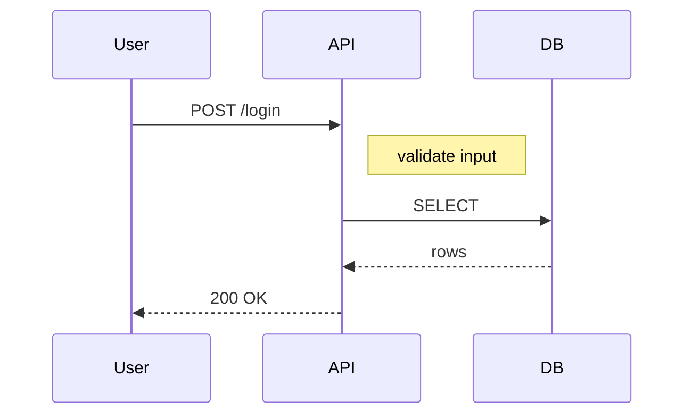
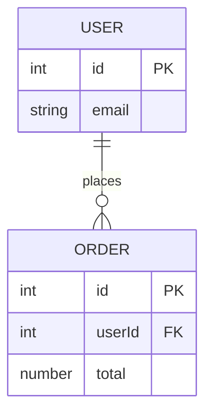

# Mermaid Migration Guide ... mermaid から cdl Text DSL v0.5 への移行手順

このページは、 mermaid (Markdown ネイティブな図表記述ライブラリ) で書かれた既存の図を、 cdl Text DSL v0.5 に書き換えるための手順をまとめた How-to (実用ガイド) です。
あなたが mermaid の `sequenceDiagram` / `flowchart` / `erDiagram` / `stateDiagram-v2` のいずれかをすでに書いているとき、 syntax 対応表と完全な例の対比で 1:1 移行できる構成にしています。

## 目次

| 節 | 対象 mermaid syntax | 対応 cdl syntax |
|---|---|---|
| 1. 主要 syntax の対応表 | 4 種類すべて | preset 別の表 |
| 2. sequenceDiagram の完全例 | `sequenceDiagram` | `type: sequence` |
| 3. erDiagram の完全例 | `erDiagram` | `type: er` |
| 4. cdl 独自の追加機能 | (mermaid 非対応) | animation / state / tween / verifier |
| 5. どちらを使うか | 選択基準 | 用途別の比較表 |

## 1. 主要 syntax の対応表

### 1.1 sequenceDiagram の対応

シーケンス図 (時系列のやりとりを横軸で描く図) で、 mermaid の各構文がどの cdl syntax に対応するかを示します。
あなたが mermaid で書いていた構文を 1 行ずつ置き換えれば、 同じ意味の cdl コードに変換できます。

| mermaid | cdl Text DSL v0.5 |
|---|---|
| `sequenceDiagram` 宣言 | `type: sequence` |
| `participant Client` | `actors:` 配下に `- Client` |
| `Client->>API: 呼び出し` | `flow:` 配下に `- Client -> API: "呼び出し"` |
| `API-->>Client: response` | `- API -> Client: "response" (success, dotted-flow)` |
| `Note over Client` | actor の `subtitle:` か `kind: card` で代用 |
| `activate` / `deactivate` | `animation:` 配下の `focus:` で制御 |

ポイントは、 mermaid の `participant` 個別宣言が cdl では `actors:` 配下に `-` で並べる形式になる点と、 mermaid の `Note over` に直接対応する仕組みがない点です。
Note 相当は actor の `subtitle:` か、 `kind: card` の actor を別途立てる方法で代替できます。

### 1.2 flowchart の対応

フローチャートで、 mermaid の各構文を cdl の `type: swimlane` (横並び) または `type: flow` (縦並び) に対応させます。

| mermaid | cdl Text DSL v0.5 |
|---|---|
| `flowchart LR` | `type: swimlane` |
| `flowchart TD` | `type: flow` |
| `A --> B: label` | `- A -> B: "label"` |
| `A -.-> B` (dotted) | `- A -> B: "label" (dotted-flow)` |
| `subgraph Title` | `type: topology` の `groups:` block |
| `class A foo` | `kind: "..."` で visual 種別 (29 種類から選択) |

ポイントは、 mermaid の `class A foo` で CSS class を割り当てる方式に対して、 cdl は `kind: actor` のように 29 種類の preset から選ぶ方式である点です。

### 1.3 erDiagram の対応

ER 図 (Entity Relationship、 データベーステーブル間関係) で、 mermaid の各構文を cdl の `type: er` に対応させます。

| mermaid | cdl Text DSL v0.5 |
|---|---|
| `erDiagram` | `type: er` |
| `USER \|\|--o{ ORDER : places` | `- User -> Order: "places" { cardinality: "1:N" }` |
| `USER { id PK email string }` | `- User: { kind: entity, rows: ["id: PK", "email: string"] }` |

ポイントは、 mermaid の crowfoot notation (`||--o{` で 1:N など) が cdl では `cardinality: "1:N"` の文字列指定になる点です。

### 1.4 stateDiagram-v2 の対応

状態遷移図で、 mermaid の各構文を cdl の `type: state` に対応させます。

| mermaid | cdl Text DSL v0.5 |
|---|---|
| `stateDiagram-v2` | `type: state` |
| `[*] --> Idle` (initial) | `- Idle: { kind: state, initial: true }` |
| `Idle --> Loading : submit` | `- Idle -> Loading: "submit"` |
| `[*] --> Done` (final) | `- Done: { kind: state, final: true }` |
| guard 条件 | `- Loading -> Done: "ok" { guard: "if attempts < 3" }` |

ポイントは、 mermaid の `[*]` で開始・終了を示す方式に対して、 cdl は `initial: true` / `final: true` の boolean フラグを actor の inline option で宣言する点です。

## 2. sequenceDiagram の完全例

mermaid で書いた典型的な login flow を、 cdl Text DSL v0.5 に 1:1 で移行する手順を示します。
以下の mermaid コードは、 「User が API を叩いて、 API が DB を SELECT する」 という 3 actor のシーケンス図です。



同じ図を cdl Text DSL v0.5 で書くと、 以下のコードになります。
mermaid との対応関係として、 `participant U as User` の 3 行が `actors:` 配下の 3 行にまとまり、 `Note right of A` は `flow` の inline option `sub: "validate input"` で表現します。

```text
title: "Login Flow"
type: sequence

actors:
  - User
  - API: function
  - DB: storage

flow:
  - User -> API: "POST /login" { sub: "validate input" }
  - API -> DB: "SELECT"
  - DB -> API: "rows" (success, dotted-flow)
  - API -> User: "200 OK" (success, dotted-flow) { sub: "JWT" }
```

[preview:presets/seq-demo]

ポイントは、 mermaid の `-->>` (点線返却) が cdl では `(success, dotted-flow)` の意味的属性に置き換わる点です。
mermaid は記号で図のスタイルを表しますが、 cdl は意味で指定する設計です。

## 3. erDiagram の完全例

ER 図の移行例も、 同じく mermaid と cdl Text DSL v0.5 を 1:1 で対比します。
以下の mermaid コードは、 User と Order の 1:N 関係を表現する典型例です。



同じ図を cdl Text DSL v0.5 で書くと、 以下のコードになります。
mermaid の crowfoot 記号 `||--o{` が cdl では `cardinality: "1:N"` の inline option に変わり、 カラム定義は `rows:` 配列にまとまります。

```text
title: "User-Order schema"
type: er

actors:
  - User: { kind: entity, rows: ["id: PK", "email: string"] }
  - Order: { kind: entity, rows: ["id: PK", "userId: FK", "total: number"] }

flow:
  - User -> Order: "places" { cardinality: "1:N" }
```

[preview:presets/er-demo]

ポイントは、 mermaid が型情報 (`int` / `string`) も独立した token として認識するのに対し、 cdl は `rows: ["id: PK", ...]` のように 1 カラム 1 文字列で渡す点です。
細かい型定義は文字列として自由に書けます。

## 4. cdl 独自の追加機能 (mermaid に無いもの)

mermaid から cdl に移行する際、 「mermaid にはなかった機能」 を追加で活用できます。
以下は、 cdl のみが提供する 7 つの機能と、 それぞれの意味です。

| 機能 | 意味 | cdl syntax 例 |
|---|---|---|
| phase (時系列の章) | 図を時系列の章に分割し、 各 phase で active 要素や state 値が遷移する | `animation:` 配下の `- step:` |
| state と tween | 数値 state を phase 進行で線形補間して表示する | `states:` + `tween:` |
| set | 文字列 / 数値の即時切替 | `set: status: "loading"` |
| animated particle | dotted-flow edge の上を粒子が path に沿って流れる | `flow` の `(dotted-flow)` |
| dynamic React コンポーネント | 静止画像でなく React コンポーネントを返し、 hover や click で拡張可能 | `<CdlDiagramView>` |
| 「目」 verifier | declaration 通りに表示されているかを engine が自動検証する | `pnpm verify:intent` |
| 29 種類の NodeKind | actor / function / storage / event / cloud / cdn / oracle など、 mermaid より広い visual を選べる | `kind: ...` |

ポイントは、 cdl は「動的・複雑・型安全な diagram」 を担当する位置づけで、 mermaid と置き換えるというより、 用途で使い分ける関係である点です。

### animation の例

mermaid では描けない animation を追加した完全例です。
balance が `100 → 90` へ滑らかに変化するAPI call sequence です。

```text
title: "API call"
type: sequence

actors:
  - Client: { kind: actor, value: "{client_bal}" }
  - API: storage
  - Server: { kind: actor, value: "{server_bal}" }

flow:
  - Client -> API: "deposit"
  - API -> Server: "send" (success)

states:
  client_bal: 100
  server_bal: 0

animation:
  - step: "API call" 1.5s
    focus: [Client, API, Server]
    tween:
      client_bal: 100 -> 90
      server_bal: 0 -> 10
    badge: "+10"
```

[preview:animation/tween-simple]

> 💡 **なぜ phase という概念があるのか** ... mermaid は「1 枚の静止図」 が前提ですが、 cdl は「時系列の章で構成された動く図」 を狙う設計です。 「step 1 では何が active で、 step 2 では何が変わるか」 を declaration として宣言し、 engine がアニメーションを生成する仕組みになっています。

## 5. どちらを使うか

mermaid と cdl の選択は、 あなたの用途で決まります。
以下の表は、 典型的な状況ごとのおすすめを示します。

| 用途 | おすすめ | 理由 |
|---|---|---|
| README に 1 行で簡単な図を貼る | mermaid | Markdown ネイティブで素直にレンダリングされる |
| docs サイトや教材で動く図を見せる | cdl | アニメーションが React で表示できる |
| 状態が動的に変わる図 (state machine / sequence) | cdl | phase と tween で時系列を表現できる |
| 図の品質を自動検証したい | cdl | verifier で declaration と render の乖離を検知 |
| LLM に図を生成させたい | cdl | YAML 風の薄い構文で生成しやすい |

両者は競合関係ではなく補完関係で、 cdl は mermaid が苦手な「動的・複雑・LLM フレンドリー」 を担当する位置づけです。

## エラーが出たときは

### `unknown type: "sequenceDiagram"`

**原因** ... cdl の `type:` に mermaid の図種別文字列を渡している。

**修正例** ... `type:` には 6 preset (`sequence` / `flow` / `swimlane` / `er` / `state` / `topology`) から選んでください。

```diff
- type: sequenceDiagram
+ type: sequence
```

### mermaid の `Note over` を cdl で表現できない

**原因** ... mermaid の `Note over X` に完全対応する syntax が cdl にない。

**修正例** ... 以下の 2 つの方法で代替できます。

1. `flow` step に `{ sub: "validate input" }` inline option を追加する (推奨)
2. `kind: card` の actor を別途追加し、 内容を入れる

### `(success, dotted-flow)` の括弧が解釈されない

**原因** ... `(` の前に空白を入れ忘れている、 または quote の閉じ忘れ。

**修正例**:

```diff
- - User -> API: "POST /login"(success)
+ - User -> API: "POST /login" (success)
```

### `flow` の `->` の左右が空

**原因** ... actor 名に空白や日本語が含まれており、 quote で囲んでいない。

**修正例**:

```diff
- - API call処理 -> API: "deposit"
+ - "API call処理" -> API: "deposit"
```

actor 名に空白や日本語 / 記号が含まれる場合は必ず `"..."` で囲みます。

## 関連

このページから次に読む候補は 4 つあります。

- 動かしながら学びたい人は [Quickstart](/docs/cdl/overview/quickstart) で 5 step
- 用途別の実用例を見たい人は [Cookbook](/docs/cdl/overview/cookbook) で 25 例
- 全 syntax を網羅したい人は [Text DSL Specification](/docs/cdl/text-dsl-spec)
- LLM に DSL を生成させたい人は [LLM 生成ガイド](/docs/cdl/text-dsl-llm-guide)
