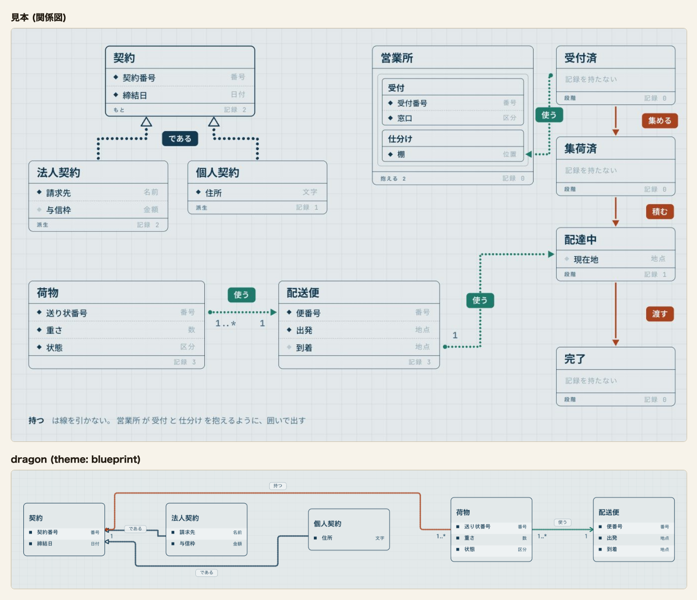
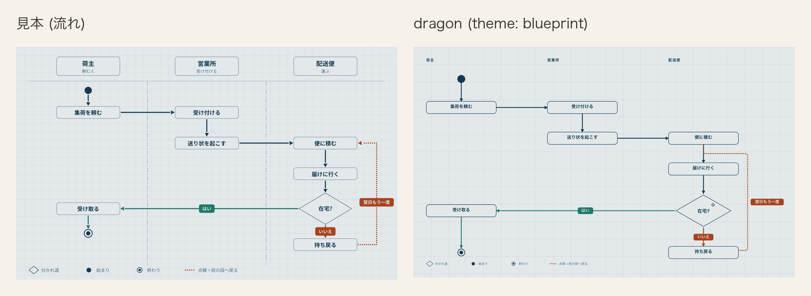
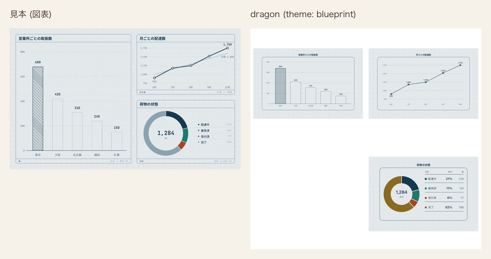
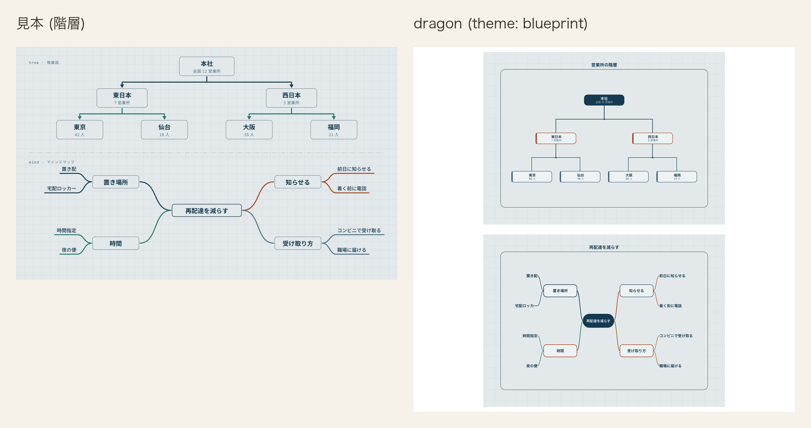
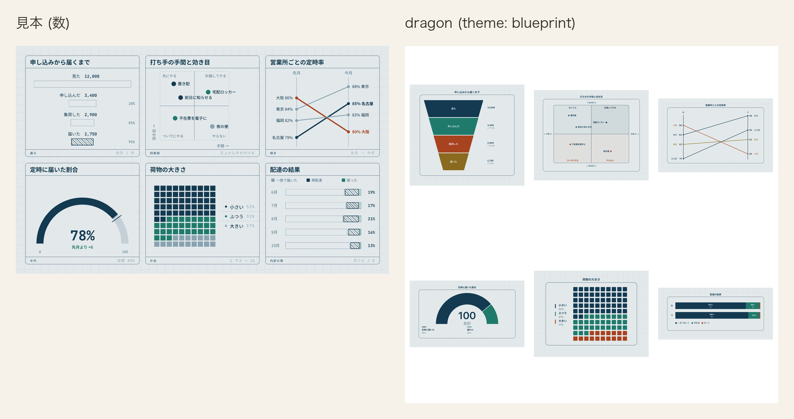
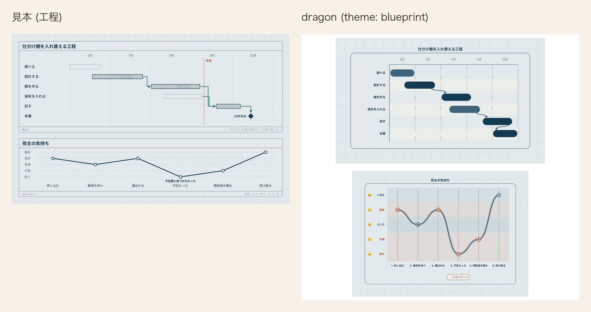

# 図面 (blueprint)

記法の一番上に `theme: blueprint` または `theme: 図面` と書く。`palette:` も `theme:` の別名として読む。

図面は地まで含めて 1 枚の絵として扱う。画面が暗い表示でも地と色を替えない。暗い地を持つ図面は、
この意匠の明暗差ではなく別の意匠として決める。

## 値

| 役 | 値 |
|---|---|
| 台 | `#e3e9ea` |
| 行の面 | `#e3e9ea` |
| 縞 | `#eef2f3` |
| 枠 | `#143a52` |
| 字 | `#143a52` |
| 型名 | `#3f6479` |
| 線 | `#143a52` |
| 所有 | `#a8431f` |
| 向きだけ | `#1f7a6b` |

### 色以外の値

| 役 | 値 |
|---|---|
| 淡 | `#6a8596`。字には使わず、図表の 6 番目の系列だけに使う |
| 黄土 | `#8a6a1f`。図表の 4 番目の系列だけに使う |
| 方眼 | 40px 四方。線は `color-mix(in srgb, var(--er-frame) 7%, transparent)` の 1px |
| 箱の枠 | 通常は 1、`data-cdl-active="true"` の箱は 2.25。始まりと終わりの印、見せ方を持つ箱は除く |
| 枠の濃さ | 1。通常の箱と強調の箱の両方。始まりと終わりの印、見せ方を持つ箱は除く |
| 開始・終了 | 小見出しを含む外側の不透明度は 1 |
| 時間の縦線 | 一点鎖線 `22 7 5 7` |
| 動き | 左から拭う。`inset(0 100% 0 0)` から `inset(0 0 0 0)`、0.42s、`cubic-bezier(.35,0,.25,1)` |
| 斜線 | `#dragon-bp-hatch` の模様。6 × 6 の `userSpaceOnUse` を -45 度回し、線 `#143a52` の幅 1.5 の `rect` を 6px おきに置く。隙間は塗らず下の面を透かす |
| 単系列の棒 | `data-cdl-emphasis="primary"` の棒は斜線 `#dragon-bp-hatch` に線 `#143a52` の 1.5 の枠、それ以外は箱の面 `#e3e9ea` に型名 `#3f6479` の 1 の枠。濃さは 1 |
| 図表の系列色 | 1 = 線、2 = 向きだけ、3 = 所有、4 = 黄土、5 = 型名、6 = 淡 |
| 発想の枝 | 4 本を系列 1 `#143a52`、2 `#1f7a6b`、3 `#a8431f`、4 `#8a6a1f` で描く |
| 折れ線 | 線と点を系列 1 の紺 `#143a52` で描く |
| 日程の棒と漏斗の段 | 図表の系列色を色みの順に塗る。`accent` は 1、`teal` は 2、`success` は 3、`warning` は 4、`info` は 5、`error` は 6。濃さは 1。日程の帯は 2 を `#1e7567`、4 を `#82641d`、6 を `#556b79` へ同じ色相のまま深くし、他は系列色のまま。帯の上の担当の字は面 `#e3e9ea` |

宅配の見本は、棒・円・半円・升目・内訳帯に `tone` を書かず、系列色順に任せる。発想の 4 本の枝は意匠側で系列 1 から 4、折れ線の線と点は系列 1 に固定する。日程だけは設計・棚・試験を `accent`、調査・端末を `info` とし、`ticks` で 6 月から 10 月を明示して設計を含む帯の端を見本の月内位置に書く。

似た青系の線、型名、淡が隣り合わないように並べた。6 色は全て台の上で 3 以上の対比になる。
描き手は処理の箱の枠を半分の濃さで描くが、図面の台の上では 2.66 となり、枠の下限 4.61 を割るため、
固定の意匠では枠の濃さを 1 にする。

## 見送ったこと

- 見本は箱を塗らず、地を 82% で透かしていた。行の面は地と同じ `#e3e9ea` で塗り、重なりや
  書き出し方に左右されない値にした。
- 見本に行の縞は無かった。行を横に追う目印と線の札の面に要るため、地より明るい紙の色
  `#eef2f3` を足した。墨は 10.6、型名は 5.63 の対比になる。
- 見本の薄い字 `#4d7187` は地の上で 4.25 となり、字の下限 4.5 を割る。型名を `#3f6479` に
  濃くし、地の上で 5.17、縞の上で 5.63 にした。
- 見本の差し色 二 `#1f7a6b` は地の上で 4.22 となる。字には使わず、図形の下限 3 で見る
  「向きだけ」の線に限った。「開始」「終了」の小見出しは型名 `#3f6479` で描き、台と行の面で
  5.17、縞で 5.63 の対比にする。
- 見本の淡 `#8aa3b1` は台の上で 2.15 となり、図形の下限 3 を割る。色相を保ったまま
  `#6a8596` に濃くし、台の上で 3.16 にした。
- 見本は主役の棒だけを斜線で塗り、他を輪郭だけで描く。dragon も同じ形にし、斜線の模様を
  画面に 1 つ置く (#2801)。系列が複数ある図には別に決めた 6 色の並びを使う。
- 見本は箱ごとに少しずつ遅らせて現していた。段で同時に現れる箱どうしに、記法に無い順序を
  足さないよう一斉にした。
- 見本の札は線の色で面を塗っていた。札の字との対比を色ごとに作らず、縞の面に線の色の枠と字を
  置く形にした。
- 見本の等幅の和文などは使わない。画面が同梱する 2 書体を図面でもそのまま使い、字体だけが
  読み込み環境で変わる形を作らない。

## 見本と並べる

[12 図種 × 7 意匠の見本を開く](../proposal/index.html)

dragon は `relation: extends` の 2 本を墨の線と白抜きの三角で描き、`composes` は所有 (朱)、
`associates` は向きだけ (青緑) で描く。箱は行の面で塗り、行は縞で交互に塗る。

比べた記法は縦列 (`lane:`) と始まり・終わりの印を書いていないため、上から下へ 1 列に並ぶ。
「はい」は向きだけ (青緑)、「いいえ」と「翌日もう一度」は所有 (朱)、それ以外の線は墨で描き、
線の札は縞の面に線の色の枠と字を置く。

棒は東京を斜線で強調し、折れ線は 5 か月の実績、内訳の輪は荷物の 4 状態を描く。
図面の墨・朱・青緑と薄い面を、3 種の図表でも同じ役割に使う。

営業所の木を上、再配達を減らす枝を下に並べ、箱と接続線の密度を見本と比べる。

漏斗・四象限・傾き・半円・升目・内訳の帯を 3 列 2 段に並べ、数の読み分けを比べる。

仕分け棚の工程を上、荷主の気持ちを下に置き、時間の進み方と注記を比べる。

## 検査

- `apps/playground-spa/src/lib/theme-matches-note.test.ts` は「値」の 9 行を読み、`cdl-theme.css` の
  `--er-*` と一致すること、固定の意匠に `html.dark` の塊が無いことを調べる。
- 同じ検査は固定の意匠の図表について、`--cdl-chart-1` から `--cdl-chart-6` と `--d-chart-1` から
  `--d-chart-6` が意匠帳の並びと一致し、6 色が異なり、全て台の上で 3 以上になることも調べる。
- 同じ検査は「枠の濃さ」と、固定の意匠だけに当たる CSS の決まりも突き合わせる。
- `apps/playground-spa/tests/chart-card-fill.spec.ts` は単系列の棒の計算後の塗りと枠、模様の参照先、
  積み上げ棒と升に模様が届かないことを明暗で調べる。
- `apps/playground-spa/tests/rendered-contrast.spec.ts` は同じ 9 行を期待値にして、固定の意匠を全図種へ
  当てた時の舞台、箱、線、文字の対比を明暗で調べる。箱の枠と線は色の alpha、
  `stroke-opacity` / `fill-opacity`、要素と祖先の `opacity` を重ねた実効の色で測り、強調の箱も含める。
- 同じ検査は模様を当てた単系列の棒と、系列色で塗る日程の棒・漏斗の段の対比も調べる。
- `apps/playground-spa/tests/theme-dark-ground.spec.ts` は台と、図面の内側へ固定した変数が画面の明暗で
  変わらないことを調べる。
- `apps/playground-spa/tests/palette-switch.spec.ts` は切替で図面を選んだ舞台の地が「台」と一致することを
  調べる。
