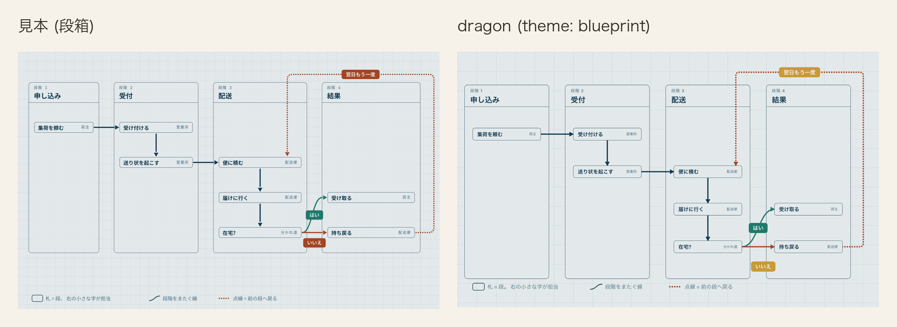
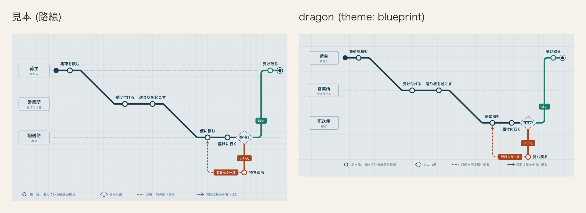
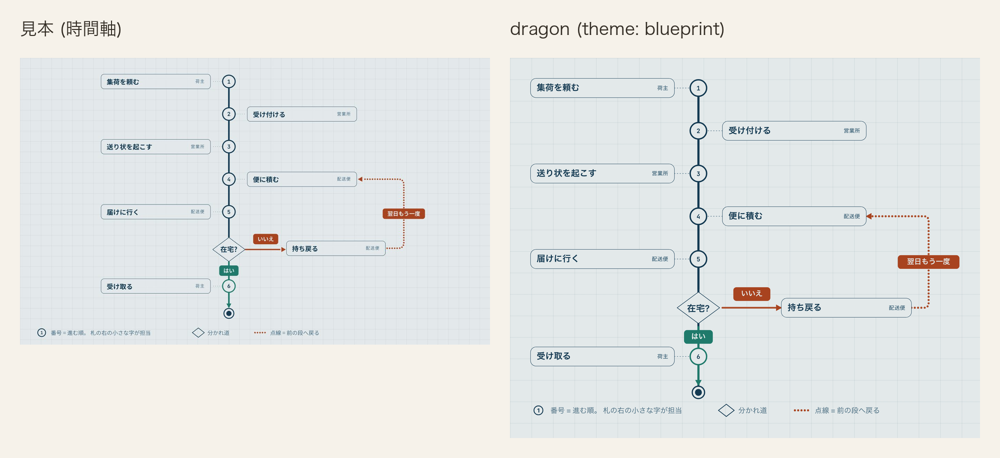

# 図面 (blueprint)

記法の一番上に `theme: blueprint` または `theme: 図面` と書く。`palette:` も `theme:` の別名として読む。

図面は地まで含めて 1 枚の絵として扱う。画面が暗い表示でも地と色を替えない。暗い地を持つ図面は、
この意匠の明暗差ではなく別の意匠として決める。

## 値

| 役 | 値 |
|---|---|
| 台 | `#e3e9ea` |
| 行の面 | `#e3e9ea` |
| 縞 | `#eef2f3` |
| 枠 | `#143a52` |
| 字 | `#143a52` |
| 型名 | `#3f6479` |
| 線 | `#143a52` |
| 所有 | `#a8431f` |
| 向きだけ | `#1f7a6b` |

### 路線図の色

| 役 | 値 |
|---|---|
| 路線図の本線 | `#143a52` |
| 路線図のはい | `#1f7a6b` |
| 路線図のいいえ | `#a8431f` |
| 路線図の枝札の字 | `#e3e9ea` |
| 路線図の駅の面 | `#e3e9ea` |
| 路線図の駅名 | `#143a52` |
| 路線図の駅名の地 | `#e3e9ea` |
| 路線図の始終点 | `#143a52` |
| 路線図の案内線 | `#4d7187` |
| 路線図の名札の面 | `#e3e9ea` |
| 路線図の名札の枠 | `#143a52` |
| 路線図の名札の名前 | `#143a52` |
| 路線図の名札の補足 | `#496d83` |
| 路線図の菱形の面 | `#e3e9ea` |
| 路線図の菱形の枠 | `#143a52` |
| 路線図の菱形の字 | `#143a52` |

名札の補足は見本の `#4d7187` では面との対比が 4.25 のため、同じ色相の `#496d83` へ寄せる。

### 色以外の値

| 役 | 値 |
|---|---|
| 淡 | `#6a8596`。字には使わず、図表の 6 番目の系列だけに使う |
| 黄土 | `#8a6a1f`。図表の 4 番目の系列だけに使う |
| 方眼 | 40px 四方。線は `color-mix(in srgb, var(--er-frame) 7%, transparent)` の 1px |
| 箱の枠 | 通常は 1、`data-cdl-active="true"` の箱は 2.25。始まりと終わりの印、見せ方を持つ箱は除く |
| 枠の濃さ | 1。通常の箱と強調の箱の両方。始まりと終わりの印、見せ方を持つ箱は除く |
| 路線図の線の濃さ | 1。見本の線路は透かさない |
| 開始・終了 | 小見出しを含む外側の不透明度は 1 |
| 時間の縦線 | 一点鎖線 `22 7 5 7` |
| 動き | 左から拭う。`inset(0 100% 0 0)` から `inset(0 0 0 0)`、0.42s、`cubic-bezier(.35,0,.25,1)` |
| 斜線 | `#dragon-bp-hatch` の模様。8 × 8 の `userSpaceOnUse` を -45 度回し、線 `#143a52` の幅 1.5 の `rect` を 8px おきに置く。隙間は塗らず下の面を透かす |
| 単系列の棒 | `data-cdl-emphasis="primary"` の棒は斜線 `#dragon-bp-hatch` に線 `#143a52` の 1.5 の枠、それ以外は箱の面 `#e3e9ea` に型名 `#3f6479` の 1 の枠。濃さは 1 |
| 図表の系列色 | 1 = 線、2 = 向きだけ、3 = 所有、4 = 黄土、5 = 型名、6 = 淡 |
| 発想の枝 | 4 本を系列 1 `#143a52`、2 `#1f7a6b`、3 `#a8431f`、4 `#4d7187` で描く。葉の下線は同じ系列の枝と同色。枝箱の枠は枠の色 1 色 |
| 階層の木 | 枝箱の枠は枠の色 1 色。左帯と分岐点の丸は描かない |
| ジャーニー | 段の帯と縦区切りは描かない。主線は塗らず系列 1 の線だけ、点は地を残した一重円にし、内側の点は描かない。縦軸の段名は型名 `#3f6479` の 1 色 |
| 四象限 | 区画の地は塗らず、左上は系列 1、右上と左下は系列 2、右下は淡 `#8aa3b1`。区画名は型名、十字と外枠は `4 4` の点線 |
| 折れ線 | 線と点を系列 1 の紺 `#143a52` で描く |
| 傾き図 | 名古屋 (`accent`) は紺 `#143a52`、大阪 (`error`) は朱 `#a8431f`、tone の無い東京と福岡は型名 `#3f6479` |
| 日程の棒と漏斗の段 | 図表の系列色を色みの順に塗る。`accent` は 1、`teal` は 2、`success` は 3、`warning` は 4、`info` は 5、`error` は 6。濃さは 1。日程の帯は 2 を `#1e7567`、4 を `#82641d`、6 を `#556b79` へ同じ色相のまま深くし、他は系列色のまま。帯の上の担当の字は面 `#e3e9ea` |
| 日程の帯の角 | 0 |
| 段階の列 | 面 `#e3e9ea`、枠 `#143a52` の 1、影なし。列の角は 12px、札の角は 8px |
| 段階の見出し | 番号 `#3f6479`、名前 `#143a52` |
| 札の右の字 | `#3f6479` |
| 段の箱の線の札 | 線は主役と枝が 5、戻る点線が 6 の `0 9.6`、三角の矢じりが 17 × 19。「はい」は向きだけ `#1f7a6b`、「いいえ」と「翌日もう一度」は所有 `#a8431f` で塗る。字は縞 `#eef2f3` の太さ 700、角は 9、枠なし |
| 段の箱の凡例 | 「札 = 段。 右の小さな字が担当」は角丸枠、「段階をまたぐ線」は曲線、「点線 = 前の段へ戻る」は丸い点線。枠と曲線は `#143a52`、点線は `#a8431f`、字は `#4d7187` |
| 時間軸の線の札 | success 面 `#1f7a6b`、error 面 `#a8431f`、success 字 `#ebf0f0`、error 字 `#e3e9ea`、success 枠 `none`、error 枠 `none`、枠の太さ 0、角 9px、高さ 40px、字 21px、字の太さ 700 |

宅配の見本は、棒・円・半円・升目・内訳帯に `tone` を書かず、系列色順に任せる。発想の枝は最初の 3 本を系列 1 から 3、4 本目を見本の薄い字の色にし、折れ線の線と点は系列 1 に固定する。日程だけは設計・棚・試験を `accent`、調査・端末を `info` とし、`ticks` で 6 月から 10 月を明示して設計を含む帯の端を見本の月内位置に書く。

ジャーニー縦軸の見本色 `#4d7187` は箱の面との対比が 4.25 のため、型名の `#3f6479` まで濃くして 5.17 を保つ。

似た青系の線、型名、淡が隣り合わないように並べた。6 色は全て台の上で 3 以上の対比になる。
描き手は処理の箱の枠を半分の濃さで描くが、図面の台の上では 2.66 となり、枠の下限 4.61 を割るため、
固定の意匠では枠の濃さを 1 にする。

## 見送ったこと

- 見本は箱を塗らず、地を 82% で透かしていた。行の面は地と同じ `#e3e9ea` で塗り、重なりや
  書き出し方に左右されない値にした。
- 見本に行の縞は無かった。行を横に追う目印と線の札の面に要るため、地より明るい紙の色
  `#eef2f3` を足した。墨は 10.6、型名は 5.63 の対比になる。
- 見本の薄い字 `#4d7187` は地の上で 4.25 となり、字の下限 4.5 を割る。型名を `#3f6479` に
  濃くし、地の上で 5.17、縞の上で 5.63 にした。
- 見本の差し色 二 `#1f7a6b` は地の上で 4.22 となる。字には使わず、図形の下限 3 で見る
  「向きだけ」の線に限った。「開始」「終了」の小見出しは型名 `#3f6479` で描き、台と行の面で
  5.17、縞で 5.63 の対比にする。
- 見本の淡 `#8aa3b1` は台の上で 2.15 となり、図形の下限 3 を割る。色相を保ったまま
  `#6a8596` に濃くし、台の上で 3.16 にした。
- 見本は主役の棒だけを斜線で塗り、他を輪郭だけで描く。dragon も同じ形にし、斜線の模様を
  画面に 1 つ置く (#2801)。系列が複数ある図には別に決めた 6 色の並びを使う。
- 見本は箱ごとに少しずつ遅らせて現していた。段で同時に現れる箱どうしに、記法に無い順序を
  足さないよう一斉にした。
- 見本の線の札は台 `#e3e9ea` の字を抜いていたが、「はい」の面 `#1f7a6b` との対比は 4.22 で
  字の下限 4.5 を割る。段の箱だけは縞 `#eef2f3` の字に変えて 4.60 とし、他の図種は縞の面に
  線の色の枠と字を置く形を保つ。
- 見本の等幅の和文などは使わない。画面が同梱する 2 書体を図面でもそのまま使い、字体だけが
  読み込み環境で変わる形を作らない。

## 見本と並べる

[12 図種 × 7 意匠の見本を開く](../proposal/index.html)

dragon は `relation: extends` の 2 本を墨の線と白抜きの三角で描き、`composes` は所有 (朱)、
`associates` は向きだけ (青緑) で描く。箱は行の面で塗り、行は縞で交互に塗る。

右は、ひな形「荷物を届けるフローチャート」の最後の段を描き終えた姿を撮り、見本と並べた。
荷主・営業所・配送便の 3 つの縦列に札・菱形・始まりと終わりの印を置く。
「はい」は向きだけ (青緑)、「いいえ」と「翌日もう一度」は所有 (朱)、それ以外の線は墨で描き、
線の札は縞の面に線の色の枠と字を置く。

右は、ひな形「荷物を届ける段の箱」の最後の段を描き終えた姿を撮り、見本と並べた。
段階の列は台と同じ面に墨の枠を引き、番号を型名、名前を墨で描き、分岐札は見本と同じ線の色で
塗って、字だけは対比を保つため台ではなく縞の色に変えた。
列 3 と列 4 の間、「翌日もう一度」が札の上辺から出る位置、「いいえ」の札の下端、見出しの名前の字を見本へ揃えた。
一方、「いいえ」の札の上端は線の 59 下 (見本は 24)、戻る線は列の上端の 50 上 (見本は 34)、下りる位置は「便に積む」の右端から 24 (見本は 60) のまま残る。これらは cdl が固定値で描き、dragon の記法に間隔の欄がないためである。
凡例の字も見本と同じ 21 にした。

右は、ひな形「荷物を届ける路線図」の最後の段を描き終えた姿を撮り、見本と並べた。
凡例の字は見本と同じ 21 にした。

右は、ひな形「荷物を届ける時間軸」の最後の段を描き終えた姿を撮り、1800 幅の見本と並べた。

dragon は軸と番号の縁を墨の `--er-line`、「はい」を向きだけの `--er-link`、終わりの印を墨の `--er-ink` で描く。
線の札は高さ 40・角 9・21 の太字とし、「はい」を `#1f7a6b`、「いいえ」と「翌日もう一度」を `#a8431f` の面で描く。「はい」の字は見本の `#e3e9ea` では対比が 4.22 のため、白側へ最小限寄せた `#ebf0f0` で 4.50 を保つ。
戻る線は太さ 6・丸い線端・`0 9.6` の点列とし、軸と「はい」は 6、「いいえ」は 5、補助線は 2、番号の縁は 4、終わりの外輪は 3.5 で描く。
図の下には、番号・分かれ道・戻る点線を説明する凡例を見本と同じ順、21 の字で描く。
札の題は 25px・700、分かれ道は 124 × 92、「在宅?」は 26px に揃えた。「いいえ」の札の下端は横線から 20 離している。
分かれ道の前後は意匠に依らず 142.5 ずつとし、和を見本と同じ 285 にした。
札と軸の間は見本と同じ 70、丸 6 と終わりの印の間も見本と同じ 105 に揃えた。
「持ち戻る」は軸から見本の 220 に対して 242 離す。cdl が札と箱の間を 32 空けるため、「いいえ」の札を線の上 20 に置くのに要る。担当の位置は `cardene777/cdl#1032`、残る線上の札の押し出しは `cardene777/cdl#1039` に対応する。

棒は東京を斜線で強調し、折れ線は 5 か月の実績、内訳の輪は荷物の 4 状態を描く。
図面の墨・朱・青緑と薄い面を、3 種の図表でも同じ役割に使う。

営業所の木を上、再配達を減らす枝を下に並べ、箱と接続線の密度を見本と比べる。

漏斗・四象限・傾き・半円・升目・内訳の帯を 3 列 2 段に並べ、数の読み分けを比べる。

仕分け棚の工程を上、荷主の気持ちを下に置き、時間の進み方と注記を比べる。

## 検査

- `apps/playground-spa/src/lib/theme-matches-note.test.ts` は「値」の 9 行を読み、`cdl-theme.css` の
  `--er-*` と一致すること、固定の意匠に `html.dark` の塊が無いこと、路線図の線の濃さを調べる。
- 同じ検査は固定の意匠の図表について、`--cdl-chart-1` から `--cdl-chart-6` と `--d-chart-1` から
  `--d-chart-6` が意匠帳の並びと一致し、6 色が異なり、全て台の上で 3 以上になることも調べる。
- 同じ検査は「枠の濃さ」と、固定の意匠だけに当たる CSS の決まりも突き合わせる。
- `apps/playground-spa/tests/chart-card-fill.spec.ts` は単系列の棒の計算後の塗りと枠、模様の参照先、
  積み上げ棒と升に模様が届かないことを明暗で調べる。
- `apps/playground-spa/tests/rendered-contrast.spec.ts` は同じ 9 行を期待値にして、固定の意匠を全図種へ
  当てた時の舞台、箱、線、文字の対比を明暗で調べる。箱の枠と線は色の alpha、
  `stroke-opacity` / `fill-opacity`、要素と祖先の `opacity` を重ねた実効の色で測り、強調の箱も含める。
- 同じ検査は模様を当てた単系列の棒と、系列色で塗る日程の棒・漏斗の段の対比も調べる。
- `apps/playground-spa/tests/theme-dark-ground.spec.ts` は台と、図面の内側へ固定した変数が画面の明暗で
  変わらないことを調べる。
- `apps/playground-spa/tests/palette-switch.spec.ts` は切替で図面を選んだ舞台の地が「台」と一致することを
  調べる。

## 流れ図

固定の流れ図は、主役線を `#143a52`・太さ 5、戻る線を `#a8431f`・太さ 6・`0 9.6` の丸い点列で描く。
終わりは半径 19・縁 3.5 の輪と半径 10 の芯にする。「はい」は `#1f7a6b`、「いいえ」と
「翌日もう一度」は `#a8431f` の面へ `#e3e9ea` の字を置き、角を 9 にする。分かれ道の字は
26・700。戻り線の残る差は次の通り。`side` を書かない形と `top` は、持ち戻るの上
（「いいえ」の線の左隣）から出て、「いいえ」の線と「便に積む → 届けに行く」の線を `A 11 11` の
跳ね越しで横切り、便に積むの下へ入る。採用した `bottom` は持ち戻るの下端から出て札の背後を上がり、
右へ折れて「便に積む → 届けに行く」の線と同じ x に重なって進み、便に積むの上端で終わる。札を見た目で
貫かず別の線も横切らない形はこれだけだが、画面では持ち戻るの下端に点が 1 つのぞき、便に積むへ入る
矢じりは札に隠れる。見本の右辺から出て右辺へ入る経路との差が残る。
