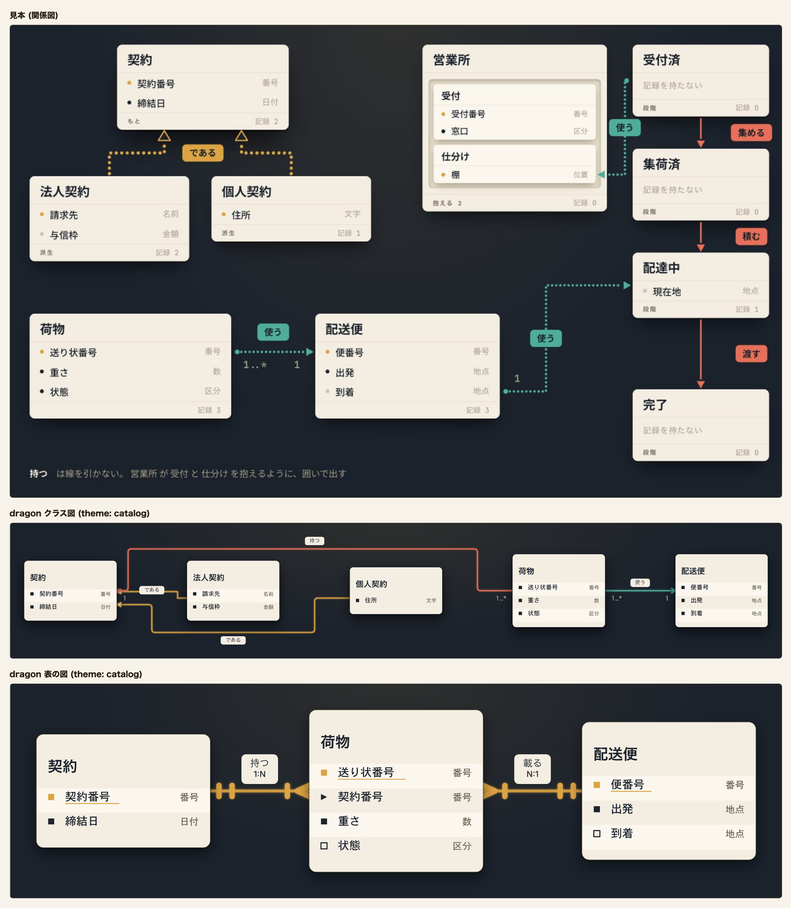
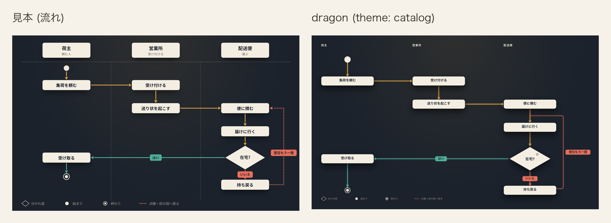
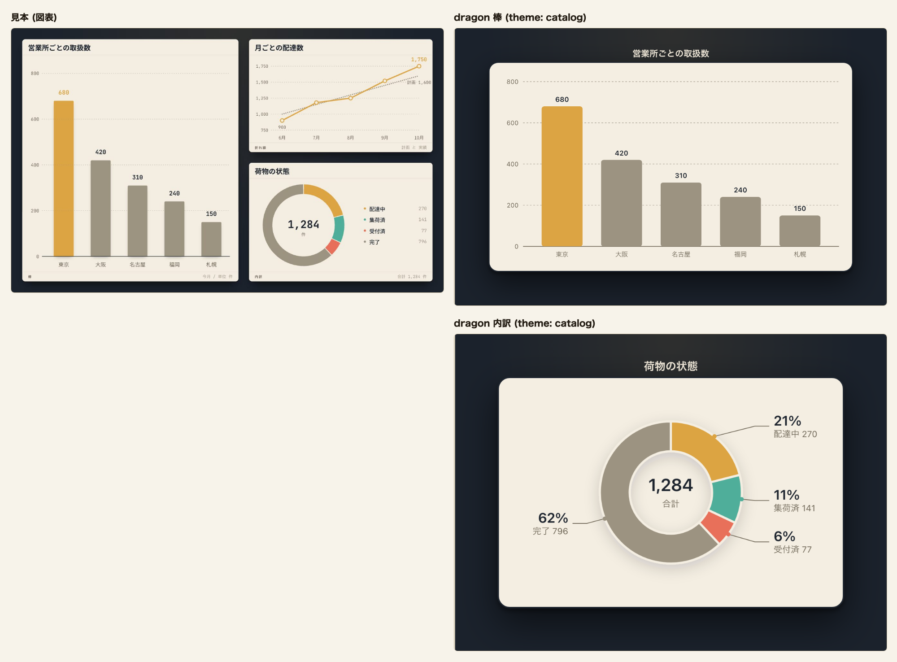

# 図録 (catalog)

記法の一番上に `theme: catalog` または `theme: 図録` と書く。`palette:` も `theme:` の別名として読む。

図録は地まで含めて 1 枚の絵として扱う。画面が暗い表示でも暗い台と明るい札の色を替えない。
台と札では同じ文字色が字の下限 4.5 を満たせないため、札の上は墨と薄、台の上は地の字と
地の薄を使う。

## 値

| 役       | 値        |
| -------- | --------- |
| 台       | `#1b222c` |
| 行の面   | `#f4eee2` |
| 縞       | `#fbf7ee` |
| 枠       | `#6f6757` |
| 字       | `#1d242e` |
| 型名     | `#6f6757` |
| 線       | `#dca443` |
| 所有     | `#e8705a` |
| 向きだけ | `#4fae9a` |

### 路線図の色

| 役 | 値 |
|---|---|
| 路線図の本線 | `#dca443` |
| 路線図のはい | `#4fae9a` |
| 路線図のいいえ | `#e8705a` |
| 路線図の枝札の字 | `#1b222c` |
| 路線図の駅の面 | `#f4eee2` |
| 路線図の駅名 | `#efe7d8` |
| 路線図の駅名の地 | `#1b222c` |
| 路線図の始終点 | `#efe7d8` |
| 路線図の案内線 | `#a39a87` |
| 路線図の名札の面 | `#f4eee2` |
| 路線図の名札の枠 | `#f4eee2` |
| 路線図の名札の名前 | `#1d242e` |
| 路線図の名札の補足 | `#6f6757` |
| 路線図の菱形の面 | `#f4eee2` |
| 路線図の菱形の枠 | `#f4eee2` |
| 路線図の菱形の字 | `#1d242e` |

### 色以外の値

| 役               | 値                                                                                                   |
| ---------------- | ---------------------------------------------------------------------------------------------------- |
| 地               | `#1b222c`。見本の暗い台                                                                              |
| 箱の面           | `#f4eee2`。暗い台から浮く札の面                                                                      |
| 墨               | `#1d242e`。札の上の字                                                                                |
| 薄               | `#6f6757`。札の上の控えめな字と通常の枠                                                            |
| 淡               | `#9c9381`。図表の系列 4 と単系列の主役でない棒                                                       |
| 一               | `#dca443`。主役に使う黄土                                                                            |
| 二               | `#4fae9a`。返りと脇に使う青緑                                                                        |
| 三               | `#e8705a`。移りに使う珊瑚色                                                                             |
| 地の字           | `#efe7d8`。台の上の字                                                                                |
| 地の薄           | `#a39a87`。台の上の控えめな字と線の両端の数                                                        |
| 濃二             | `#5f8a78`。二と薄を半々に混ぜた色                                                                    |
| 濃三             | `#ac6c58`。三と薄を半々に混ぜた色                                                                    |
| 囲いの面         | `#30363d`。台に地の字を 10% 混ぜた、台より一段明るい暗い面                                         |
| 箱の枠           | 通常は薄の 1、`data-cdl-active="true"` の箱は墨の 2                                                |
| 枠の濃さ         | 1。通常の箱と強調の箱の両方。始まりと終わりの印、見せ方を持つ箱は除く                              |
| 落ちる影         | 通常は `0 3px 2px` の黒 28% と `0 12px 16px` の黒 45%、主役は `0 4px 3px` の黒 34% と `0 20px 26px` の黒 55% |
| 線の光           | 線の色 60% の 3px                                                                                    |
| 地の模様         | 一 10% の `radial-gradient(ellipse at 50% 0%, ..., transparent 62%)`                                |
| 札               | `accent` / `info` は一 `#dca443`、`success` は二 `#4fae9a`、`teal` / `error` / `warning` は三 `#e8705a` の面。`data-cdl-edge-role="main"` は一。字 `#1b222c` は台の色。枠は持たず、面の無い札は地の字 |
| 鍵               | 一。下線と同じ行の印に使う                                                                          |
| 単系列の棒       | `data-cdl-emphasis="primary"` の棒は一 `#dca443`、それ以外は淡 `#9c9381`。濃さは 1               |
| 始まり・終わりの印 | 箱の面の色。塗りと輪郭の両方                                                                        |
| 縦列             | 名前は地の字、区切りの点線は地の薄                                                                 |
| 囲い             | 囲いの面で塗り、名前は地の字                                                                        |
| 見せ方を持つ箱   | 面の色の絵は墨と薄の字、墨の絵は面の色の字と地の薄の輪郭、塗らない絵は地の字                      |
| 動き             | 箱は不透明度 0、下へ 22px、拡大率 0.985 から浮く。0.62s、`cubic-bezier(.16,.84,.3,1)`。線は 0.62s 後に不透明度 0 から 0.9s で一斉に灯る |
| 図表の系列色     | 1 = 一、2 = 二、3 = 三、4 = 淡、5 = 濃二、6 = 濃三                                                 |
| 日程の棒と漏斗の段       | 図表の系列色を色みの順に塗る。`accent` は 1、`teal` は 2、`success` は 3、`warning` は 4、`info` は 5、`error` は 6。濃さは 1。段の字は墨 `#1d242e`。日程の帯は 5 を `#669480`、6 を `#b57c6a` へ同じ色相のまま浅くし、他は系列色のまま。帯の上の担当の字は墨 `#1d242e` |

## 見送ったこと

- 見本の型名は淡 `#9c9381` で、面の上の対比が 2.63 となり字の下限 4.5 を割る。型名は薄にした。
- 見本の札は枠を持たない。箱の枠の下限 4.61 を保つため、薄の 1 の枠を足した。
- 見本の主役の札は影を深くするだけだった。強調の箱は影を深くした上で墨の 2 の枠を足した。
  一の枠は面の上で 1.93 となり、箱の枠の下限を割る。
- 見本に行の縞は無かった。入れ子の札に使う一段明るい紙の色を縞に使った。
- 見本は札の上辺に白い光を `inset` の影で置いていた。SVG の `filter` は内側へ影を落とせないため
  描かない。
- 見本は線を丸い点の連なりで引いていた。dragon は実線と破線で関係の種類を分けるため、線の
  作りは変えない。
- 見本は線を端から端へ引き、札と線を 1 枚ずつ、1 本ずつ順に出していた。段で同時に現れる物へ
  記法に無い順序を足さず、箱は一斉に浮かせ、線は箱の後から一斉に灯す。
- 見本の状態の移りは三で描いていた。dragon は関係が 1 種類の状態遷移図と ER 図を線の口で
  描くため、一になる。
- 見本は図表の札を少し傾けていた。図種ごとの座標を保つため傾けない。
- 見本の書体は太い題と等幅の型名を組み合わせていた。画面が同梱する 2 書体をそのまま使う。
- 見本の札の角は 12px だった。図種ごとの形を保つため、描き手の角のままにする。
- 見本の図表に 5 色目と 6 色目は無い。見本の顔料を混ぜた濃二と濃三を足した。
- 台の上で縦列を区切り、内側を押して受け取るため、台より一段明るい暗い囲いの面を足した。
- 墨で塗る見せ方は暗い台に沈むため、見せ方の違いを保ったまま外形を読める地の薄の輪郭を足した。

## 見本と並べる

[12 図種 × 7 意匠の見本を開く](../proposal/index.html)

dragon のクラス図には、契約、法人契約、個人契約、荷物、配送便を並べる。
`relation: extends` の 2 本 (である) は一 (黄土) の線と白抜きの三角、`composes` (持つ) は三 (珊瑚色)、`associates` (使う) は二 (青緑) で描く。
線はそれぞれの色で光り、線に添える札は線の色で塗って台の色の字を置く。

表の図では、`鍵` を書いた契約番号、送り状番号、便番号の行頭の印と名前の下線を一で描く。
`外` を書いた荷物の契約番号は行頭を山形にし、`条件` を書いた状態と到着には中空の印を置く。
行は 1 行おきに縞で塗り、関係の線は 1 種類なので一で描く。
dragon 側の箱はすべて明るい札とし、薄の細い枠と下へ落ちる影で台から浮かせる。

見本と同じ題材でも、比べた記法には縦列 (`lane:`) と始まり・終わりの印を書いていないため、dragon の流れ図は上から下へ 1 列に並ぶ。
`role: main` を書いた 5 本 (集荷を頼む → 受け付ける → 送り状を起こす → 便に積む → 届けに行く → 在宅?) は一で描き、見本の主役の道筋と揃える。
「はい」 (`success`) は二、「いいえ」と「翌日もう一度」 (`error`) は三になり、見本と同じ色の割り当てになる。

系列が 1 つの棒では、最も大きい東京の棒を一、他の棒を淡で塗り、見本の主役の棒と同じ形にする。
図全体を 1 枚の札に載せ、図の題は台の上に地の字で置く。

内訳は、系列 1 から 4 を一、二、三、淡の順で塗り、配達中、集荷済、受付済、完了を表す。
並びは見本と同じで、見本の折れ線 (月ごとの配達数) は比べていない。

## 検査

- `apps/playground-spa/src/lib/theme-matches-note.test.ts` は「値」の 9 行と CSS の `--er-*`、
  地の字と地の薄、一と `--cdl-now`、図表の系列色と 12 個の変数を突き合わせる。
  文字用 tone は札の面と縞、地の字と地の薄は台との対比を測る。
  「枠の濃さ」と、固定の意匠だけに当たる CSS の決まりも突き合わせる。
- `apps/playground-spa/tests/rendered-contrast.spec.ts` は 9 つの口と一、図表の系列色を期待値にして、
  固定の意匠を全図種へ当てた時の舞台、箱、線、文字の対比を明暗で調べる。
- `apps/playground-spa/tests/theme-dark-ground.spec.ts` は台と舞台内の変数が画面の明暗で変わらない
  ことを固定の意匠ごとに調べる。
- `apps/playground-spa/tests/theme-appear.spec.ts` は箱と線が開いた時だけ動き、動きを減らす設定で
  止まることを調べる。
- `apps/playground-spa/tests/theme-catalog.spec.ts` は札の影、線の光、線に添える札、台の上の題を
  関係図、流れ図、図表で調べる。線の色みごとの札と単系列の棒も意匠帳の値と突き合わせる。
- `apps/playground-spa/tests/palette-switch.spec.ts` は切替で図録を選んだ舞台の地が「台」と一致する
  ことを、配色を持たない図と表の図で調べる。
