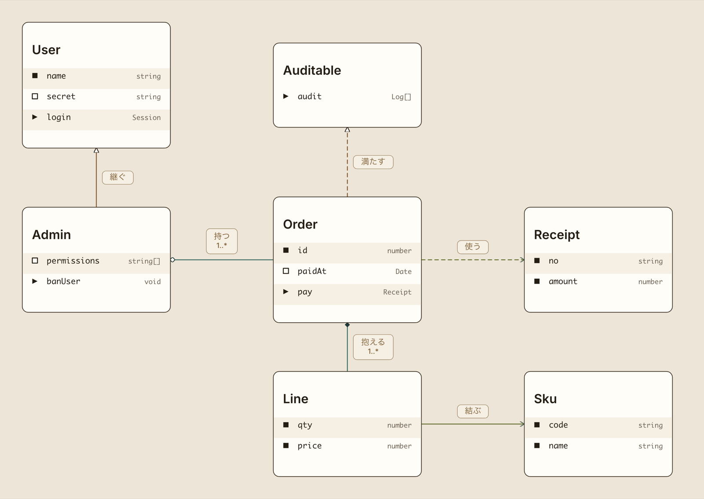

# クラス図

クラス図の意匠。
箱の作り (行頭の印 + 左に名前 + 右に型) と行の縞と 7 色の組は ER 図と共通で、
そちらは [`../er/note.md`](../er/note.md) が持つ。
ここはクラス図に固有の判断だけを置く。

図は engine が描いたもの。
段を書かない静止した図なので、箱は段から外して線だけを段に載せてある
(`../er/note.md` § 段を書かない図では何も「いま」 にしない と同じ扱い)。

**2 枚だけ手を入れてある**。 案 B の 2 本の区切り線 (§ 案 B は縞を捨てる) と、
余白を詰めた絵の箱の高さ (§ 箱の下の余白 の 2 枚目) は、engine の出力に頁の上で足した
見せかけ = engine はまだ描かない。 案 C の線の色は色を差しただけなので engine の出力のまま。

7 箱 6 関係。
`palette:` を 1 行も書いていない = 既定が効いた状態。

## 何を見せるか

クラス図には ER 図に無いものが 3 つある。
持ち物と振る舞いという 2 つの群、公開かどうかの区別、6 種に分かれた関係。
どれを図の主役に置くかで意匠が変わるので、同じ 7 箱 6 関係を 3 つの立場で描いて見比べた。

| 案 | 立場 | 捨てるもの |
|---|---|---|
| A 表として見せる | クラスは列と型が並んだ表。 ER 図と同じ読み方をする | 群の境目を行頭の印だけが示す |
| B 約束として見せる | クラスは外に向けた約束書き。 UML の 3 段をそのまま出す | 行の縞 |
| C 関係を見せる | 読みどころは箱の中身ではなく箱の間。 6 種を 3 群に寄せて色で分ける | 色の口が 7 から 9 に増える |

採ったのは **案 A**。

行の縞は ER 図で決めた形で、決めた理由 (名前と型が離れて並ぶので行を横に追う目印が要る) が
クラス図でもそのまま効く。
箱の作りが同じものに別の読み方を当てる理由が無い。

### 案 B は縞を捨てる

題 / 持ち物 / 振る舞い を区切り線で割り、種類の札を出す形。
UML には忠実だが、行頭の印と区切り線は同じ役目なので両方は引けない
(engine が「印がある図では線を引かない」 と決めている)。
線を採ると縞が要らなくなり、名前と型が離れて並ぶ問題が戻る。

種類の札だけは案 A でも出せるので、そこだけ採った (§ 種類の札を出す)。

### 案 C は色を増やす向き

継ぐ / 満たす を 1 色、持つ / 抱える を 1 色、結ぶ / 使う を 1 色に分けた形。
群の中の 2 種は既に 線 (実線 / 破線) と 印の塗り (白抜き / 塗る) で分かれているので、
色が担うのは群の見分けだけになる。

数の上では通っていた。
行の面の上で対比 6.26 から 8.43、色どうしの見分けは ΔE 28.2 から 48.9 で、
この repo が箱の枠に課す下限 4.61 と、見分けの下限 15 をどちらも上回る。

外したのは数値ではなく向き。
`../er/note.md` § 色を増やす方向では決まらなかった が、台の色を変える案を 9 回出して全て外し、
色を 1 組に固定して箱の組み立て方を変えた時に決まったことを記録している。
6 種の関係は既に 線 × 印の形 × 印が付く側 の 3 軸で分かれており、色は 4 軸目になる。

engine を変えずに配色の口を 2 つ足すだけで届く形なので、
関係の見分けが要る図が出てから決め直せる。

## 既定の配色

配色を持たない図では、行の縞が 1 本も出ない。

縞の色は配色からしか来ない。
配色を持たない舞台では `--cdl-row-stripe` が未定義になり、描画側の落ち先 (箱の面) が出る。
色の値で測ると、明るい側も暗い側も縞と箱の面が完全に同じ値になっていた。
縞の矩形は描かれているので、消えているのは色だけ。

この 2 枚は組み立て器で組んだ図 (§ 組み立て器 API は既定を持たない)。
既定を持たせる前は、記法で書いたクラス図も同じ見た目だった。

そこで `type: class` に **生成りに茶** を既定として持たせた。
`type: er` と同じ扱いで、書き手が `palette:` を書いた時はそちらが勝つ。

別の色みを既定にする案は採らない。
箱の作りが ER 図と同じなので、色みを分けると 2 つの図種が並んだ時に理由の無い差が出る。

既定を持たせず縞だけ画面の色で出す案も採らない。
縞と配色は切り離せるが、台が透過のままなので図の地が画面の地になり、
生成りの組ほど箱が浮かない。

### 組み立て器 API は既定を持たない

既定が効くのは **記法と JSON の入口だけ**。
組み立て器 (`classDiagram({ ... })`) を直に呼ぶ経路は既定を持たず、`palette:` を書いた時だけ載る。

ER 図も同じで、`er({ ... })` は既定を持たない (見本帳の `er-demo` は `palette: "kinari"` を明記している)。
既定を決めているのは dragon の `配色と縞を当てる` で、そこを通るのは記法と JSON の入口だから。

見本帳の図は組み立て器で組んでいるので、`palette:` を書き続ける。

### 書けば別の色みになる

7 色の値と、明暗それぞれの組は `../er/note.md` § 配色 が持つ。
ここには値を書かない = 2 か所に書くと片方だけ直して食い違う。

## 種類の札を出す

クラスと抽象クラスとインターフェースを見分ける札 (`abstract` / `interface`) を出す。

3 案のどれを採っても独立に決まる。
engine は元から持っていたのに、見本帳で 1 度も使っていなかった。

見本帳の `class-demo` で `Auditable` に `interface`、`User` に `abstract` を出した。
**2 つ違う値を出す**のは、札が「クラス」 と書くための飾りではなく種類を分ける口だと読めるようにするため。
1 種類だけだと、その語が箱の説明なのか種類なのかが図から決まらない。

書き方は入口で名前が違う。

| 入口 | 書き方 |
|---|---|
| 記法 / JSON | `eyebrow: "interface"` |
| 組み立て器 | `stereotype: "interface"` |

札は **書いた時だけ** 出る。
「クラス」 と書いた札は箱がクラスであることしか言わず、図の中の全ての箱に同じ字が並ぶ。

## 箱の下の余白

3 案に共通で直す点。
いまの箱は最後の行の帯の下に 48 空く。

行送りが 56 なので、48 は **空の行 1 つ** に見える。
最後の行に縞が乗る箱では余白が別の帯として読め、乗らない箱では最後の行が倍の高さに見える。

24 に詰める。
16 を下回ると縞の角が箱の角の丸みからはみ出すので、丸みより大きく取る。

寸法は engine (cdl) が持つ。
行送り / 余白 / 角の丸み の実数は cdl 側の実装が SSOT で、ここには測った時の値を記録として置くだけ。
上の 48 / 56 / 16 は engine 0.26.0 を描いて測った値なので、engine が動いたら測り直す。

**直す先は cdl** で、この repo からは直せない。
engine が出し直されるまで、いまの見た目は 1 枚目のまま。
2 枚目は頁の上で箱の高さを縮めて撮った見せかけ。

## まだ決めていないこと

### 関係の色

案 C を後から足すか。
足すなら配色の口が 7 から 9 に増えるので、`../er/note.md` § 配色 の表も一緒に伸びる。

### 群の間を空けるか

いまは持ち物と振る舞いの境目を行頭の印 (四角 / 山形) だけが示す。
案 B の区切り線は採らなかったが、線ではなく間隔で分ける形は試していない。
