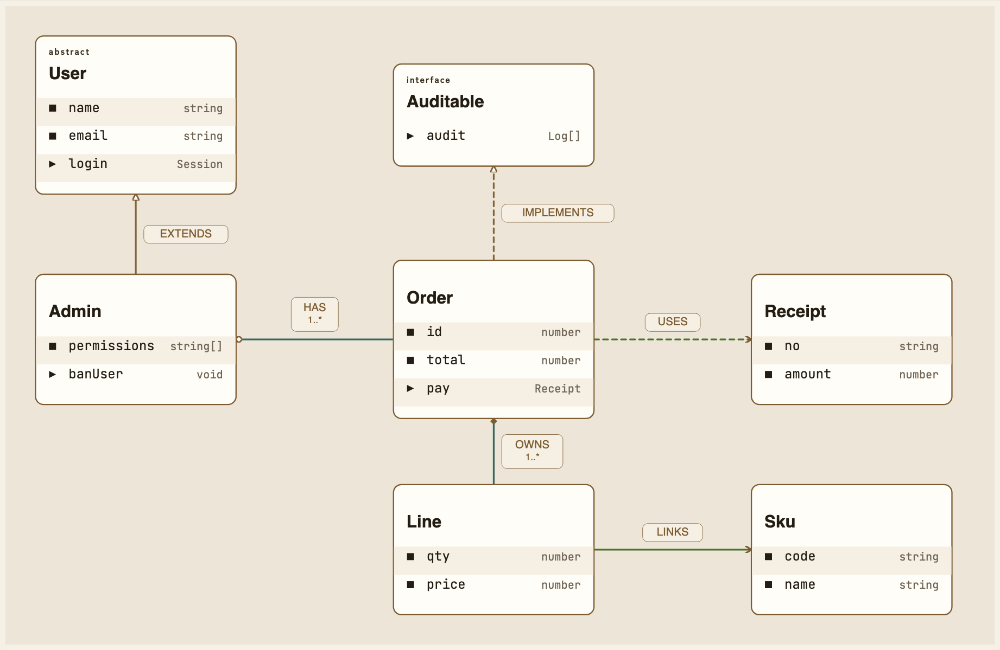
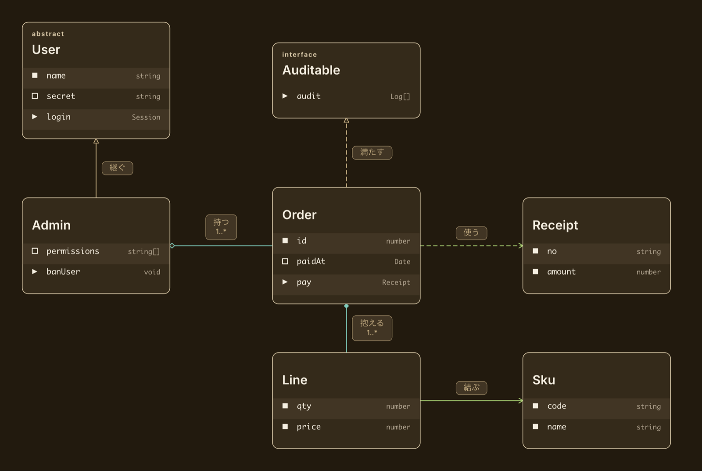
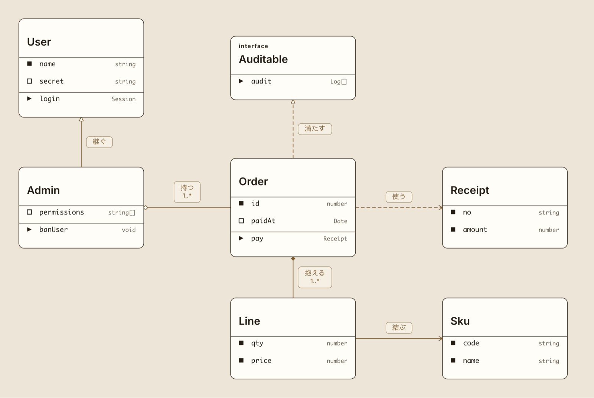
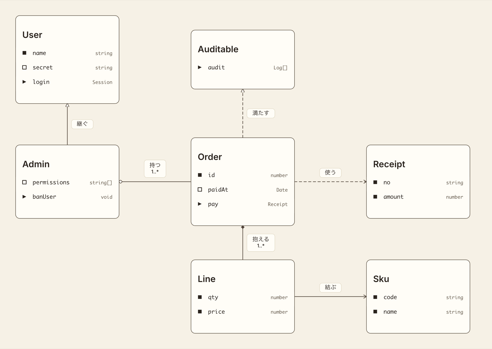
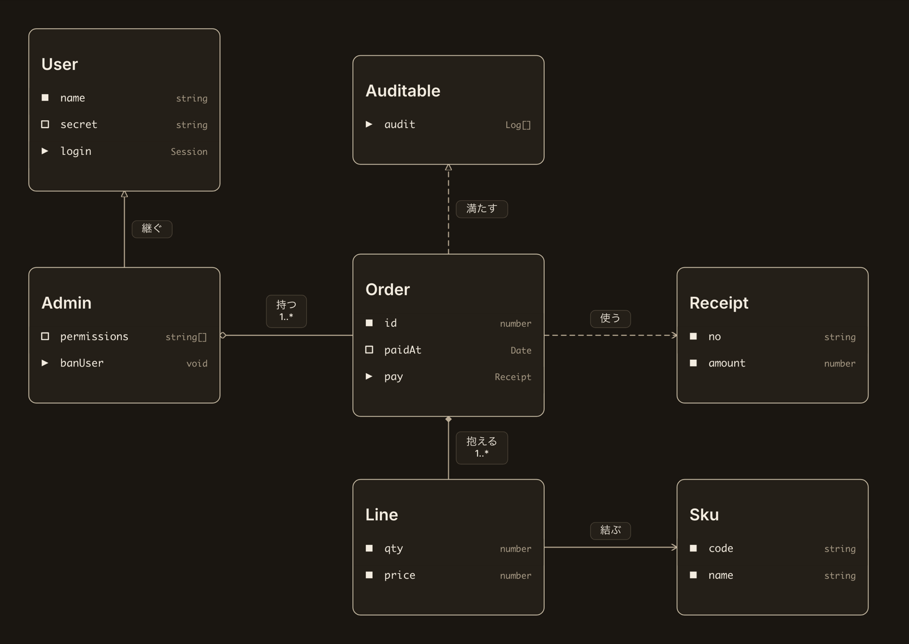
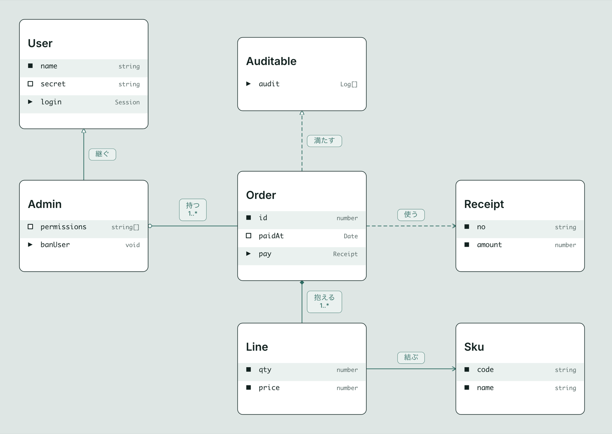
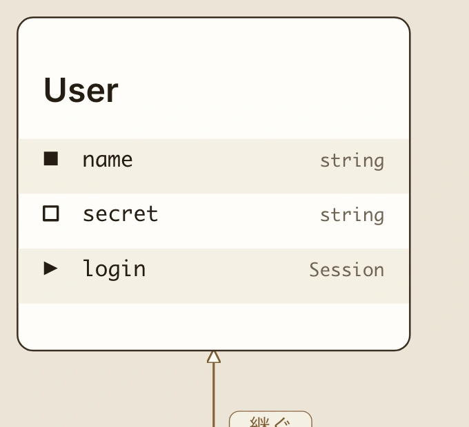
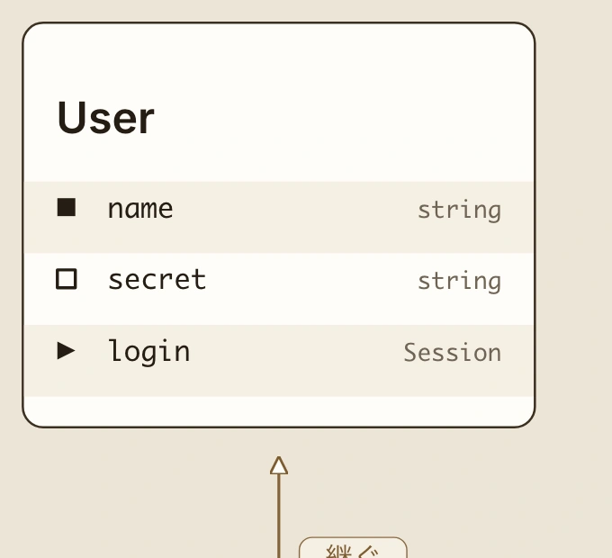

# クラス図

クラス図の意匠。
箱の作り (行頭の印 + 左に名前 + 右に型) と行の縞と 7 色の組は ER 図と共通で、
そちらは [`../er/note.md`](../er/note.md) が持つ。
ここはクラス図に固有の判断だけを置く。

図は engine が描いたもの。
段を書かない静止した図なので、箱は段から外して線だけを段に載せてある
(`../er/note.md` § 段を書かない図では何も「いま」 にしない と同じ扱い)。

**1 枚だけ手を入れてある**。 案 B の 2 本の区切り線 (§ 案 B は縞を捨てる) は engine の出力に
頁の上で足した見せかけで、engine は描かない。 それ以外は engine の出力そのまま。

7 箱 6 関係。
`palette:` を 1 行も書いていない = 既定が効いた状態。

## 何を見せるか

クラス図には ER 図に無いものが 3 つある。
持ち物と振る舞いという 2 つの群、公開かどうかの区別、6 種に分かれた関係。
どれを図の主役に置くかで意匠が変わるので、同じ 7 箱 6 関係を 3 つの立場で描いて見比べた。

| 案 | 立場 | 捨てるもの |
|---|---|---|
| A 表として見せる | クラスは列と型が並んだ表。 ER 図と同じ読み方をする | 群の境目を行頭の印だけが示す |
| B 約束として見せる | クラスは外に向けた約束書き。 UML の 3 段をそのまま出す | 行の縞 |
| C 関係を見せる | 読みどころは箱の中身ではなく箱の間。 6 種を 3 群に寄せて色で分ける | 色の口が 7 から 9 に増える |

採ったのは **案 A**。 後から **案 C を重ねた** (§ 関係を色で分ける)。

行の縞は ER 図で決めた形で、決めた理由 (名前と型が離れて並ぶので行を横に追う目印が要る) が
クラス図でもそのまま効く。
箱の作りが同じものに別の読み方を当てる理由が無い。

案 A と案 C は排他ではない。
案 A が箱の読み方を決め、案 C が箱の間の読み方を足す。
案 B だけが案 A と排他になる = 縞を捨てる形なので、箱の読み方が入れ替わる。

### 案 B は縞を捨てる

題 / 持ち物 / 振る舞い を区切り線で割り、種類の札を出す形。
UML には忠実だが、行頭の印と区切り線は同じ役目なので両方は引けない
(engine が「印がある図では線を引かない」 と決めている)。
線を採ると縞が要らなくなり、名前と型が離れて並ぶ問題が戻る。

種類の札だけは案 A でも出せるので、そこだけ採った (§ 種類の札を出す)。

## 既定の配色

配色を持たない図では、行の縞が 1 本も出ない。

縞の色は配色からしか来ない。
配色を持たない舞台では `--cdl-row-stripe` が未定義になり、描画側の落ち先 (箱の面) が出る。
色の値で測ると、明るい側も暗い側も縞と箱の面が完全に同じ値になっていた。
縞の矩形は描かれているので、消えているのは色だけ。

この 2 枚は組み立て器で組んだ図 (§ 組み立て器 API は既定を持たない)。
既定を持たせる前は、記法で書いたクラス図も同じ見た目だった。

そこで `type: class` に **生成りに茶** を既定として持たせた。
`type: er` と同じ扱いで、書き手が `palette:` を書いた時はそちらが勝つ。

別の色みを既定にする案は採らない。
箱の作りが ER 図と同じなので、色みを分けると 2 つの図種が並んだ時に理由の無い差が出る。

既定を持たせず縞だけ画面の色で出す案も採らない。
縞と配色は切り離せるが、台が透過のままなので図の地が画面の地になり、
生成りの組ほど箱が浮かない。

### 組み立て器 API は既定を持たない

既定が効くのは **記法と JSON の入口だけ**。
組み立て器 (`classDiagram({ ... })`) を直に呼ぶ経路は既定を持たず、`palette:` を書いた時だけ載る。

ER 図も同じで、`er({ ... })` は既定を持たない (見本帳の `er-demo` は `palette: "kinari"` を明記している)。
既定を決めているのは dragon の `配色と縞を当てる` で、そこを通るのは記法と JSON の入口だから。

見本帳の図は組み立て器で組んでいるので、`palette:` を書き続ける。

### 書けば別の色みになる

9 色の値と、明暗それぞれの組は `../er/note.md` § 配色 が持つ。
ここには値を書かない = 2 か所に書くと片方だけ直して食い違う。
この絵では 3 群の色も入れ替わっている (縦の関係が青磁、所有が代赭、向きだけが藍)。

## 関係を色で分ける

6 種の関係を 3 群に寄せ、群ごとに色を変える。

| 群 | 種類 | 群の中の見分け |
|---|---|---|
| 縦の関係 | 継ぐ / 満たす | 線 (実線 / 破線) |
| 所有 | 持つ / 抱える | 印の塗り (白抜き / 塗る) |
| 向きだけ | 結ぶ / 使う | 線 (実線 / 破線) |

**群の中は色を分けない**。
群の中の 2 種は既に線か印の塗りで分かれているので、色まで足すと同じことを 2 回言うことになる。
色が担うのは群の見分けだけ。

縦の関係は既にある「線」 の色を使う。
増える口は 2 つで、`../er/note.md` § 配色 の表が 7 行から 9 行になった。

### 1 度見送ってから採った

最初は見送っている。
意匠帳は色を増やす方向で 9 回外しており、色を 1 組に固定して箱の組み立て方を変えた時に決まった。
6 種は既に 線 × 印の形 × 印が付く側 の 3 軸で分かれているので、色は 4 軸目になる。

数の上では最初から通っていた。
行の面の上で対比 6.19 から 8.43、色どうしの見分けは ΔE 34.5 から 57.3 で、
枠に課す下限 4.61 と見分けの下限 15 をどちらも上回る。

外していたのは向きの問題で、「関係の見分けが要る図が出てから決め直せる」 と書いてあった。
その判断を変えて採った。

### 色は engine が名前で決め、値は画面が当てる

engine は関係の種類から色みの **名前** を決める (`CLASS_RELATION_TONE`)。
値は持たないので、実際の色は画面が名前を見て当てる。

優先順位は 関係に書いた色み > 図に書いた既定 > 種類から決まる既定 の 3 段。
見本帳は 3 形とも色みを書かない = 書くと種類の既定より勝って 6 本とも同じ色になる。

### 札は線の色に従わない

線に添える札 (`継ぐ` 等) は線とは別の塊にあり、色みが届かない。
札の枠と字は「線」 の色のままにした。

追わせるには engine が札にも色みを出す必要がある。
札は名前を読ませるもので、群を読ませるのは線の役目なので、そこまでは追っていない。

## 線の太さ

関係の線を 7 にした。
印の輪郭も線との比を保って上げてある。

| 何 | 前 | 後 | 線との比 |
|---|---|---|---|
| 線 | 2.25 | 7 | — |
| 白抜きの印の輪郭 | 1.4 | 4.36 | 0.622 |
| 開いた矢の輪郭 | 1.6 | 4.98 | 0.711 |

線だけ太くすると印が痩せて見えるので、比を動かさずに一緒に上げる。
箱の枠 (1.75) との比は 1.29 から 4.0 になった。

**全ての図に同じ値を掛けている**。
ER 図も状態遷移図も流れ図も 7 で、図の種類では分けない。

### 1 度クラス図だけにしてから、全体へ広げた

最初はクラス図だけを 3.5 にした。
§ 関係を色で分ける で 6 種を 3 群の色に分けた結果、色が意味を持つようになったのはクラス図だけで、
細い線は色が薄く見えて群の見分けが効きにくい、という理由だった。

実物を並べて見ると **3.5 でも細い**。
太い方が読みやすいのは図の種類に依らないので、種類で分ける形をやめて全体を 7 にした。

engine が出す `data-cdl-type` で図の種類を名指しできる状態は残っている。
いま使っていないだけで、種類ごとに描き分けたくなれば書ける。

### 見比べ方で結論が変わる

最初の見比べでは 2.25 / 2.75 / 3 / 3.5 を並べて 3.5 を採った。
**このとき図を面の幅に押し込めていた** ので、12 表の ER 図では倍率が 0.53 になり、
3.5 が画面上では 1.8 画素にしかなっていなかった。

等倍で出し直すと 3.5 は細く、6 から 12 まで振って 7 に落ち着いた。
**太さを見比べる時は、図を縮めずに等倍で並べる**。 縮めた図で決めると必ず細い側に寄る。

画面で `getComputedStyle` を読んで測っており、クラス図 ・ ER 図 ・ 流れ図 のいずれも 7 で
固定してある。

## 種類の札を出す

クラスと抽象クラスとインターフェースを見分ける札 (`abstract` / `interface`) を出す。

3 案のどれを採っても独立に決まる。
engine は元から持っていたのに、見本帳で 1 度も使っていなかった。

見本帳の `class-demo` で `Auditable` に `interface`、`User` に `abstract` を出した。
**2 つ違う値を出す**のは、札が「クラス」 と書くための飾りではなく種類を分ける口だと読めるようにするため。
1 種類だけだと、その語が箱の説明なのか種類なのかが図から決まらない。

書き方は入口で名前が違う。

| 入口 | 書き方 |
|---|---|
| 記法 / JSON | `eyebrow: "interface"` |
| 組み立て器 | `stereotype: "interface"` |

札は **書いた時だけ** 出る。
「クラス」 と書いた札は箱がクラスであることしか言わず、図の中の全ての箱に同じ字が並ぶ。

## 箱の下の余白

3 案に共通で直した点。

直す前は最後の行の帯の下に 48 空いていた。
行送りが 56 なので、48 は **空の行 1 つ** に見える。
最後の行に縞が乗る箱では余白が別の帯として読め、乗らない箱では最後の行が倍の高さに見えた。

24 に詰めた。
16 を下回ると縞の角が箱の角の丸みからはみ出すので、丸みより大きく取る。

**直したのは engine (cdl) 側**。
余白の起点を最後の行の中線から縞の帯の下端に変えたので、行送りを変えても余白が取り残されない。
3 行の箱で高さが 340 から 316 になった。

寸法は engine が持つ。
行送り / 余白 / 角の丸み の実数は cdl 側の実装が SSOT で、ここには測った時の値を記録として置くだけ。
上の 48 / 56 / 16 は engine 0.26.0 と 0.27.0 を描いて測った値なので、engine が動いたら測り直す。

この直しは ER 図と状態遷移図にも同じように効く。
行頭の印を持つ箱すべてが対象で、クラス図に固有の話ではない。

## まだ決めていないこと

### 群の間を空けるか

いまは持ち物と振る舞いの境目を行頭の印 (四角 / 山形) だけが示す。
案 B の区切り線は採らなかったが、線ではなく間隔で分ける形は試していない。
