# ER 図

ER 図を描く時に効く記法の制約と、線の引き方、行の組み方、読み違いを生む形をまとめる。

図ごとの意匠 (寸法 / 段 / その図固有の判断) は `docs/design/notation/` 配下に図単位で納める。
本 file は記法そのものについて、図をまたいで効くことだけを持つ。

図は全て engine が描いたもので、線は端点を散らし、通り道をずらし、高さを揃え、交わる所は弧で跨ぐ形になっている。

冒頭の 2 枚は決まった形と既定の色で描いたもの。
それ以降の図は判断の途中で撮ったものなので、色は決まる前の値のまま。

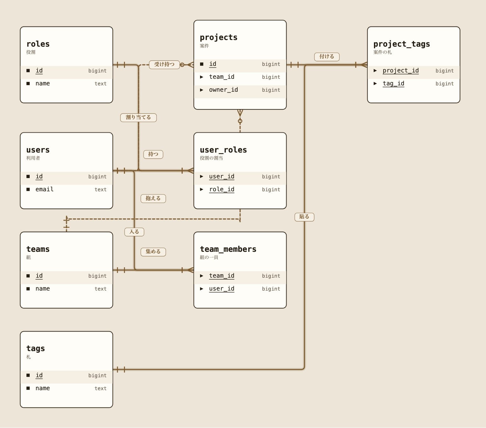

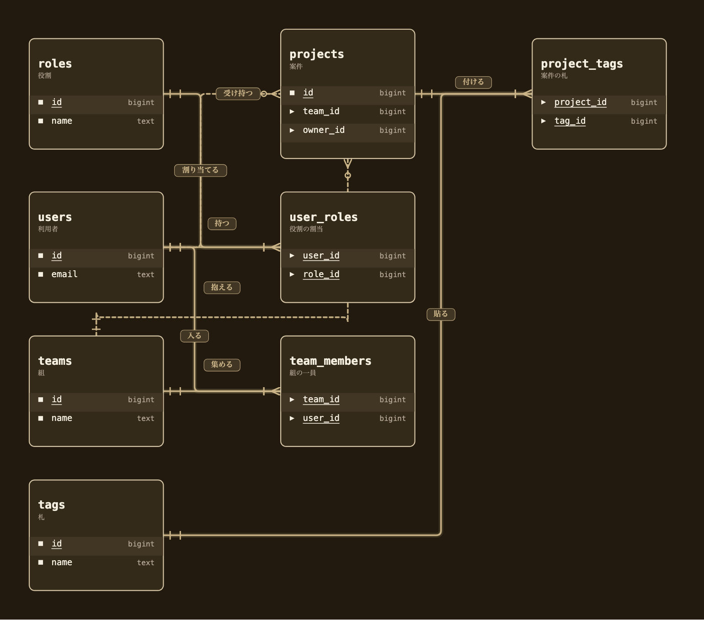

8 表 8 関係、多対多が 2 組 (`er-mesh`)。

## 記法の制約

### 横 1 列にしか並ばない

`er` の記法は、実体 1 つにつき帯を 1 本作り、必ず `stack 0` に置く。

```
b.lane(laneId, { width: boxLaneW(boxW) });
b.node(e.id, {
  lane: laneId,
  stack: 0,
  kind: "storage",
  ...
});
```

出典は cdl の `packages/cdl/src/presets.ts` の `er()`。

帯が列、段が列の中の位置なので、実体ごとに列を 1 本ずつ作って段を 0 に固定すると、表は横 1 列にしか並ばない。
書き手が段を指定する口も無い。

### 並べ替えでは直らない

1 列に並んだ表は、左右の 2 つとしか隣り合えない。
関係を 4 本持つ実体があると、どう並べ替えても 2 本は隣を飛び越す。

置き場所だけを変えた 4 通りを実測した。

| | 並べ方 | 図の枠 | 縦横比 | 最長の線 | 400 を超える線 |
|---|---|---|---|---|---|
| A | 1 列 / 宣言順 (いまの形) | 5189 × 738 | 7.0 | 4068 | 3 本 |
| B | 1 列 / 飛び越し最小 | 5189 × 738 | 7.0 | 2352 | 2 本 |
| C | 算法の割当 (4 列 2 段) | 2867 × 1150 | 2.5 | 1718 | 6 本 |
| D | 手組み / 流れと枝 | 3716 × 1048 | 3.5 | 836 | 1 本 |

短い線 (隣どうし) はどの図でも 350 から 374 に収まる。
差が出るのは飛び越す線だけで、A の 4068 が D では 836 になる。

**A — 1 列 / 宣言順。**
3 本が図の上端と下端に張り付き、両端のどちらからも 1000 以上離れた所に名前が出る。

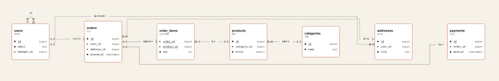

**B — 1 列 / 飛び越し最小。**
隣り合わせられる関係を全て隣に置いた。
それでも `orders` の 4 本は収まらず、2 本が飛ぶ。

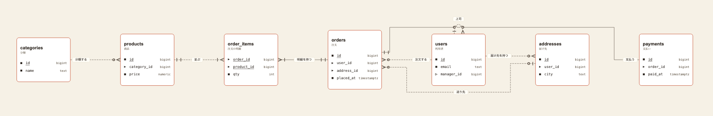

**C — 算法の割当。**
cdl #600 の `orderNodes` が返す並び。
枠は一番小さくなるが、段をまたぐ線が 6 本出るので通り道の共有も一番多い。

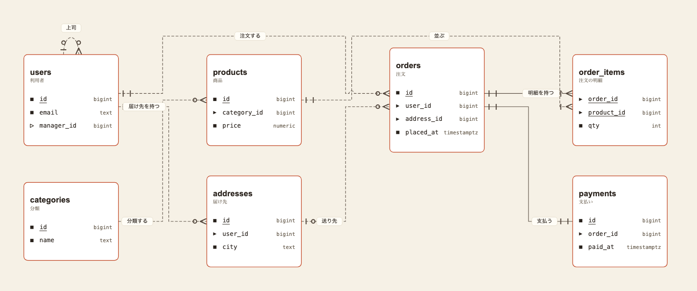

**D — 手組み / 流れと枝。**
`categories → products → order_items → orders → users` を横 1 本の流れにして、`payments` と `addresses` を下段へ落とした。
長い線は `送り先` の 836 が 1 本だけ残る。

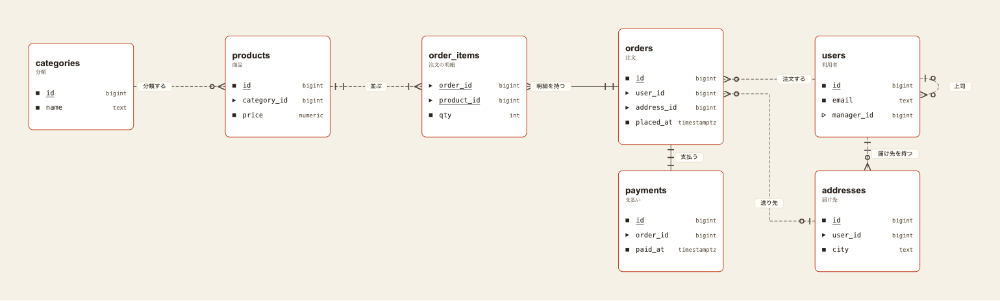

## 読み違いを生む形

### 重なった破線が実線に見える

同じ通り道を 2 本の破線が走ると、刻みが噛み合って隙間が埋まり、実線に見える。

ER 図では実線が識別する関係を指すので、これは見た目だけの問題ではない。
関係の種類そのものが違って読める。

実測では C の `x 612` の縦の通り道を 3 本の関係が共有しており、うち 2 本がまったく同じ線の上を走っていた。

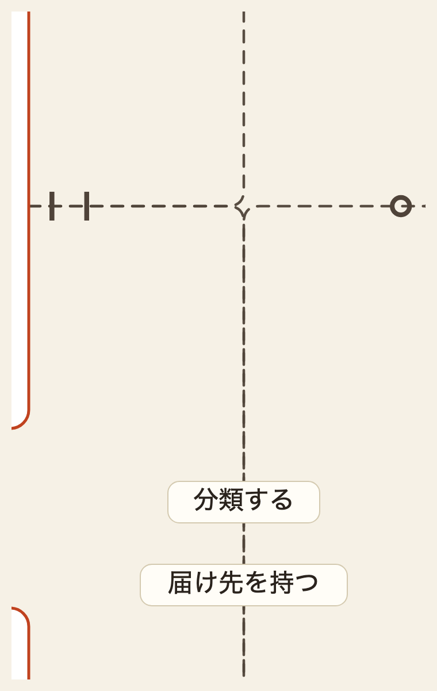

通り道をずらした後。
2 本に分かれ、札はそれぞれ自分の線の上に乗る。

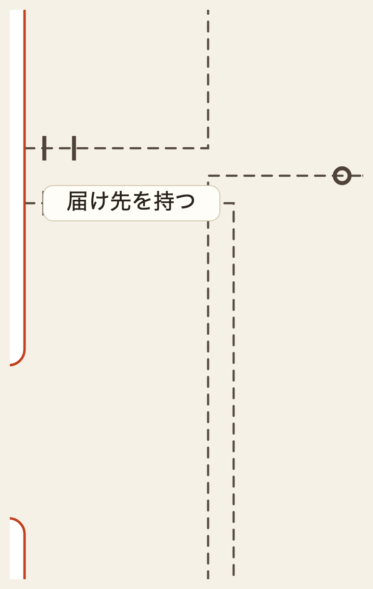

### 同じ点から出た 2 本が 1 本に見える

読みにくさの実体は交差ではなく、2 本が同じ点から出てしばらく同じ線を共有すること。
実測では `users` の右辺で `注文する` と `届け先を持つ` が同じ `(425, 377)` から出ており、根元の端の印がどちらのものか読めなかった。

線が箱を避ける通り道は「塞ぐ箱の端 + 余白」 で決まるので、同じ箱を避ける線は必ず同じ列を通る。
8 表 8 関係の図で並走が 4 組出た。

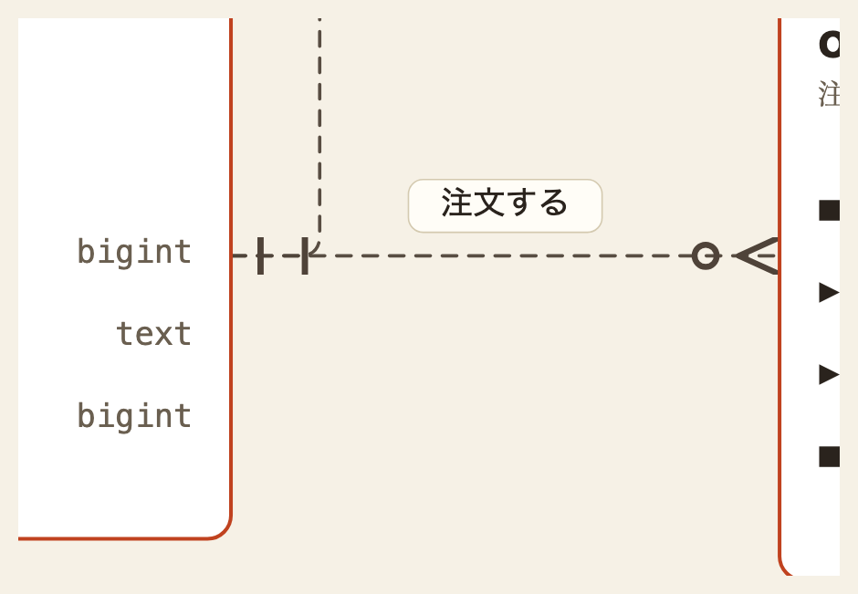

端点を辺の上で散らした後。
別々の高さから出て、交わる所は弧で跨ぐ。

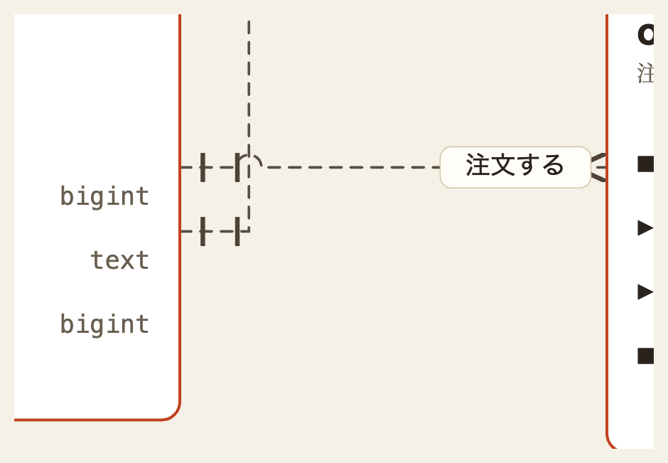

### 札が他人の線の名前に見える

札を線から離して浮かせると、上を平行に走る別の線に近づく。
実測では札を 34 離していたのに対し、平行な線との間隔が 28 しかなく、札が自分の線より他人の線の近くに出ていた。

## 線の引き方

| 手当て | やること | 効くところ |
|---|---|---|
| 通り道をずらす | 同じ直線を 40 以上ならんで走る区間を、後から出る線の側へ 26 ずらす | 重なって 1 本に見える形 |
| 通り道の高さを揃える | 箱の外を走る横の通り道を、x が重ならない組だけ同じ高さに寄せる | 平行な線が 28 ずれて段になる形 |
| 交点で跨ぐ | 横に走る側が半径 11 の弧で上へ逃げる | 本当に交わる箇所 |
| 端点を辺の上で散らす | 同じ辺に付く線を、行 1 つ分 (56) ずつ離して付ける | 同じ点から出て根元を共有する形 |
| 札を線に載せる | 浮かせず、自分の線の上に置く。 札の下地が線を隠す | どの線の名前か読めない形 |

交点で跨ぐ形。
横に走る側が上へ逃げ、下をくぐる線が切れずに済む。

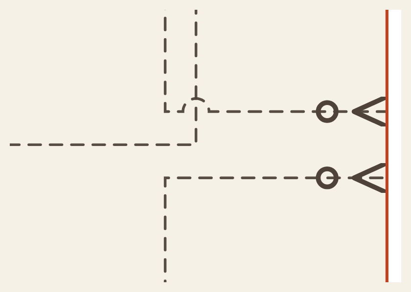

### 動かすのは後から出る線

先に出た線を動かすと、図に線を 1 本足しただけで既にある線が動く。

同じ節から出る線は重ねたまま残す。
幹線から順に降りる 1 本の線として読め、読み手は共有した起点から分岐を辿れる。
起点が違う線は辿る手掛かりが無いので、重なると 2 本あることすら読めない。

### 角を直角にする案は見送った

丸みを外して折れ位置を 1 点に揃える案があった。

角がずれて見えた原因は 1 点で 3 本が同時に折れることだったので、終点を辺の上で散らせば丸みのままでも解ける。
4 つ目の手当てを入れた時点で要否を判定し、不要と判断した。

### 端点を散らす形は 2 度やめている

辺の上で端点を散らす仕組みは以前 engine に入っていた。
CAR-429 で削除され (起点と終点は辺の中央固定と `edges.ts` に明記)、CAR-1560 では fan-origin 保存として、同じ点から扇状に出る形を守る判定まで足されている。

つまりこれは崩れではなく 2 度決めた形。
戻す時は 280 図すべての線の根元が動く。

## 手当てが効いたか

置き場所 4 通りに同じ手当てを当てた結果。

| | 重なる区間 前 | 後 | 跨ぎ |
|---|---|---|---|
| A | 4 | 0 | 4 |
| B | 1 | 0 | 6 |
| C | 5 | 0 | 7 |
| D | 1 | 0 | 0 |

重なって走る区間は 4 図とも 0 件になった。
代わりに経路が別れて交わる所が生まれ、そこは弧で跨ぐ。
D で跨ぎが 0 なのは、並べ方の時点で交わりが起きていないため。

### 形を変えても同じ規則で描けるか

A から D は同じ 7 表 8 関係を置き直した 4 通りで、中身は 4 図とも同一。
規則が形に依らないかは別の話なので、表の数と繋がり方を変えた 4 図に同じ手当てを当てた。
置き場所は cdl #600 の `orderNodes` が返した割当をそのまま使っている。

| 形 | 規模 | 図の枠 | 縦横比 | 重なり 前 | 後 | 跨ぎ |
|---|---|---|---|---|---|---|
| 小さい図 | 3 表 2 関係 | 2045 × 506 | 4.0 | 0 | 0 | 0 |
| 1 表に集まる | 6 表 5 関係 | 2093 × 1852 | 1.1 | 2 | 1 | 2 |
| 一直線に連なる | 6 表 5 関係 | 4055 × 450 | 9.0 | 0 | 0 | 0 |
| 多対多が 2 組 | 8 表 8 関係 | 2045 × 1796 | 1.1 | 7 | 0 | 4 |

連なる形と小さい形は元から重なりが無く、手当てが働く場面も無い。
集まる形と多対多の形で効く。
多対多は 7 件の重なりが 0 になり、集まる形に 1 件残っている。

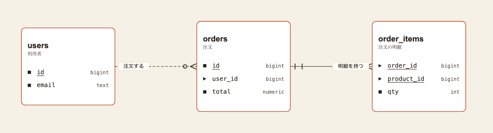

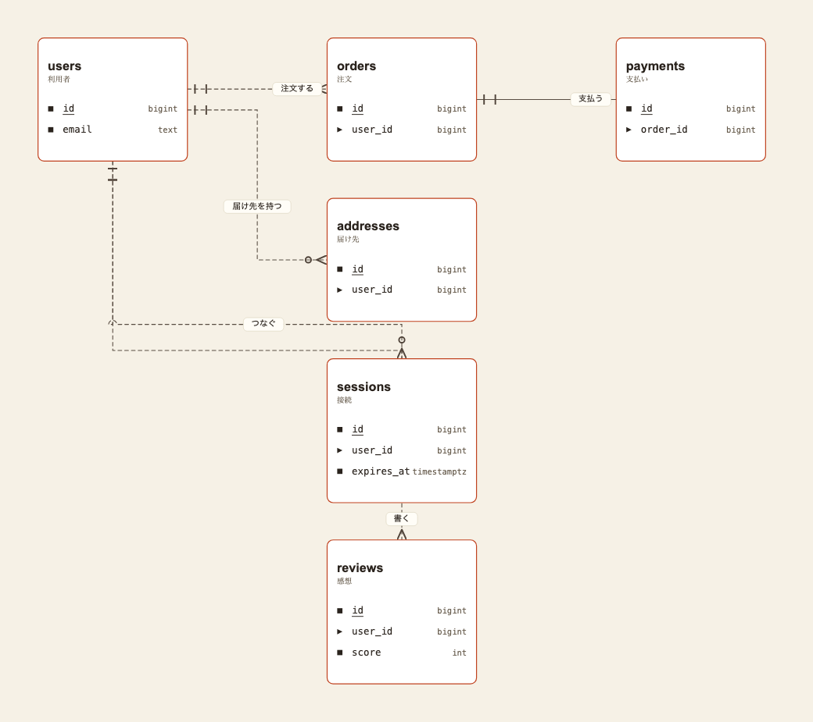

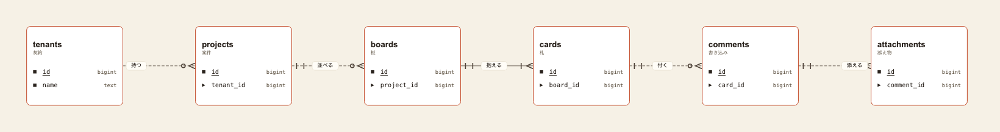

多対多が 2 組の形は本 file の冒頭に置いてある。

## 見るところ

線の見た目を判断する時は 3 点を見る。

| # | 見るところ | 確かめること |
|---|---|---|
| 1 | 交わる所 | 上を通る線が弧で跨いでいるか。 下をくぐる線が切れていないか |
| 2 | 線の根元 | 同じ箱から出る線が別々の高さから出ているか。 2 本が 1 本に見える所が無いか |
| 3 | 関係の名前 | 札が自分の線の上に乗っているか。 隣の箱の関係に見える札が無いか |

## 配色

箱は 1 行おきに薄く敷く (行の縞)。
色を置く口は 7 つで、台・行の面・縞・枠・字・型名・線。

### 既定 — 生成りに茶

| 役 | 明 | 暗 |
|---|---|---|
| 台 | `#ece5d8` | `#221a0e` |
| 行の面 | `#fffdf8` | `#342a1a` |
| 縞 | `#f5efe4` | `#413524` |
| 枠 | `#3a2f20` | `#d6c6a6` |
| 字 | `#241d14` | `#f5efe2` |
| 型名 | `#6f6455` | `#b3a692` |
| 線 | `#7d5c31` | `#cbb488` |

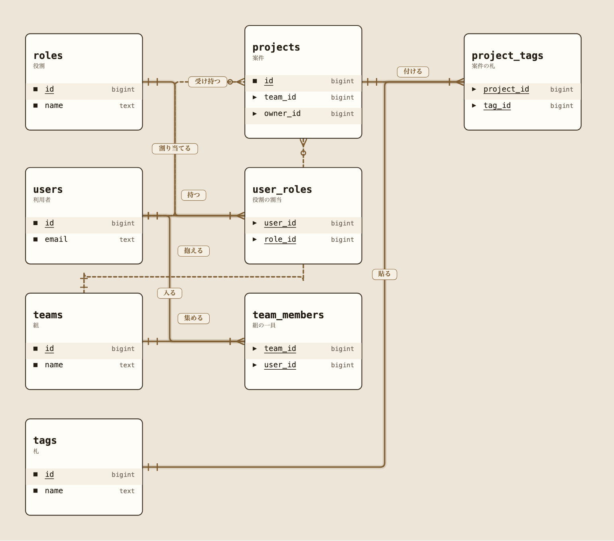


### 指定した時だけ当たる — 青磁に墨

| 役 | 明 | 暗 |
|---|---|---|
| 台 | `#dee6e4` | `#1a201f` |
| 行の面 | `#ffffff` | `#293130` |
| 縞 | `#eaf1ef` | `#343d3c` |
| 枠 | `#1e3230` | `#c9dbd7` |
| 字 | `#132220` | `#edf3f1` |
| 型名 | `#5a6b69` | `#9aaba8` |
| 線 | `#2d6b62` | `#7ccdbe` |

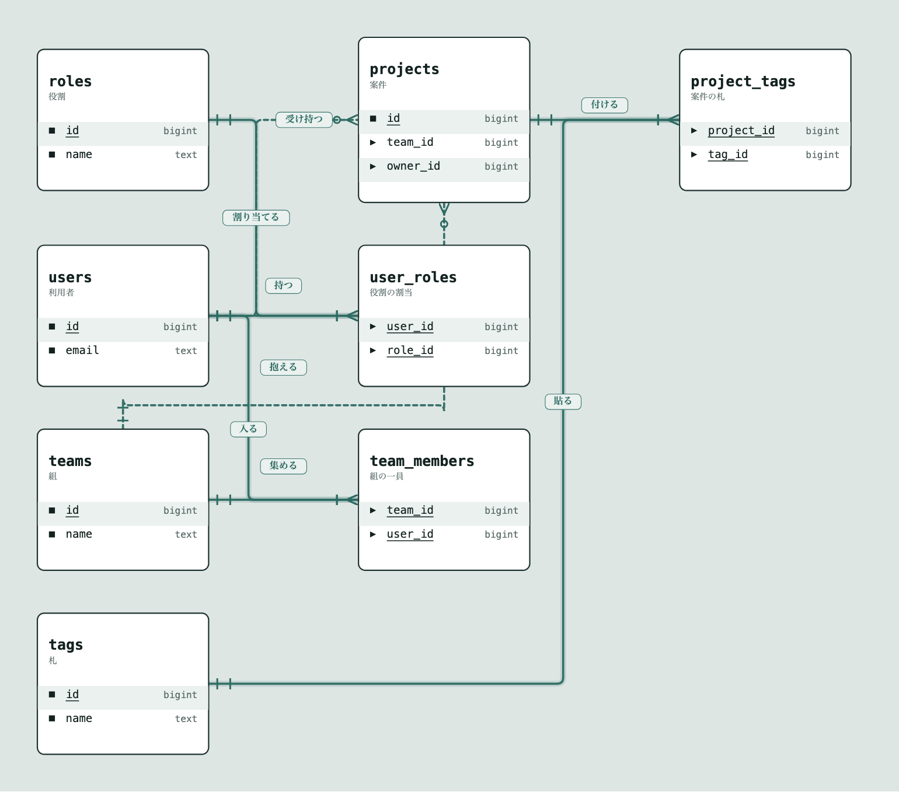

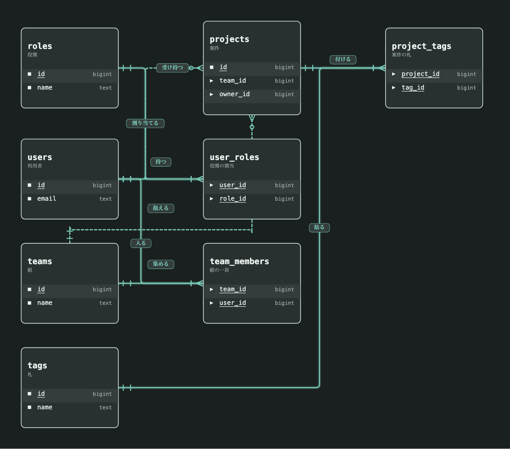

### 台と行の面は必ず別の色にする

同じにすると箱が消えて壊れて見える。
既定は明るい側で 8.2、暗い側で 7.9 離してある。

### 色を増やす方向では決まらなかった

台の色だけを変える案を 9 回出して全て外れた。
台に色を入れ、面に色を入れ、枠と線を別の色にし、色相 2 つを距離で組む所まで進めたが、
増やすほど図が散らかった。

決まったのは **色を 1 組に固定して箱の組み立て方を変えた**時。
板と枠 / 見出しの帯 / 反転した見出し / 左の帯 / 影 / 行の縞 の 6 通りを出し、行の縞が採られた。

外し方は 3 つに分かれる。

| 呼び方 | 台の例 | 明るさ | 開き |
|---|---|---|---|
| 牛乳 | `#f7f2e6` | 95.6 | 17 |
| 汚い | `#ded7cd` | 86.3 | 17 |
| 黄土 | `#e6d9bd` | 87.1 | 41 |

牛乳は台が白に近すぎ、汚いは暗くて色みが薄く、黄土は色みが濃すぎる。
通る帯は明るさ 91 から 94、開き 17 から 29。

暗い側で茶が灰に見えるのも同じ理由で、開きが 20 を割ると色みが読めなくなる。

## 行の組み方

### 行と行の縦の間隔

群を分ける空行を置かず、行の間隔を揃える。

`er` は鍵と値を空行 1 つで分けていたので、その 1 箇所だけ送りが倍になっていた。

| 箱 | 行の並び | 境目の間隔 前 | 後 |
|---|---|---|---|
| `users` | `id` / `email` | 112 | 56 |
| `user_roles` | `user_id` / `role_id` | 56 | 56 |
| `projects` | `id` / `team_id` / `owner_id` | 112 | 56 |

空行そのものをやめた (cdl #606、取り込み済)。

群を分ける役目は行頭の印が持っている。
ER は鍵の名前に下線、クラス図は持ち物が四角で振る舞いが山形。
空行はその 2 つ目の手掛かりで、代わりに行の間隔を不揃いにしていた。

鍵だけの中継表には空行が入らないので、空行があると実体表とだけ間隔が食い違う。
やめた結果、`users` と `user_roles` はどちらも 2 行・高さ 330 で完全に揃う。

### 名前と型の間

箱の幅は中身によらず 400 で固定し、名前は左端から、型は右端に揃えている。
だから間は「400 から 名前と型の字数を引いた残り」 そのままになる。

| 箱 | 行 | 名前の終わり | 型の始まり | 間 |
|---|---|---|---|---|
| `categories` | `id` / `bigint` | 122 | 320 | 198 |
| `orders` | `id` / `bigint` | 1670 | 1868 | 198 |
| `orders` | `user_id` / `bigint` | 1748 | 1868 | 120 |
| `orders` | `address_id` / `bigint` | 1795 | 1868 | 73 |
| `orders` | `placed_at` / `timestamptz` | 1779 | 1802 | 22 |

同じ箱の中で 22 から 198 まで開く。
短い名前と短い型が並ぶ `categories` の行が一番空き、長い型を持つ `placed_at` の行が一番詰まる。

直すなら 3 通りある。
どれを採るかは決めていない。

| 案 | やること | 代償 |
|---|---|---|
| 型の列を揃える | 箱ごとに「一番長い名前 + 一定」 の位置から型を書き始める | 間は一定になり右端も揃う。 箱ごとに型の開始位置が変わる |
| 箱の幅を中身で決める | 一番長い行に合わせて箱の幅を変える | 間は詰まるが、箱の幅が不揃いになる |
| 型を名前の直後に置く | 右揃えをやめて一定間隔で続ける | 間は一定。 右端が不揃いになる |

## 関係の名前

日本語で書く。
`注文する` / `明細を持つ` / `上司`。

同じ見本帳の時系列のやり取りの図が日本語なので、ER 図だけ語が混ざるのを避ける。
英語を主にして日本語を添える案もあるが、短い線の上で字が 2 行になり場所を取る。

## まだ決めていないこと

### 中継表の見せ方

全ての列が鍵で、それ自体は何も持たない表 (`user_roles` / `team_members` / `project_tags`) を、実体表と見分ける形。

いまは同じ見た目なので、業務上の実体が 8 つあるように読める。
実際の実体は 5 つ。

箱の見せ方は色ではなく形で選ぶことが cdl #616 で決まっている。
engine が持つのは 5 通りで、外にある / 通り道 / ここが働く / 消えては困る / 作り直せる。

### 名前と型の間

上の 3 通りのどれを採るか。

### 線が鍵の行を通っていない

並べ方を変えても、線は箱の縦中央から出て中央へ入る。
どの並べ方でも同じで、置き場所では直らない。

見本の 3 表で、繋ぐ 2 つの行の高さと今の線の高さを測った。

| 繋がり | 繋ぐ 2 つの行 | 行の高さ | 今の高さ | ずれ |
|---|---|---|---|---|
| `注文する` | `users.id → orders.user_id` | 326 → 382 | 349 → 349 | 23 / 33 |
| `明細を持つ` | `orders.id → order_items.order_id` | 326 → 354 | 349 → 349 | 23 / 5 |
| `上司` | `users.manager_id → users.id` | 438 → 326 | 箱の上 22-128 | 310 |

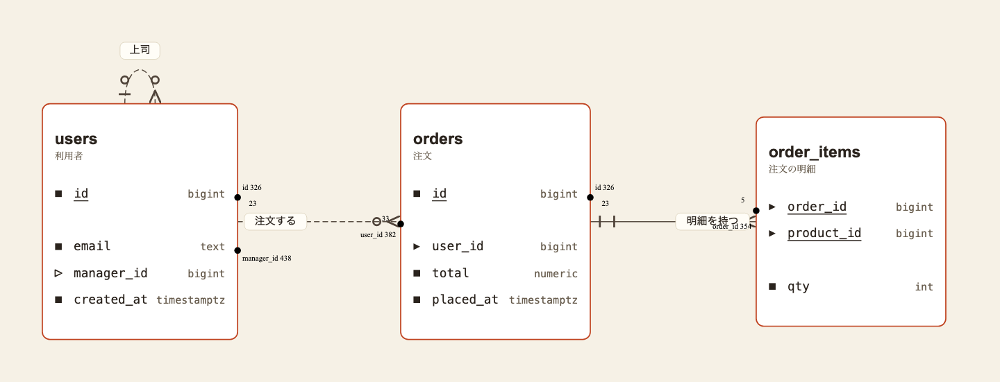

この 1 枚だけ空行をやめる前の engine で描いてある。
`users` の `id` の下に空行が入っているのが見分けで、上の測定値もその状態で取ったもの。
空行をやめた後は行の位置が上に詰まるので、測り直すと値が変わる。

`上司` のずれが大きいのは、自分への関係が箱の上を回るため。
線は箱の上端より上に出るので、鍵の行とは 310 離れる。
