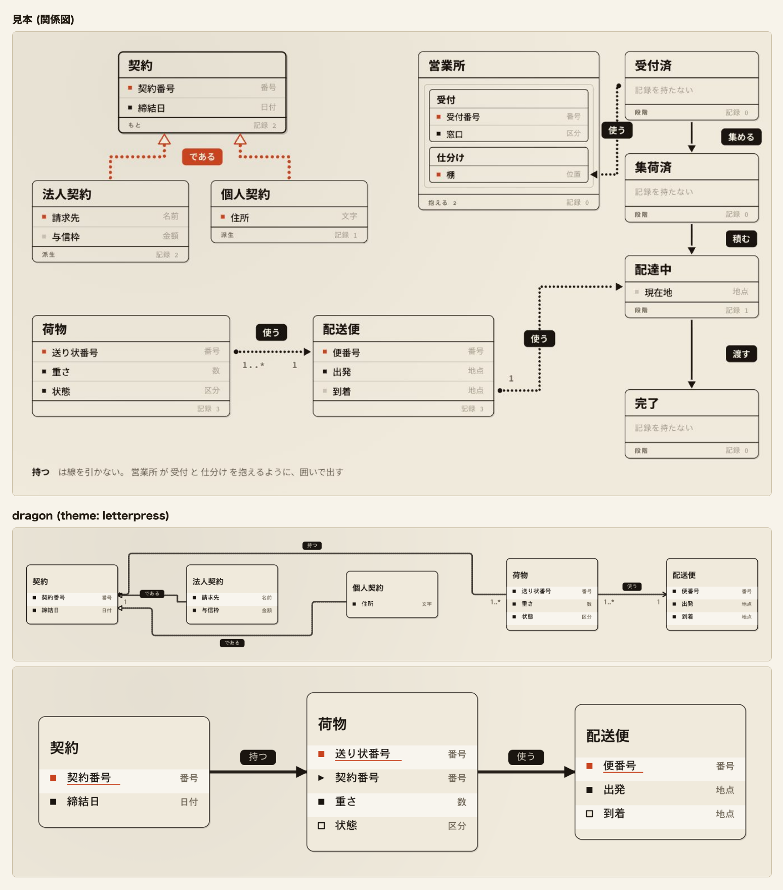
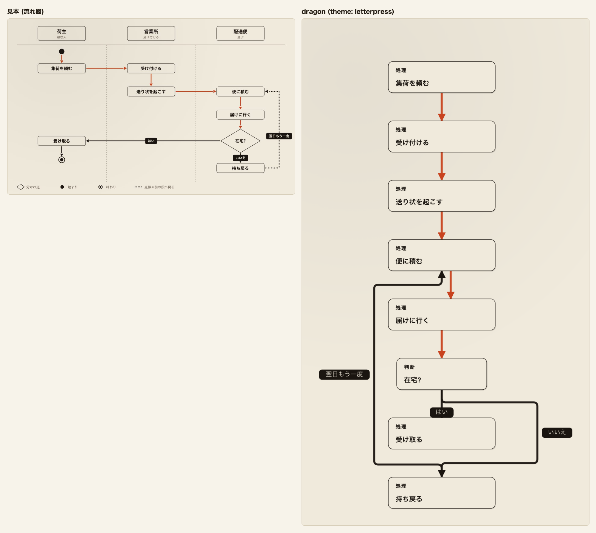
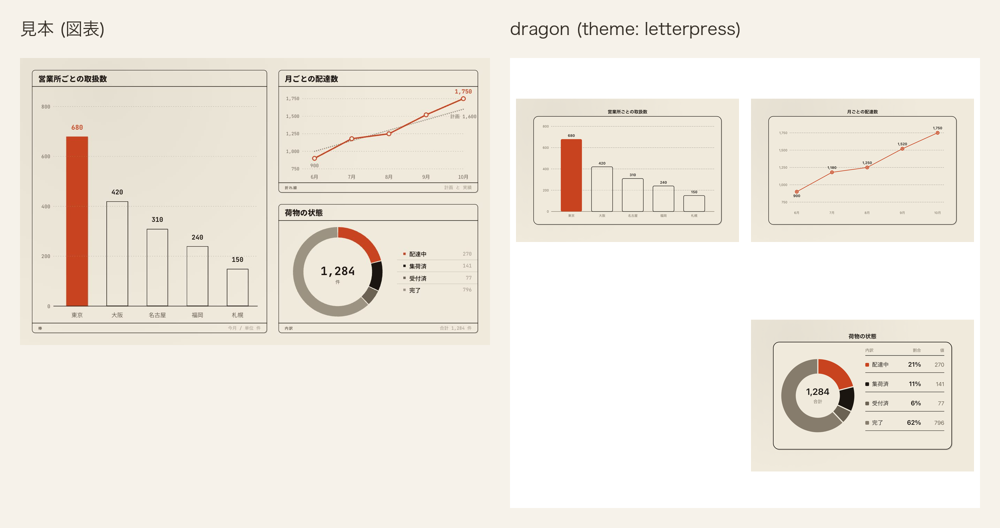

# 活版 (letterpress)

記法の一番上に `theme: letterpress` または `theme: 活版` と書く。`palette:` も `theme:` の別名として読む。

活版は地まで含めて 1 枚の絵として扱う。画面が暗い表示でも紙の地と色を替えない。朱は主役と鍵に
限り、字には使わない。

## 値

| 役       | 値        |
| -------- | --------- |
| 台       | `#f0eadc` |
| 行の面   | `#f0eadc` |
| 縞       | `#f8f5ee` |
| 枠       | `#1a1510` |
| 字       | `#1a1510` |
| 型名     | `#6b6253` |
| 線       | `#1a1510` |
| 所有     | `#1a1510` |
| 向きだけ | `#1a1510` |

### 色以外の値

| 役           | 値                                                                        |
| ------------ | ------------------------------------------------------------------------- |
| 地           | `#f0eadc`。見本の紙の地                                                   |
| 箱の面       | `#f0eadc`。地と同じ色で塗り、紙が続いて見える面                           |
| 墨           | `#1a1510`。枠、字、線、所有、向きだけに使う                               |
| 薄           | `#6b6253`。型名と控えめな字に使う                                         |
| 淡           | `#867c6c`。図表の 4 番目の系列だけに使う                                  |
| 一           | `#c8431f`。主役と鍵に限る朱                                               |
| 二           | `#1a1510`。返りと脇に使う墨                                               |
| 三           | `#1a1510`。移りに使う墨                                                   |
| 朱墨         | `#712c18`。朱と墨を半々に混ぜた色                                         |
| 朱淡         | `#b26b50`。朱と見本の淡を半々に混ぜた色                                   |
| 箱の枠       | 通常は 1.5、`data-cdl-active="true"` の箱は 3。どちらも墨                 |
| 枠の濃さ     | 1。通常の箱と強調の箱の両方。始まりと終わりの印、見せ方を持つ箱は除く     |
| 押し跡       | 通常は墨 14% の 2px、主役は墨 18% の 3px                                  |
| 地の模様     | 墨 5% の `radial-gradient(circle at 18% 12%, ..., transparent 60%)`       |
| 開始・終了   | 小見出しを含む外側の不透明度は 1                                          |
| 見出しの下線 | 表の箱の名前の下だけ 2.5。縦の区切りは変えない                            |
| 鍵           | 一。下線と同じ行の印に使う                                                |
| 札           | 墨の面に地の字。面のある札だけに当てる                                    |
| 単系列の棒   | `data-cdl-emphasis="primary"` の棒は一 `#c8431f`、それ以外は箱の面 `#f0eadc` に墨 `#1a1510` の 1.5 の枠。濃さは 1 |
| 動き         | 不透明度 0、拡大率 1.035 から版を押す。0.34s、`cubic-bezier(.2,.9,.28,1)` |
| 図表の系列色 | 1 = 一、2 = 墨、3 = 薄、4 = 淡、5 = 朱墨、6 = 朱淡                        |
| 日程の棒と漏斗の段   | 図表の系列色を色みの順に塗る。`accent` は 1、`teal` は 2、`success` は 3、`warning` は 4、`info` は 5、`error` は 6。濃さは 1。日程の帯は 1 を `#bc3f1d`、4 を `#71695b`、6 を `#985a43` へ同じ色相のまま深くし、他は系列色のまま。帯の上の担当の字は面 `#f0eadc` |

描き手は処理の箱の枠を半分の濃さで描く。台と箱の面が同じ活版でも枠の下限 4.61 を保つため、
固定の意匠では枠の濃さを 1 にする。

## 見送ったこと

- 見本は箱を塗らず地を透かしていた。行の面を地と同じ色で塗り、重なりや書き出し方に
  左右されず紙が続いて見える値にした。
- 見本に行の縞は無く、行の間を墨 26% の細い罫で分けていた。行を追う目印と札以外の面に
  要るため、地より明るい紙の色を縞として足した。
- 見本の型名は淡 `#9d9382` で、地の上の対比が 2.53 となり字の下限 4.5 を割る。型名は薄にした。
- 見本の淡は図形の下限 3 も割る。図表の系列 4 は色相を保った `#867c6c` に濃くした。
- 見本は継承の線と札の「である」を朱で刷っていた。朱を主役と鍵に限るため、継承は線の口の
  墨で描く。
- 見本は主役の線の札を朱の面に地の字で抜いていたが、対比は 4.09 となる。札は全て墨の面に
  地の字を置く。
- 見本は線を丸い点の連なりで刷っていた。dragon は実線と破線で関係の種類を分けるため、線の
  作りは変えない。
- 見本は箱を少しずつ遅らせて押し、行・線・札も後から順に出していた。段で同時に現れる箱どうしに
  記法に無い順序を足さず、箱を一斉に押す形だけにした。
- 見本の書体は太い題と等幅の型名を組み合わせていた。画面が同梱する 2 書体をそのまま使う。
- 見本の箱の角は 12px だった。図種ごとの形を保つため、描き手の角のままにする。
- 見本の図表に 5 色目と 6 色目は無い。墨と朱の 2 顔料から朱墨と朱淡を足した。

## 見本と並べる

[12 図種 × 7 意匠の見本を開く](../proposal/index.html)

dragon は `relation: extends` の 2 本 (である) を墨の線と白抜きの三角で描き、`composes` (持つ) と
`associates` (使う) も墨で描く。関係の 3 群を全て墨にしたのは、見本の二 (返り・脇) と三 (移り) が
使う墨に揃えたためで、見本で朱だった「である」が墨になる理由は「見送ったこと」にある。
札は墨の面に地の字を置く。

表の図では、`鍵` を書いた契約番号、送り状番号、便番号の行頭の印と名前の下線を朱で描く。
`外` を書いた荷物の契約番号の行頭は山形、`条件` を書いた状態と到着の行頭は中空の印で描き、
行は縞で 1 行おきに塗る。

図面の比較と同じ題材を使う。比べた記法は縦列 (`lane:`) と始まり・終わりの印を書いていないため、
上から下へ 1 列に並ぶ。
`role: main` を書いた 5 本 (集荷を頼む → 受け付ける → 送り状を起こす → 便に積む →
届けに行く → 在宅?) は一 (朱) で描き、見本の主役の道筋と揃える。
「はい」「いいえ」「翌日もう一度」は墨で描き、札は墨の面に地の字を置く。
箱は墨の 1.5 の枠に押し跡を付け、面は地と同じ色で塗る。

系列が 1 つの棒なので、最も大きい東京の棒を一 (朱) で塗り、他の棒は地の面に墨の 1.5 の枠で
描く。見本の主役の棒と同じ形になる。
内訳は、系列 1 から 4 を朱、墨、薄、淡の順で塗り、配達中、集荷済、受付済、完了を表す。
この並びは見本と同じで、見本の折れ線 (月ごとの配達数) は比べていない。

## 検査

- `apps/playground-spa/src/lib/theme-matches-note.test.ts` は「値」の 9 行と CSS の `--er-*`、
  「色以外の値」の一と `--cdl-now`、図表の系列色と 12 個の変数を突き合わせる。
  「枠の濃さ」と単系列の棒、固定の意匠だけに当たる CSS の決まりも突き合わせる。
- `apps/playground-spa/tests/theme-catalog.spec.ts` は単系列の棒の主役とそれ以外、全値が 0 以下の時に
  主役を持たないことを意匠帳の値と突き合わせる。
- `apps/playground-spa/tests/rendered-contrast.spec.ts` は 9 つの口と一を期待値にして、固定の意匠を
  全図種へ当てた時の舞台、主役、箱、線、文字の対比を明暗で調べる。箱の枠と線は色の alpha、
  `stroke-opacity` / `fill-opacity`、要素と祖先の `opacity` を重ねた実効の色で測り、強調の箱も含める。
- `apps/playground-spa/tests/theme-dark-ground.spec.ts` は台と舞台内の変数が画面の明暗で変わらない
  ことを固定の意匠ごとに調べる。
- `apps/playground-spa/tests/theme-appear.spec.ts` は箱が現れる時の動きと、動きを減らす時に止まることを
  固定の意匠ごとに調べる。
- `apps/playground-spa/tests/palette-switch.spec.ts` は切替で活版を選んだ舞台の地が「台」と一致する
  ことを、配色を持たない図と表の図で調べる。
