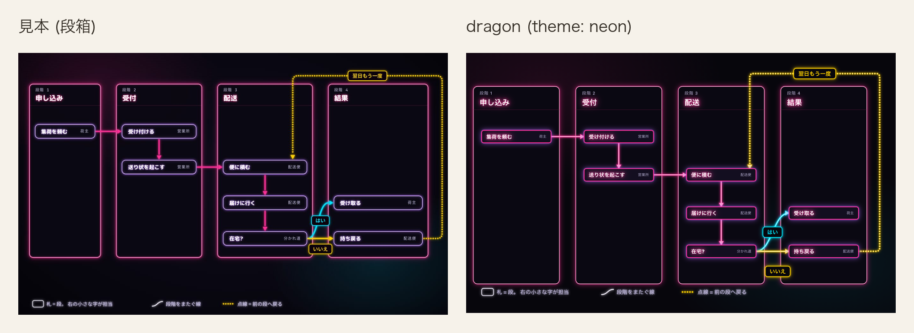
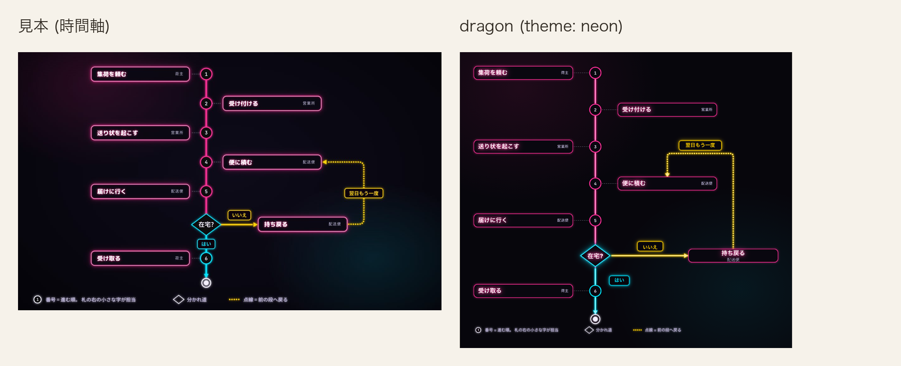

# 電飾 (neon)

記法の一番上に `theme: neon` または `theme: 電飾` と書く。`palette:` も `theme:` の別名として読み、
英字と和名のどちらも使える。

電飾は夜の壁に掛けたネオン管のように作る。枠も題も線も、白に近い芯の周りに色の光が
にじむ管で描く。地まで含めて 1 枚の絵として扱い、画面が暗い表示でも地と色を替えない。
台と面がどちらも暗く、同じ字と薄が両方の上で字の下限を満たすため、字は 1 組で持つ。

## 値

| 役       | 値        |
| -------- | --------- |
| 台       | `#07060c` |
| 行の面   | `#09070f` |
| 縞       | `#15131b` |
| 枠       | `#ff2e97` |
| 字       | `#f3eefe` |
| 型名     | `#c4bce0` |
| 線       | `#ff2e97` |
| 所有     | `#ffd000` |
| 向きだけ | `#00e5ff` |

### 路線図の色

| 役 | 値 |
|---|---|
| 路線図の本線 | `#ff2e97` |
| 路線図のはい | `#00e5ff` |
| 路線図のいいえ | `#ffd000` |
| 路線図の枝札の字 | `#07060c` |
| 路線図の駅の面 | `#09070f` |
| 路線図の駅名 | `#f3eefe` |
| 路線図の駅名の地 | `#07060c` |
| 路線図の始終点 | `#f3eefe` |
| 路線図の案内線 | `#c4bce0` |
| 路線図の名札の面 | `#0a0812` |
| 路線図の名札の枠 | `#a6f6ff` |
| 路線図の名札の名前 | `#ffffff` |
| 路線図の名札の補足 | `#c4bce0` |
| 路線図の菱形の面 | `#09070f` |
| 路線図の菱形の枠 | `#00e5ff` |
| 路線図の菱形の字 | `#f3eefe` |

路線図の名札の名前は、見本の `.ti` と同じ 800 で描く。

### 色以外の値

| 役           | 値                                                                                                             |
| ------------ | -------------------------------------------------------------------------------------------------------------- |
| 地           | `#07060c`                                                                                                       |
| 箱の面       | `#09070f`                                                                                                       |
| 字           | `#f3eefe`。中身の字、図表の系列 6                                                                             |
| 薄           | `#c4bce0`。型名と控えめな字、図表の系列 5                                                                      |
| 淡           | `#8f86b3`。単系列の主役でない棒と図表の系列 4。字には使わない                                             |
| 一           | `#ff2e97`。主役の桃。箱の枠、線、鍵、主役 (`--cdl-now`)、図表の系列 1                                      |
| 二           | `#00e5ff`。返りと脇の水色                                                                                     |
| 三           | `#ffd000`。移りの黄                                                                                         |
| 題           | `#ffffff`。箱の名前と図の題                                                                                   |
| 箱の枠       | 通常は一の 2、`data-cdl-active="true"` の箱は一の 3 と外光                                                   |
| 枠の濃さ     | 1。通常の箱と強調の箱の両方。始まりと終わりの印、見せ方を持つ箱は除く                                          |
| 路線図の線の濃さ | 1。見本の線路は透かさない                                                                                   |
| 管           | `#dragon-neon-tube` の filter。芯は管の色を 35%、白を 65% 混ぜた色で、周りに管の色の光がにじむ                    |
| 地のにじみ   | 左上に一 10%、右下に二 8% の放射状のにじみ                                                                        |
| 題の光       | 一の `drop-shadow(0 0 5px ...)` と一 60% の `drop-shadow(0 0 12px ...)`                                            |
| 題の太さ     | 800                                                                                                             |
| 札           | 面 `#09070f`。`accent` / `info` は一 `#ff2e97`、`success` は二 `#00e5ff`、`teal` / `error` / `warning` は三 `#ffd000` を枠・字・外光に使う。`data-cdl-edge-role="main"` は一。色みを持たない札は薄の枠と字の色 |
| 時間軸の線の札 | success 面 `#07060c`、error 面 `#07060c`、success 字 `#00e5ff`、error 字 `#ffd000`、success 枠 `#00e5ff`、error 枠 `#ffd000`、枠の太さ 2.5、角 9px、高さ 40px、字 21px、字の太さ 700 |
| 鍵           | 一。下線と同じ行の印に使う                                                                                  |
| 単系列の棒   | `data-cdl-emphasis="primary"` の棒は一 `#ff2e97` に一の光、それ以外は面 `#09070f` に淡 `#8f86b3` の 1 の枠。濃さは 1 |
| 書体         | 今の 2 書体のまま                                                                                                 |
| 動き         | 点く (下の「動き」)                                                                                                |
| 図表の系列色 | 1 = 一、2 = 二、3 = 三、4 = 淡、5 = 薄、6 = 字                                                                  |
| 発想の枝 | 4 本を系列 1 `#ff2e97`、2 `#00e5ff`、3 `#ffd000`、4 `#8f86b3` で描く |
| 折れ線 | 線と点を系列 1 の桃 `#ff2e97` で描く |
| 日程の棒と漏斗の段   | 図表の系列色を色みの順に塗る。`accent` は 1、`teal` は 2、`success` は 3、`warning` は 4、`info` は 5、`error` は 6。濃さは 1。日程の帯は系列色のまま。帯の上の担当の字は面 `#09070f` |
| 段階の列         | 面 `#0a0812`、枠 `#ffb6db` の 2、一の `0 0 2px` と一 55% の `0 0 10px` の光。列の角は 16px、札の角は 8px。札の枠は紫 `#b26bff` の 2、光も同じ紫 |
| 段階の見出し     | 番号 `#c4bce0`、名前 `#ffffff` に一の `0 0 5px` と一 60% の `0 0 12px` の光 |
| 札の右の字       | `#c4bce0` |
| 段の箱の線の札   | 線は主役と枝が 5、戻る点線が 6 の `0 9.6`、三角の矢じりが 17 × 19。台 `#07060c` の面。はいは二 `#00e5ff`、いいえ・翌日もう一度は三 `#ffd000` の字と 2.5 の枠、角 9px |
| 段の箱の凡例     | 「札 = 段。 右の小さな字が担当」は角丸枠、「段階をまたぐ線」は曲線、「点線 = 前の段へ戻る」は丸い点線。枠と曲線は `#f3eefe`、点線は `#ffd000`、字は `#c4bce0` |

宅配の見本は、棒・円・半円・升目・内訳帯に `tone` を書かず、系列色順に任せる。発想の 4 本の枝は意匠側で系列 1 から 4、折れ線の線と点は系列 1 に固定する。日程だけは設計・棚・試験を `accent`、調査・端末を `info` とし、`ticks` で 6 月から 10 月を明示して設計を含む帯の端を見本の月内位置に書く。

## 管と光

`#dragon-neon-tube` は `filterUnits="userSpaceOnUse"`、領域 `x="-10%"` / `y="-10%"` /
`width="120%"` / `height="120%"`、色の計算は `sRGB` の filter とする。外接矩形の幅または高さが 0 の
直線でも管を残すため、filter の領域は舞台の座標から取る。

1 段目の `feColorMatrix` は入力の不透明度に依らず、`0.6 × (R + G + B) − 0.2` で明るい画素だけを
`tube` へ残す。台と面は落ち、一・二・三と芯は残る。`tube` を標準偏差 5 の `haze` と 1.5 の
`halo` へぼかし、`feMorphology` の `erode` を半径 0.5 で掛けた `thin` を作る。

2 段目の `feColorMatrix` は `thin` の各成分を 35% 残し、白を 65% 足して `core` を作る。
`feMerge` は `haze` / `halo` / `SourceGraphic` / `core` の順に重ね、元の枠と線の色を意匠帳の
一・二・三のまま残す。

管は見せ方と印を持たない箱の輪郭を描く図形と、`edge-line` / `sequence-line` / `tree-edge` /
`mind-edge` に当てる。字を子に持つ `g` と `text` には当てず、芯と光で字の輪郭をぼかさない。

札には管の filter を当てず、枠の色の `drop-shadow` を外へだけ重ねる。内側へにじむ光を札の字の下へ
入れないことで、一・二・三の字と暗い面の対比を保つ。

路線図の `#dragon-metro-neon-glow` は、見本の SVG 全体の光と同じく `SourceGraphic` を標準偏差 1.5 と
5 でぼかし、5、1.5、元の図の順に重ねる。
線路の組、案内線、駅、始終点、分かれ道は、平行移動を持たない外箱へ
`filterUnits="userSpaceOnUse"` の `-3%` / `106%` の領域で当てる。
枝の札は同じ二段の光を持つ別の filter とし、札自身の外接矩形を基準に左右 10%、上下 50% の余白を取る。
高さ 36 の札では上下 18 となり、標準偏差 5 の 3 倍に当たる 15 より広い。
路線図の線と分かれ道からは `#dragon-neon-tube` を外し、本線 `#ff2e97`、はい `#00e5ff`、
いいえ `#ffd000` の芯を白へ寄せない。
名札は今の芯と外光を保つ。

## 動き

箱は不透明度 0 から 0.9s、`linear` で点ける。不透明度は 0% で 0、9% で .85、13% で .12、
21% で 1、25% で .35、33% で 1、100% で 1 とし、何度かちらついてから残る。

線は箱が点き終えた 0.9s 後から 0.7s、`cubic-bezier(.3, 0, .2, 1)` で左からの切り抜きを開く。
線の長さを書き換えないため、実線と破線を保ったまま管の光が残る。動きを減らす設定では箱と線の動きを止める。

## 見送ったこと

この節には見本にあって dragon が描かない飾りだけを書き、描いているが形や値を見本から変えた所は次の節に書く。

- 見本の題の丸ゴシック (`M PLUS Rounded 1c` の 800) は、書体を足さず、今の書体の 800 の太さと一の光で代える。
  新しい書体を同梱すると全ての意匠の読み込みが重くなり、和字の幅も変わって描き手が測った箱の大きさとずれるため。

## 見本から変えたこと

- 見本は箱の役 (段階は黄、実体と抱える箱は水色、入れ子の箱は紫) で管の色を変える。描き手は箱に役を印として
  出さないため、全ての箱を一の管にした。線と札は見本と同じく関係の種類で一・二・三に分ける。
- 見本の管の芯は枠の色そのもの (`color-mix(... 35%, white)`) だった。dragon は枠と線の色を意匠帳の一・二・三のまま残し、
  検査と強調の色が読めるようにして、同じ混ぜ方の芯を filter で上に重ねた。
- 見本の内側へのにじみは `inset` の影だった。SVG の図形は内側の影を持てないため、filter で管から内外の両方へにじませる。
- 見本の型名は `#bdb5dc` だが、Issue が決めた薄 `#c4bce0` にそろえた。淡は字に使わない。
- 見本に行の縞は無い。行を追う目印のため、面に字を 5% 混ぜた縞を足した。
- 見本の内訳は 4 色。5 色目と 6 色目は Issue の 8 値から薄と字を当て、混ぜた色を足していない。
- 見本の札は図全体の光の下にあり、内側にも光が入る。内側の光は一の字の対比を削るため、札は外へだけ光らせた。
- 見本の棒は 18% の淡い面に管の枠を持つ。dragon は主役の棒を一と一の光で塗り、他を暗い面に淡の細い枠で描く。
- 見本の関係の線は丸い点の連なりだった。dragon が関係の種類を表す実線と破線をそのまま使う。
- 見本は線を `stroke-dashoffset` で端から伸ばす。実線と破線を保つため、左からの切り抜きで現す。
- 見本は箱を 1 枚ずつ、行を 1 行ずつずらして点ける。段で同時に現れる物へ記法に無い順序を足さない。
- 見本の地は `#0e0b1a` から `#040308` への暗がり。Issue が地を `#07060c` の 1 色に決めたので、暗がりは付けず、桃と水色のにじみだけを重ねた。

## 見本と並べる

[12 図種 × 7 意匠の見本を開く](../proposal/index.html)

dragon のクラス図には、契約、法人契約、個人契約、荷物、配送便を並べる。
`relation: extends` の 2 本 (である) は一の線と白抜きの三角と一の札、`composes` (持つ) は三の線と三の札、
`associates` (使う) は二の線と二の札で描く。線は白に近い芯の周りに線の色の光がにじむ管になる。
5 つの箱は強調しないので、一の 2 の管の枠で描き、箱の名前は題の白に一の光を重ねる。

表の図では、`鍵` を書いた契約番号、送り状番号、便番号の行頭の印と名前の下線を一で描く。
`外` を書いた荷物の契約番号は行頭を山形にし、`条件` を書いた状態と到着には中空の印を置く。
行は 1 行おきに縞で塗る。関係の線は 1 種類なので一で、札も枠と字を一にして外へだけ光らせる。

比べた記法には縦列 (`lane:`) と始まり・終わりの印を書いていないので、dragon の流れ図は上から下へ 1 列に並ぶ。
`role: main` を書いた 5 本は一の管。「はい」 (`success`) は二、「いいえ」と「翌日もう一度」 (`error`) は三の管で、
札の枠と字もその色にする。箱の名前は題の白に一の光を重ねる。

右は、見本帳の段の箱に使った宅配の筋書きの記法から `animation:` を外して描いた静止図で、見本帳では
段ごとの動きにより描く側が過ぎた線を淡い破線にするため、静止図の見本と並べる時は動きを外した。
段階の列と見出しを管の光で描き、線の札は暗い台へ線と同じ色の枠と字を置いて見本へ揃えた。
列 3 と列 4 の間が広いこと、「翌日もう一度」が札の上辺から出ること、「いいえ」の札の下端が列の
下端に接すること、見出しの名前の字が小さいことは描く側が決めるため、dragon では見本に揃えていない。

比較画像は動きを外した同じ記法を使い、1800 幅の見本と dragon をともに 940 / 1800 倍で並べた。
最後の「受け取る」と「持ち戻る」も、他の札と同じ静止した枠で撮っている。

dragon は軸と番号の縁を一の `--er-line`、「はい」を二の `--er-link`、終わりの印を字の `--er-ink` で描く。
線の札は高さ 40・角 9・21 の太字とし、地 `#07060c` の面に、「はい」は二 `#00e5ff`、他の 2 枚は三 `#ffd000` の 2.5 の枠・字・外光を置く。分かれ道は面 `#09070f`、二の 3 の縁と同色の光で描く。
戻る線は太さ 6・丸い線端・`0 9.6` の点列とし、軸と「はい」は 6、「いいえ」は 5、補助線は 2、番号の縁は 4、終わりの外輪は 3.5 で描く。
図の下には、番号・分かれ道・戻る点線を説明する凡例を見本と同じ順で描く。
札の題は 25px・800、分かれ道は 124 × 92、「在宅?」は 26px に揃えた。「いいえ」の札の下端は横線から 20 離している。
札と軸の間は見本の 70 に対して 96、丸 6 と終わりの印の間は見本の 105 に対して 120 のまま残る。どちらも cdl の近接の下限に由来する。
「持ち戻る」が軸から 396 離れる点は `cardene777/cdl#1031`、担当の位置は `cardene777/cdl#1032`、残る線上の札の押し出しは `cardene777/cdl#1039` に対応する。

単系列の棒は、最も大きい東京を一と一の光で塗り、他を暗い面に淡の細い枠で描く。
内訳は系列 1 から 4 を一・二・三・淡で塗る。図表の枠は箱と同じ一の管で描き、図の題は題の白に一の光を重ねる。
折れ線には 5 か月の配達実績を載せ、3 種の図表の光を一度に比べる。

営業所の木と再配達を減らす枝を上下に置き、暗がりの管と字のにじみを比べる。

6 種の数の図を 3 列 2 段に並べ、一・二・三・淡の光の読み分けを比べる。

仕分け棚の工程と荷主の気持ちを上下に置き、時間軸と感情の光り方を比べる。

## 検査

- `apps/playground-spa/src/lib/theme-matches-note.test.ts` は「値」の 9 行、一、題、図表の系列色、枠の濃さを
  CSS と突き合わせ、路線図の線の濃さと、字と系列色の対比を測る。
- `apps/playground-spa/tests/rendered-contrast.spec.ts` は電飾を全図種へ当てた時の色、箱と線、文字の対比を
  明暗で調べ、意匠ごとの適用数、測れた図種、違反、地の集合を出す。
- `apps/playground-spa/tests/neon-theme.spec.ts` は filter の段と芯、箱と線の管、字に管が届かないこと、
  題、地のにじみ、札、鍵、単系列の棒を調べる。
- `apps/playground-spa/tests/theme-catalog.spec.ts` は線の色みごとの札と単系列の棒を意匠帳の値と突き合わせる。
- `apps/playground-spa/tests/theme-dark-ground.spec.ts` は台と舞台内の変数が画面の明暗で変わらないことを調べる。
- `apps/playground-spa/tests/theme-appear.spec.ts` は箱と線が開いた時だけ動き、動きを減らす設定で止まることを調べる。
- `apps/playground-spa/tests/editor-initial-animation.spec.ts` は最後の段まで進んでも箱と線がそれぞれ 1 回だけ動くことを調べる。
- `apps/playground-spa/tests/palette-switch.spec.ts` は配色の無い図と表の図で電飾の札が 1 件ずつ並び、押すと舞台の地が「台」になることを調べる。
