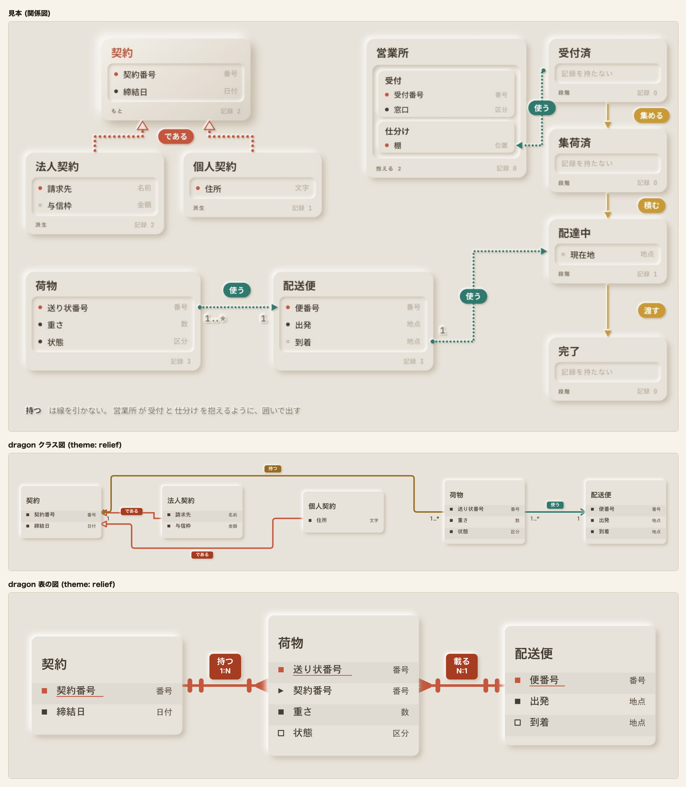
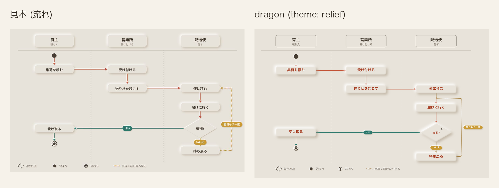
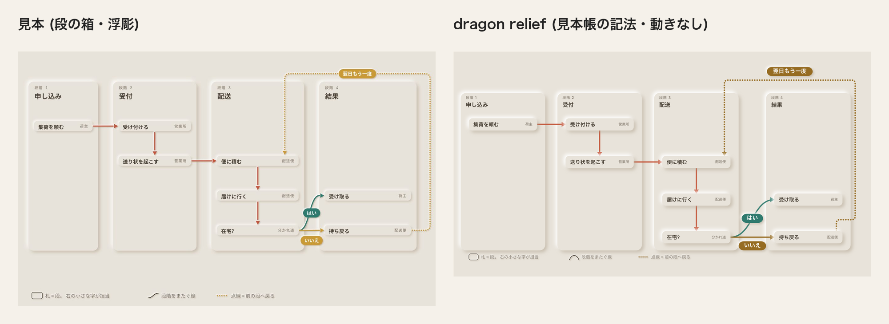
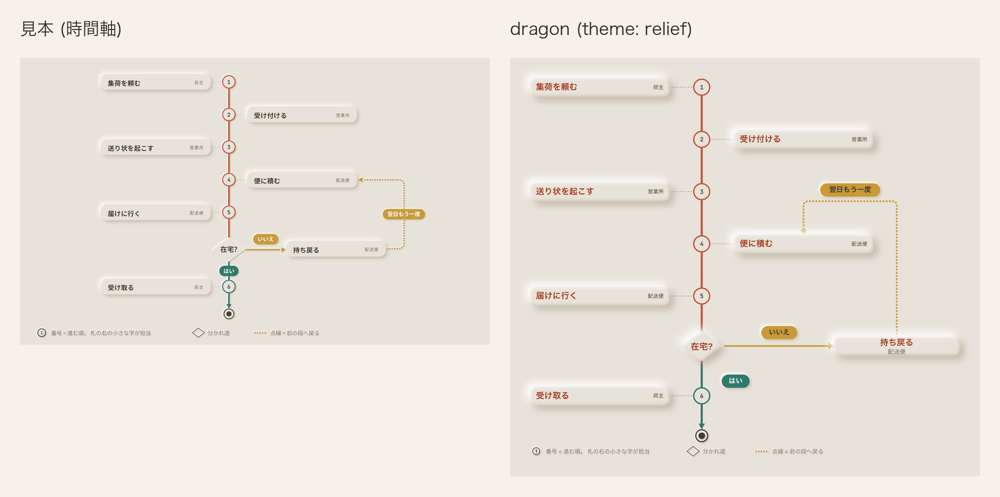
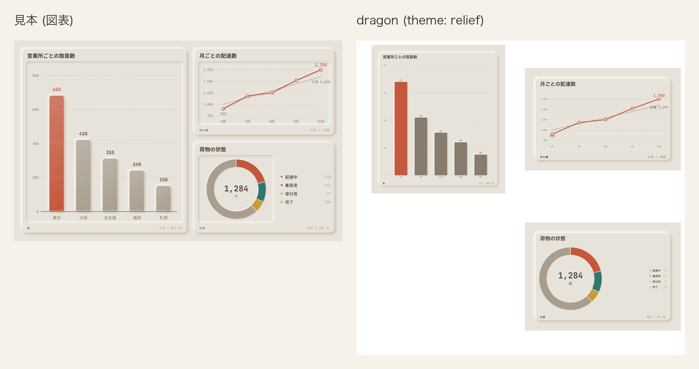
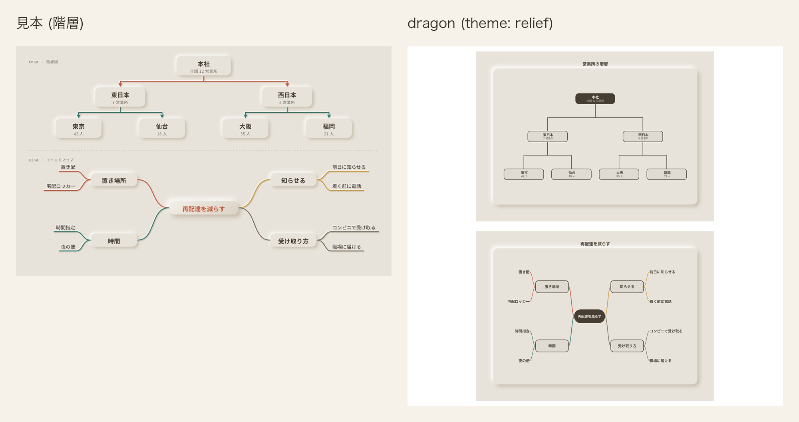
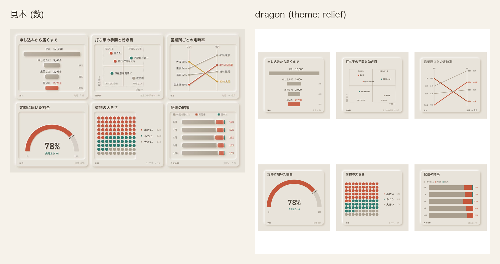
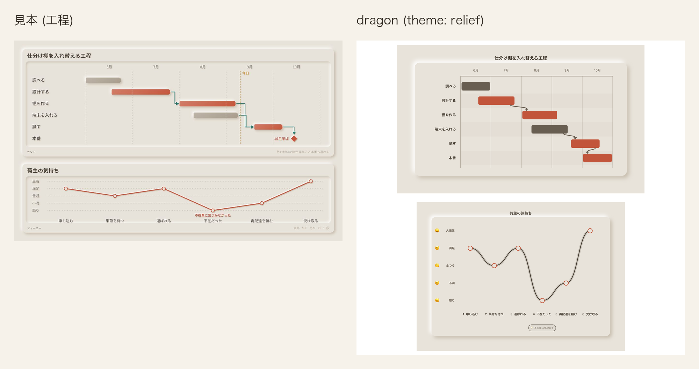
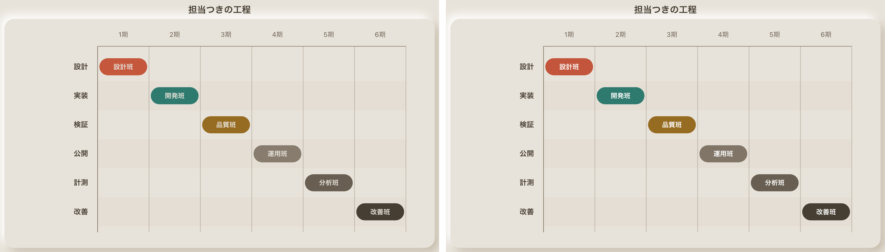
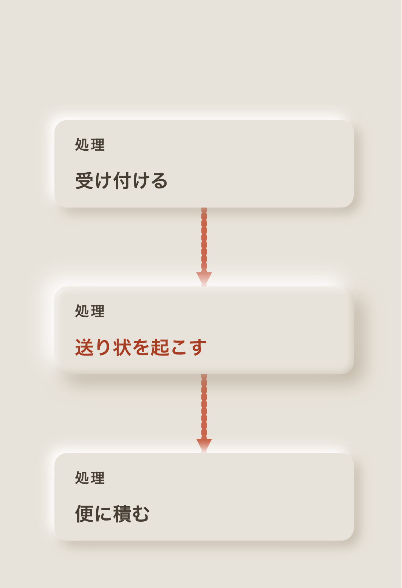

# 浮彫 (relief)

記法の一番上に `theme: relief` または `theme: 浮彫` と書く。`palette:` も `theme:` の別名として読み、
英字と和名のどちらも使える。

浮彫は砂色の平らな地に、地と同じ色の板を光と影だけで浮かせる。地まで含めて 1 枚の絵として扱い、
画面の明暗で地と色を替えない。

## 値

| 役       | 値        |
| -------- | --------- |
| 台       | `#e8e3da` |
| 行の面   | `#e8e3da` |
| 縞       | `#e0dbd2` |
| 枠       | `#463e33` |
| 字       | `#463e33` |
| 型名     | `#685e51` |
| 線       | `#c4573c` |
| 所有     | `#966c22` |
| 向きだけ | `#2f7a6e` |

### 路線図の色

| 役 | 値 |
|---|---|
| 路線図の本線 | `#c4573c` |
| 路線図のはい | `#2f7a6e` |
| 路線図のいいえ | `#c99a35` |
| 路線図の枝札の字 | `#ffffff` |
| 路線図の駅の面 | `#e8e3da` |
| 路線図の駅名 | `#463e33` |
| 路線図の駅名の地 | `#e8e3da` |
| 路線図の始終点 | `#463e33` |
| 路線図の案内線 | `#7a7062` |
| 路線図の名札の面 | `#e8e3da` |
| 路線図の名札の枠 | `#e8e3da` |
| 路線図の名札の名前 | `#463e33` |
| 路線図の名札の補足 | `#6e6456` |
| 路線図の菱形の面 | `#e8e3da` |
| 路線図の菱形の枠 | `#e8e3da` |
| 路線図の菱形の字 | `#463e33` |

名札の補足は見本の `#7a7062` では面との対比が 3.80 のため、同じ色相の `#6e6456` へ寄せる。

### 色以外の値

| 役           | 値 |
| ------------ | -- |
| 地           | `#e8e3da` |
| 箱の面       | `#e8e3da` |
| 墨           | `#463e33`。中身の字と箱の名前、図表の系列 6 |
| 薄           | `#685e51`。型名と控えめな字、図表の系列 5。見本の `#7a7062` を濃くした |
| 淡           | `#877c6d`。単系列の主役でない棒、図表の系列 4、箱の中の区切りの線。字には使わない。見本の `#a99e8e` を濃くした |
| 一           | `#c4573c`。赤土。線、鍵、主役 (`--cdl-now`)、図表の系列 1。字には使わない |
| 二           | `#2f7a6e`。青緑。向きだけの線 |
| 三           | `#966c22`。黄土。所有の線。見本の `#c99a35` を濃くした |
| 題           | `#a63c21`。主役の箱の名前と、一の札の面。一を濃くした |
| 白           | `#ffffff`。色みを持つ札の太字と影の明るい側 |
| 縁線         | なし。箱の輪郭は板の影で出す |
| 枠の濃さ     | 1。縁線は引かないが、固定の意匠の決まりに揃える |
| 路線図の線の濃さ | 1。見本の線路は透かさない |
| 関係の線の濃さ | 1。一は台との対比が 3.44 なので、透かさず線の下限 3 を保つ |
| 板の影       | `7px 7px 15px rgba(160,144,120,.5)` と `-7px -7px 15px #fff`。標準偏差はぼかしの半分の 7.5 |
| 主役         | `12px 12px 24px rgba(160,144,120,.55)` と `-12px -12px 24px rgba(255,255,255,.95)`。内側は左上の縁に白 .75、右下の縁に `rgb(160,144,120)` .32。反転した alpha は白側へ 3px 右下、暗色側へ 3px 左上にずらし、標準偏差 4 でにじませる |
| 窪み         | 外は板の影と同じ。輪郭から内側へ 14px 縮め、`5px 5px 11px rgba(160,144,120,.42)` と `-5px -5px 11px rgba(255,255,255,.88)` を縮めた形の内側だけへにじませる。標準偏差は 5.5 |
| 小さな板     | `4px 4px 9px rgba(160,144,120,.45)` と `-4px -4px 9px rgba(255,255,255,.9)`。標準偏差は 4.5 |
| 札           | `accent` / `info` は一 `#a63c21`、`success` は二 `#2f7a6e`、`teal` / `error` / `warning` は三 `#966c22` の面。`data-cdl-edge-role="main"` は一。字 `#ffffff` は白の太字。色みを持たない札は箱の面で小さく浮かせ、字は墨 |
| 時間軸の線の札 | success 面 `#2f7a6e`、error 面 `#c99a35`、success 字 `#ffffff`、error 字 `#383838`、success 枠 `none`、error 枠 `none`、枠の太さ 0、角 20px、高さ 40px、字 21px、字の太さ 700 |
| 鍵           | 一。下線と同じ行の印に使う |
| 単系列の棒   | `data-cdl-emphasis="primary"` の棒は一 `#c4573c`、それ以外は淡 `#877c6d`。どちらも小さく浮かせる |
| 書体         | 今の 2 書体のまま |
| 動き         | 浮き出る (下の「動き」) |
| 図表の系列色 | 1 = 一、2 = 二、3 = 三、4 = 淡、5 = 薄、6 = 墨 |
| 発想の枝 | 4 本を系列 1 `#c4573c`、2 `#2f7a6e`、3 `#966c22`、4 `#7a7062` で描く。枝箱の枠は枠の色 1 色 |
| 階層の木 | 枝箱の枠は枠の色 1 色。左帯と分岐点の丸は描かない |
| ジャーニー | 段の帯と縦区切りは描かない。点は系列 1 の一重円にし、内側の点は描かない |
| 四象限 | 区画の地は塗らず、左上は系列 1、右上と左下は系列 2、右下は淡 `#a99e8e`。区画名は型名、十字と外枠は `4 4` の点線 |
| 升目 | `chart-waffle-cell` は丸 |
| 折れ線 | 線と点を系列 1 の赤 `#c4573c` で描く |
| 傾き図 | 名古屋 (`accent`) は赤 `#c4573c`、大阪 (`error`) は黄土 `#966c22`、tone の無い東京と福岡は灰 `#685e51` |
| 日程の棒と漏斗の段   | 図表の系列色を色みの順に塗る。`accent` は 1、`teal` は 2、`success` は 3、`warning` は 4、`info` は 5、`error` は 6。濃さは 1。日程の帯は 1 を `#c2553b`、4 を `#807567` へ同じ色相のまま深くし、他は系列色のまま。帯の上の担当の字は白 `#ffffff` |
| 日程の帯の角 | 5px |
| 段階の列         | 面 `#e8e3da`、枠なし、`url(#dragon-relief-raised)` の板の影。列の角は 22px、札の角は 14px |
| 段階の見出し     | 番号 `#685e51`、名前 `#463e33` |
| 札の右の字       | `#685e51` |
| 段の箱の線の札   | 線は主役と枝が 5、戻る点線が 6 の `0 9.6`、三角の矢じりが 17 × 19。はいは二 `#2f7a6e`、いいえ・翌日もう一度は三 `#966c22` の面。字は白 `#ffffff`、角 20px、枠なし |
| 段の箱の凡例     | 「札 = 段。 右の小さな字が担当」は角丸枠、「段階をまたぐ線」は曲線、「点線 = 前の段へ戻る」は丸い点線。枠と曲線は `#463e33`、点線は `#966c22`、字は `#7a7062` |

宅配の見本は、棒・円・半円・升目・内訳帯に `tone` を書かず、系列色順に任せる。発想の枝は最初の 3 本を系列 1 から 3、4 本目を見本の薄い字の色にし、折れ線の線と点は系列 1 に固定する。日程だけは設計・棚・試験を `accent`、調査・端末を `info` とし、`ticks` で 6 月から 10 月を明示して設計を含む帯の端を見本の月内位置に書く。

## 影と窪み

4 つの filter は全て `filterUnits="userSpaceOnUse"`、領域 `x="-10%"` / `y="-10%"` /
`width="120%"` / `height="120%"`、`colorInterpolationFilters="sRGB"` とする。小さい箱で影を切らず、
幅または高さが 0 の図形でも filter の領域を舞台から取るため。

`#dragon-relief-raised` は `SourceAlpha` から暗い影と明るい影を独立に作る。暗い影は
`feOffset dx="7" dy="7"`、`feGaussianBlur stdDeviation="7.5"`、`feFlood flood-color="rgb(160,144,120)" flood-opacity=".5"`。
明るい影は `feOffset dx="-7" dy="-7"`、`feGaussianBlur stdDeviation="7.5"`、
`feFlood flood-color="#ffffff" flood-opacity="1"` とし、元の図形の下へ敷く。

`#dragon-relief-dome` の外の暗い影は `feOffset dx="12" dy="12"`、`feGaussianBlur stdDeviation="12"`、
`feFlood flood-color="rgb(160,144,120)" flood-opacity=".55"`。明るい影は `feOffset dx="-12" dy="-12"`、
`feGaussianBlur stdDeviation="12"`、`feFlood flood-color="#ffffff" flood-opacity=".95"` とする。
内側の縁は `SourceAlpha` を反転して切る。白側の反転 alpha を `feOffset dx="3" dy="3"` で右下へ
ずらすと左上の内縁が白くなり、暗色側を `feOffset dx="-3" dy="-3"` で左上へずらすと右下の内縁が
`rgb(160,144,120)` .32 になる。標準偏差 4 でにじませる。3px と 4 は、題の暗い側を覆わず、
小さい主役でも丸い盛り上がりが残る幅として選んだ。面の塗りは箱の面のまま変えない。

`#dragon-relief-well` は外側に `#dragon-relief-raised` と同じ影を置く。輪郭を 14px 内側へ縮めた形へ、
暗い側を `feOffset dx="5" dy="5"`、`feGaussianBlur stdDeviation="5.5"`、
`feFlood flood-color="rgb(160,144,120)" flood-opacity=".42"`、明るい側を
`feOffset dx="-5" dy="-5"`、`feGaussianBlur stdDeviation="5.5"`、
`feFlood flood-color="#ffffff" flood-opacity=".88"` でにじませる。縮めた形を反転してぼかした後、
縮めた形自身で `operator="in"` の切り抜きを掛けるため、左上の暗い縁と右下の明るい縁は縮めた形の
内側だけに残り、板の縁との間には足されない。14px は目盛りと棒へ窪みの縁を重ねず、図表の内側が
一段沈んで見える余白として選んだ。

`#dragon-relief-raised-sm` の暗い影は `feOffset dx="4" dy="4"`、
`feGaussianBlur stdDeviation="4.5"`、`feFlood flood-color="rgb(160,144,120)" flood-opacity=".45"`。
明るい影は `feOffset dx="-4" dy="-4"`、`feGaussianBlur stdDeviation="4.5"`、
`feFlood flood-color="#ffffff" flood-opacity=".9"` とする。

路線図の `#dragon-metro-relief-shadow` は、見本の SVG 全体の陰と同じく `SourceAlpha` を標準偏差 2 で
ぼかす。
暗い側は `dx="2.5"` / `dy="2.5"`、`rgb(160,144,120)` の .55、明るい側は `dx="-2"` /
`dy="-2"`、白の .95 とする。
線路の組、案内線、駅、始終点、分かれ道は、平行移動を持たない外箱へ
`filterUnits="userSpaceOnUse"` の `-3%` / `106%` の領域で当てる。
枝の札は同じ陰を持つ別の filter とし、札自身の外接矩形を基準に左右 10%、上下 50% の余白を取る。
高さ 36 の札では上下に 18 を取り、ぼかしとずらしを札の端で切らない。
名札は今の板の陰を保ち、分かれ道からは板の filter を外す。

板の filter は見せ方と印を持たない箱の輪郭だけへ当てる。主役は dome、図表は主役でも well を優先する。
直下の子が全て `circle` の `g` は、重なった円の和を 1 つの輪郭として `g` に 1 回だけ当て、中の円には
当てない。`path` と `ellipse` を持つ database は、上面の楕円が自分の影で縁を見せるよう個別に当てる。
小さな板は札の面と図表の棒へ当てる。見出しの帯、行の縞、区切り、印、字を含む `g`、線には当てない。
線へ filter を当てないのは、直線の外接矩形の幅または高さが 0 になる形で線が消えるため。

## 動き

箱は不透明度 0、拡大率 .94 から 0.6s、`cubic-bezier(.3, 1.25, .5, 1)` で浮き出る。
線は箱が浮き出た 0.6s 後から 0.7s、`cubic-bezier(.35, 0, .25, 1)` で左から現す。
実線と破線を保つため、線の長さではなく左からの切り抜きを使う。段で同時に現れる物へ記法に無い順序を足さない。

## 図種ごとに確かめる所

意匠帳から導いた全図種で、`node-body` の輪郭に縁線が無く、面が箱の面であることを測る。
通常の箱は raised、主役は dome、図表は well が計算後の filter に現れることを調べる。
線は一・二・三・墨のどれかで、filter を持たないことを調べる。札と棒は raised-sm、図表の内側は well の
縮めた窪みを持ち、字や目盛りを含む祖先には filter が届かないことを調べる。

## 見送ったこと

この節には見本にあって dragon が描かない飾りだけを書き、描いているが形や値を見本から変えた所は次の節に書く。

- 見本は箱の中の行の並びを 1 つの窪みに収める。dragon の描き手 (cdl) は行の並びを 1 つの要素として描かず、
  1 行おきの縞だけを別の要素にするため、行の窪みは描かない。縞で行を追う目印は残す。

## 見本から変えたこと

- 主役の題は見本の `#c4573c` (台の上で 3.44) から、同じ色相で濃くした `#a63c21` にした。
  箱の名前は大きな字の閾値に届かず、字の下限 4.5 が要るため。一 `#c4573c` は線・鍵・主役・図表の系列 1 にそのまま使う。
- 見本の薄 `#7a7062` (3.80)・淡 `#a99e8e` (2.06)・三 `#c99a35` (2.01) は、それぞれ字の 4.5、
  系列色の 3、線の 3 と白の字の 4.5 を満たすよう `#685e51`・`#877c6d`・`#966c22` へ同じ色相で濃くした。
- 見本の型名は淡だが、字の下限を満たすため薄 `#685e51` にした。淡は字に使わない。
- 見本の板の影は CSS の `box-shadow`。SVG の図形は `box-shadow` を持たないため、同じ値の影を filter で作った。
  ぼかし 15px は標準偏差 7.5 とした。
- 見本の主役の膨らみは面の `linear-gradient`。共通の検査が面の色を箱の面と突き合わせるため、
  面は箱の面のまま、内側の明暗を filter でにじませた。
- 見本の図表は板の中に窪んだ枠を別に置く。dragon の図表の箱は 1 つの図形なので、同じ図形から
  内側へ縮めた窪みを filter で作った。
- 一の札は白の字が 4.5 を満たすよう題で塗った。一 `#c4573c` の上の白は 4.40。
- 見本に行の縞は無い。行を追う目印のため、地に墨を 5% 混ぜた縞を足した。
- 見本は図全体に浅い浮きを掛け、線と札も浮かせる。dragon は線に影を付けない。直線の外接矩形の扱いによる。
- 見本の関係の線は丸い点の連なり。dragon が関係の種類を表す実線と破線をそのまま使う。
- 見本の関係の線は透過を足さない。台との対比が 3.44 の一へ共通の濃さ .8 / .85 を掛けると線の下限 3 を
  割るため、浮彫だけ関係の線の濃さを 1 にした。
- 見本は線を `stroke-dashoffset` で端から伸ばす。実線と破線を保つため、左からの切り抜きで現す。
- 見本は箱を 1 枚ずつ、行を 1 行ずつずらして浮かせる。段で同時に現れる物へ記法に無い順序を足さない。
- 見本の板の角は 22px。dragon は描き手の丸みのまま。

## 見本と並べる

[12 図種 × 7 意匠の見本を開く](../proposal/index.html)

dragon のクラス図には、契約、法人契約、個人契約、荷物、配送便を並べる。
`relation: extends` の 2 本 (である) は一の線と白抜きの三角、`composes` (持つ) は三の線、
`associates` (使う) は二の線で描く。札はそれぞれ題・三・二で塗り、字を白の太字にして小さく浮かせる。
5 つの箱は強調しないので、どれも縁線の無い板を右下の暗い影と左上の白い影で浮かせる。

表の図では、`鍵` を書いた契約番号、送り状番号、便番号の行頭の印と名前の下線を一で描く。
`外` を書いた荷物の契約番号は行頭を山形にし、`条件` を書いた状態と到着には中空の印を置く。
行は 1 行おきに縞で塗る。関係の線は 1 種類なので一で、札は題で塗って字を白の太字にする。

比べた記法には縦列 (`lane:`) と始まり・終わりの印を書いていないので、dragon の流れ図は上から下へ 1 列に並ぶ。
`role: main` を書いた 5 本は一の線。「はい」 (`success`) は二、「いいえ」と「翌日もう一度」 (`error`) は三の線で、
札もその色で塗って字を白の太字にする。

右は、見本帳の段の箱に使った宅配の筋書きの記法から `animation:` を外して描いた静止図で、見本帳では
段ごとの動きにより描く側が過ぎた線を淡い破線にするため、静止図の見本と並べる時は動きを外した。
段階の列を浮いた板にし、見出し、担当の字、線の札を見本から調整した色へ揃えた。
列 3 と列 4 の間が広いこと、「翌日もう一度」が札の上辺から出ること、「いいえ」の札の下端が列の
下端に接すること、見出しの名前の字が小さいことは描く側が決めるため、dragon では見本に揃えていない。

比較画像は動きを外した同じ記法を使い、1800 幅の見本と dragon をともに 940 / 1800 倍で並べた。
最後の「受け取る」と「持ち戻る」も、他の札と同じ静止した枠で撮っている。

dragon は軸と番号の縁を一の `--er-line`、「はい」を二の `--er-link`、終わりの印を墨の `--er-ink` で描く。
線の札は高さ 40・角 20・21 の太字とし、「はい」を二 `#2f7a6e`、他の 2 枚を見本の黄土 `#c99a35` の面で描く。黄土の札の字は見本の白では対比が 2.57 のため、黒側へ最小限寄せた `#383838` で 4.55 を保つ。
戻る線は太さ 6・丸い線端・`0 9.6` の点列とし、軸と「はい」は 6、「いいえ」は 5、補助線は 2、番号の縁は 4、終わりの外輪は 3.5 で描く。
図の下には、番号・分かれ道・戻る点線を説明する凡例を見本と同じ順で描く。
札の題は 25px・700、分かれ道は 124 × 92、「在宅?」は 26px に揃えた。「いいえ」の札の下端は横線から 20 離している。
札と軸の間は見本の 70 に対して 96、丸 6 と終わりの印の間は見本の 105 に対して 120 のまま残る。どちらも cdl の近接の下限に由来する。
「持ち戻る」が軸から 396 離れる点は `cardene777/cdl#1031`、担当の位置は `cardene777/cdl#1032`、残る線上の札の押し出しは `cardene777/cdl#1039` に対応する。

単系列の棒は、最も大きい東京を一、他を淡で塗り、どちらも小さな板として浮かせる。
内訳は系列 1 から 4 を一・二・三・淡で塗る。図表の板は外を浮かせ、14px 内側から窪ませる。
折れ線には 5 か月の配達実績を載せ、3 種の図表の凹凸を一度に比べる。

営業所の木と再配達を減らす枝を上下に置き、浮いた板と窪んだ線を比べる。

6 種の数の図を 3 列 2 段に並べ、板・窪み・色面の使い分けを比べる。

仕分け棚の工程と荷主の気持ちを上下に置き、帯と感情札の浮き方を比べる。

日程の帯の上の担当の字は、札の字と同じ白 `#ffffff` で書く。板の面 `#e8e3da` の字では系列 1 から 4 が 3.20 から 3.98 しか出ず、
白でも系列 1 の一 `#c4573c` が 4.40、系列 4 の淡 `#877c6d` が 4.09 で字の下限 4.5 を割る。
そこで日程の帯だけ、系列 1 を `#c2553b`、系列 4 を `#807567` へ同じ色相のまま深くして 4.51 にした。

見本の関係図で主役の契約は、面の明暗で丸く盛り上がる。dragon では段の `focus:` が当たった箱が主役で、
外の影を 12 に広げ、内側の左上の縁を白く、右下の縁を暗くして膨らませる。箱の名前は題で描く。
比べた 3 枚の記法には段が無く主役が出ないため、主役だけを別に写した。

## 検査

- `apps/playground-spa/src/lib/theme-matches-note.test.ts` は「値」の 9 行、一、図表の系列色、枠の濃さ、
  縁線、路線図の線の濃さを CSS と共通検査へ突き合わせる。
- `apps/playground-spa/tests/rendered-contrast.spec.ts` は固定の意匠を全図種へ当て、浮彫では縁線が無いことと
  面、線、文字の対比を明暗で調べる。
- `apps/playground-spa/tests/relief-theme.spec.ts` は全図種の地・板・線・対比、4 つの filter、主役、札、
  棒、鍵、初期の動きを調べる。filter の値と札の対比はこの意匠帳から読む。
- `apps/playground-spa/tests/theme-catalog.spec.ts` は線の色みごとの札と単系列の棒を意匠帳の値と突き合わせる。
- `apps/playground-spa/tests/theme-dark-ground.spec.ts` は台と舞台内の変数が画面の明暗で変わらないことを調べる。
- `apps/playground-spa/tests/theme-appear.spec.ts` は箱と線が開いた時だけ動き、動きを減らす設定で止まることを調べる。
- `apps/playground-spa/tests/palette-switch.spec.ts` は切替で浮彫を選んだ舞台の地が「台」と一致することを、
  配色を持たない図と表の図で調べる。
