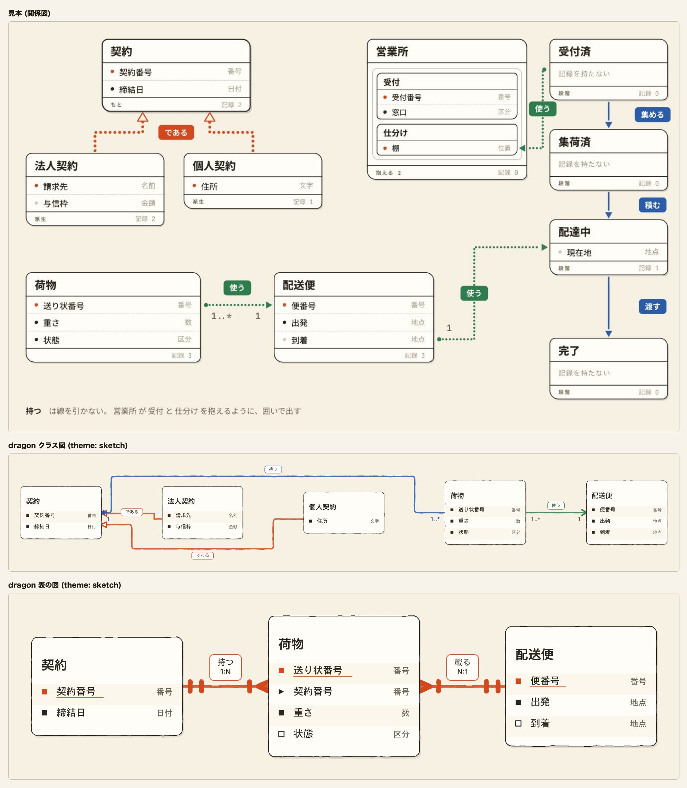
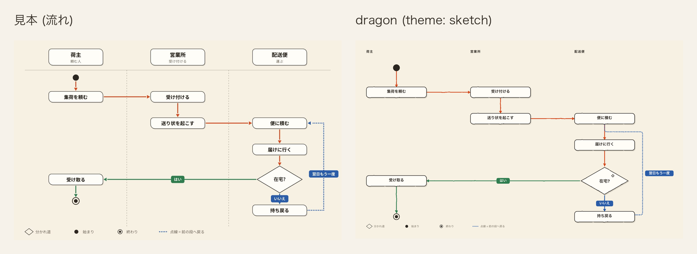
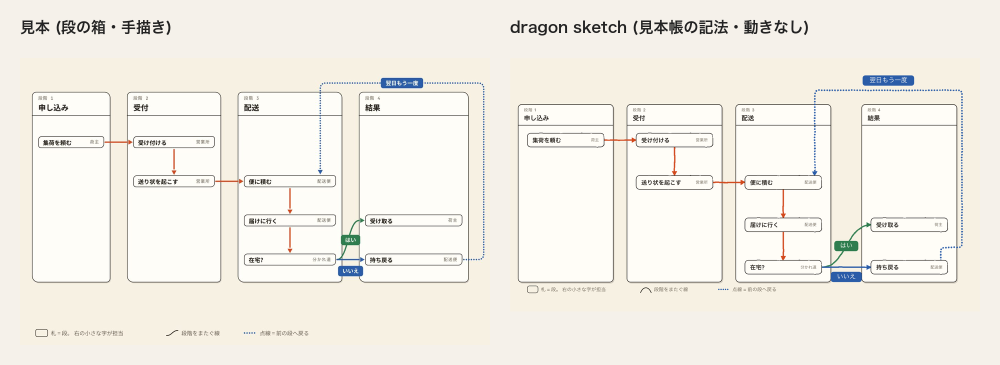
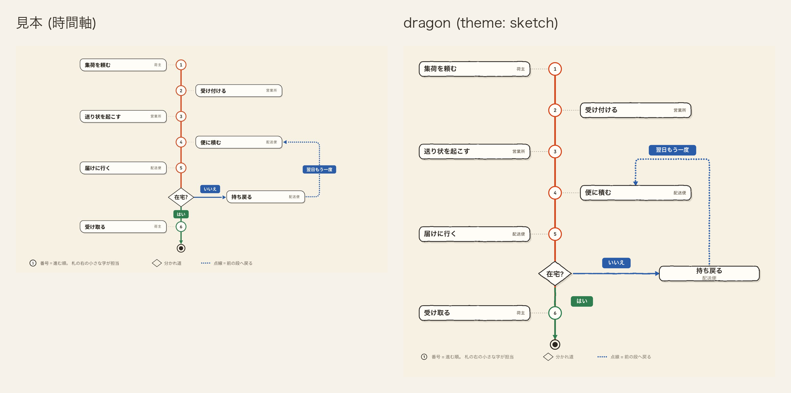
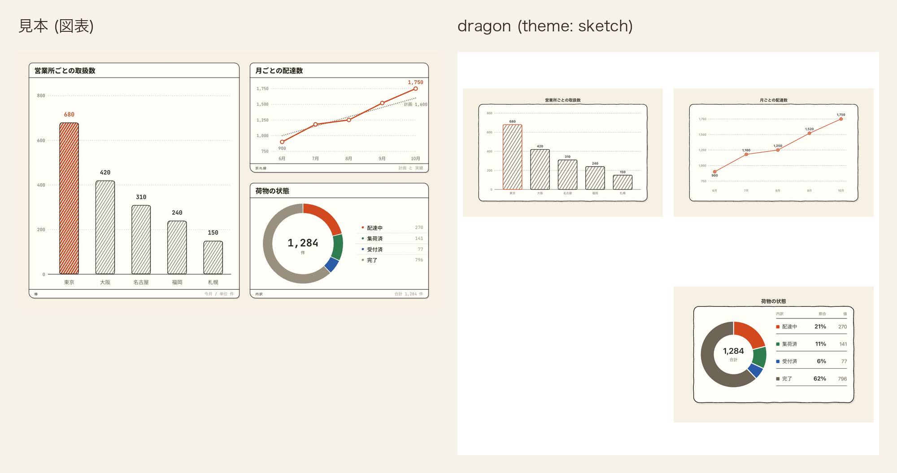
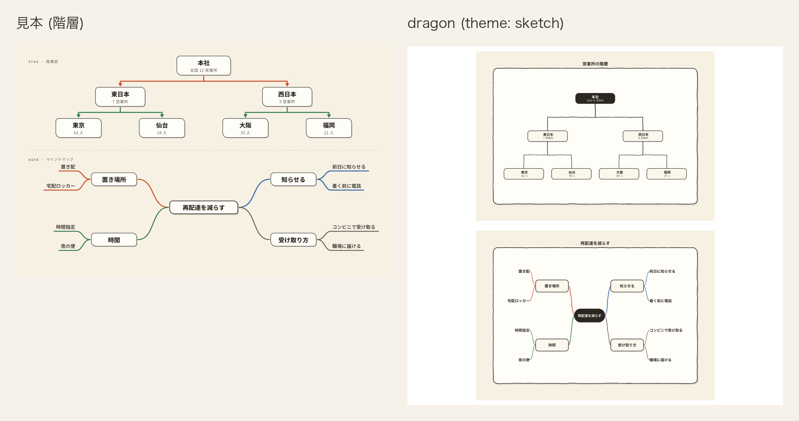
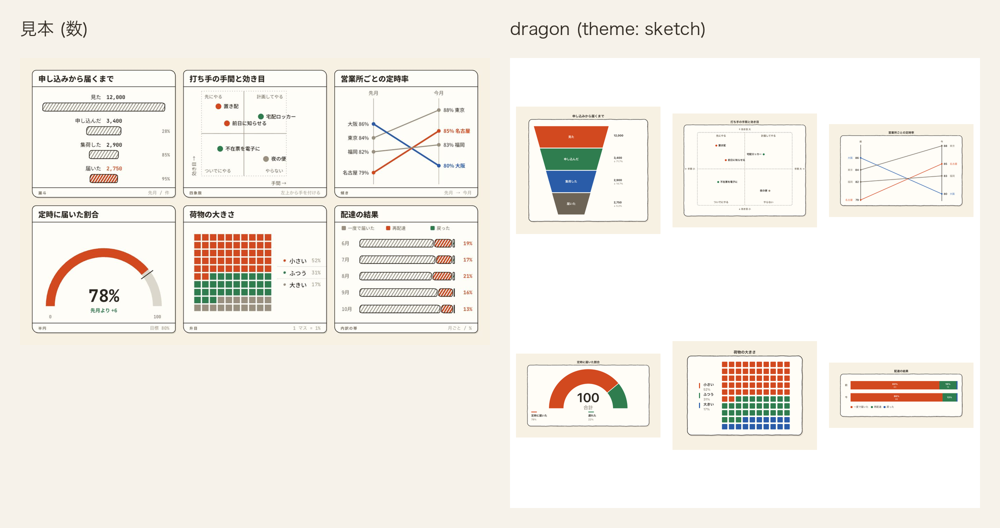
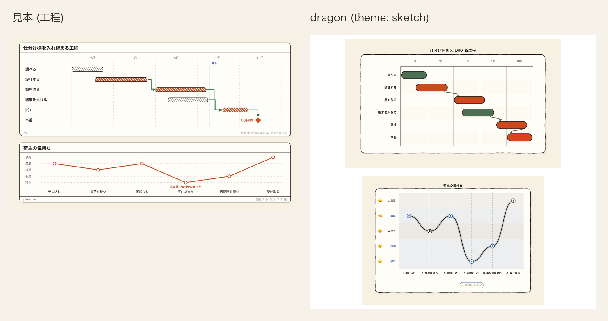
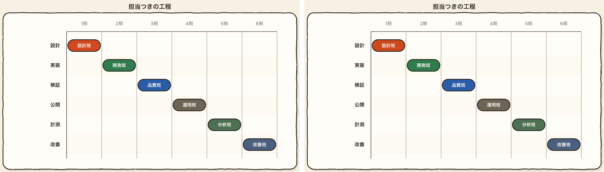

# 手描き (sketch)

記法の一番上に `theme: sketch` または `theme: 手描き` と書く。`palette:` も `theme:` の別名として読み、
英字と和名のどちらも使える。

手描きは地まで含めて 1 枚の絵として扱い、画面が暗い表示でも生成りの地と色を替えない。台と面が
どちらも明るく、同じ墨と薄が両方の上で字の下限を満たすため、字は 1 組で持つ。

## 値

| 役       | 値        |
| -------- | --------- |
| 台       | `#f7f1e3` |
| 行の面   | `#fffdf7` |
| 縞       | `#fbf7ed` |
| 枠       | `#2b2620` |
| 字       | `#2b2620` |
| 型名     | `#6d6456` |
| 線       | `#d2491f` |
| 所有     | `#2a5ca8` |
| 向きだけ | `#2f7d4f` |

### 路線図の色

| 役 | 値 |
|---|---|
| 路線図の本線 | `#d2491f` |
| 路線図のはい | `#2f7d4f` |
| 路線図のいいえ | `#2a5ca8` |
| 路線図の枝札の字 | `#fffdf7` |
| 路線図の駅の面 | `#fffdf7` |
| 路線図の駅名 | `#2b2620` |
| 路線図の駅名の地 | `#f7f1e3` |
| 路線図の始終点 | `#2b2620` |
| 路線図の案内線 | `#6d6456` |
| 路線図の名札の面 | `#fffdf7` |
| 路線図の名札の枠 | `#2b2620` |
| 路線図の名札の名前 | `#2b2620` |
| 路線図の名札の補足 | `#6d6456` |
| 路線図の菱形の面 | `#fffdf7` |
| 路線図の菱形の枠 | `#2b2620` |
| 路線図の菱形の字 | `#2b2620` |

路線図の名札は墨 `#2b2620` の 2px の枠と、右へ 3px・下へ 4px ずらした墨 16% の影を持つ。
名札には揺らぎの filter を当てず、名前は見本の `.ti` と同じ 800 で描く。

### 色以外の値

| 役           | 値                                                                                                      |
| ------------ | ------------------------------------------------------------------------------------------------------- |
| 地           | `#f7f1e3`                                                                                                |
| 箱の面       | `#fffdf7`                                                                                                |
| 墨           | `#2b2620`。中身の字と箱の枠                                                                              |
| 薄           | `#6d6456`。型名と控えめな字、図表の系列 4                                                                |
| 淡           | `#9a9080`。ペンの斜線。地との対比 2.79 のため字と系列色には使わない                                      |
| 一           | `#d2491f`。主役の朱。字には使わない                                                                      |
| 二           | `#2f7d4f`。返りと脇の緑                                                                                  |
| 三           | `#2a5ca8`。移りの青                                                                                      |
| 濃二         | `#4e7052`。二と薄を半々に混ぜた色                                                                        |
| 濃三         | `#4b607f`。三と薄を半々に混ぜた色                                                                        |
| 箱の枠       | 通常は墨の 2、`data-cdl-active="true"` の箱は墨の 3                                                     |
| 枠の濃さ     | 1。通常の箱と強調の箱の両方。始まりと終わりの印、見せ方を持つ箱は除く                                   |
| 路線図の線の濃さ | 1。見本の線路は透かさない                                                                               |
| 箱の影       | 墨 16% を右へ 3px・下へ 4px ずらした影。強調の箱は墨 20% を 4px・5px                                    |
| 箱の角       | 描き手の丸み (`rx="16"`) のまま                                                                         |
| 線の揺れ     | `#dragon-sketch-wobble` の filter                                                                        |
| ペンの斜線   | `#dragon-sketch-pen` の模様                                                                               |
| 札           | 面 `#fffdf7` に字 `#2b2620`。`accent` / `info` は一 `#d2491f`、`success` は二 `#2f7d4f`、`teal` / `error` / `warning` は三 `#2a5ca8` の枠。`data-cdl-edge-role="main"` は一。色みを持たない札は墨の枠。枠の太さ 2 |
| 時間軸の線の札 | success 面 `#2f7d4f`、error 面 `#2a5ca8`、success 字 `#fffdf7`、error 字 `#fffdf7`、success 枠 `none`、error 枠 `none`、枠の太さ 0、角 9px、高さ 40px、字 21px、字の太さ 700 |
| 鍵           | 一。下線と同じ行の印に使う                                                                               |
| 単系列の棒   | `data-cdl-emphasis="primary"` の棒は一の朱 `#d2491f` のペン斜線 `#dragon-sketch-pen-primary` に一 `#d2491f` の 2 の枠、それ以外は淡のペン斜線 `#dragon-sketch-pen` に墨 `#2b2620` の 2 の枠。濃さは 1 |
| 書体         | 画面が持つ 2 書体のまま                                                                                  |
| 動き         | 描く (下の「動き」)                                                                                      |
| 図表の系列色 | 1 = 一、2 = 二、3 = 三、4 = 薄、5 = 濃二、6 = 濃三                                                      |
| 発想の枝 | 4 本を系列 1 `#d2491f`、2 `#2f7d4f`、3 `#2a5ca8`、4 `#6d6456` で描く。枝箱の枠は枠の色 1 色 |
| 階層の木 | 枝箱の枠は枠の色 1 色。左帯と分岐点の丸は描かない |
| ジャーニー | 段の帯と縦区切りは描かない。点は系列 1 の一重円にし、内側の点は描かない |
| 四象限 | 区画の地は塗らず、左上は系列 1、右上と左下は系列 2、右下は淡 `#9a9080`。区画名は型名、十字と外枠は `4 4` の点線 |
| 折れ線 | 線と点を系列 1 の朱 `#d2491f` で描く |
| 傾き図 | 名古屋 (`accent`) は朱 `#d2491f`、大阪 (`error`) は青 `#2a5ca8`、tone の無い東京と福岡は灰 `#6d6456` |
| 日程の棒と漏斗の段   | 図表の系列色を色みの順に塗る。`accent` は 1、`teal` は 2、`success` は 3、`warning` は 4、`info` は 5、`error` は 6。濃さは 1。日程の棒は墨 `#2b2620` の 2 の枠で囲む。日程の帯は 1 を `#ce481e` へ同じ色相のまま深くし、他は系列色のまま。帯の上の担当の字は面 `#fffdf7` |
| 日程の帯の角 | 2px |
| 段階の列         | 面 `#fffdf7`、枠は墨 `#2b2620` の 2、墨 16% を右へ 3px・下へ 4px ずらした影。列の角は 12px、札の角は 12px。札は揺らすが影を付けない |
| 段階の見出し     | 番号 `#6d6456`、名前 `#2b2620` |
| 札の右の字       | `#6d6456` |
| 段の箱の線の札   | 線は主役と枝が 5、戻る点線が 6 の `0 9.6`、三角の矢じりが 17 × 19。はいは二 `#2f7d4f`、いいえ・翌日もう一度は三 `#2a5ca8` の面。字は行の面 `#fffdf7`、角 9px、枠なし |
| 段の箱の凡例     | 「札 = 段。 右の小さな字が担当」は角丸枠、「段階をまたぐ線」は曲線、「点線 = 前の段へ戻る」は丸い点線。枠と曲線は `#2b2620`、点線は `#2a5ca8`、字は `#6d6456` |

宅配の見本は、棒・円・半円・升目・内訳帯に `tone` を書かず、系列色順に任せる。発想の枝は最初の 3 本を系列 1 から 3、4 本目を見本の薄い字の色にし、折れ線の線と点は系列 1 に固定する。日程だけは設計・棚・試験を `accent`、調査・端末を `info` とし、`ticks` で 6 月から 10 月を明示して設計を含む帯の端を見本の月内位置に書く。

## 線の揺れとペンの斜線

`#dragon-sketch-wobble` は `filterUnits="userSpaceOnUse"`、領域 `x="-10%"` / `y="-10%"` /
`width="120%"` / `height="120%"` の filter とする。`feTurbulence` は `fractalNoise`、
`baseFrequency="0.03"`、2 octave、seed 7 とし、`feDisplacementMap` は scale 3 で R と G を使う。
`userSpaceOnUse` にするのは、幅または高さが 0 の直線でも filter の領域を舞台から取って線を残すため。

揺れは見せ方と印を持たない箱の輪郭だけと、`edge-line` / `sequence-line` / `tree-edge` /
`mind-edge` に当てる。字を含む `g` と `text` には当てず、箱の中身を読める形に保つ。

`#dragon-sketch-pen` は 10 × 10 の `userSpaceOnUse` の模様を 32 度回し、淡の 3px の `rect` を
10px おきに置く。隙間は塗らず、下の地を透かす。模様は `sequence-band` と図表の `chart-bar` に
当てる。日程の `gantt-bar` は図表の系列色で塗る (#2801)。

## 動き

箱は不透明度 0、拡大率 .95 から 0.4s、`cubic-bezier(.2, 1.5, .42, 1)` で描き、終わりで少し
行き過ぎて戻る。線は箱を描き終えた 0.4s 後から 0.36s、`cubic-bezier(.2, .85, .3, 1)` で
左から一息に現す。実線と破線を保つため、線の長さではなく左からの切り抜きを使う。

## 見送ったこと

- 箱ごとに違う角の丸みは、見本では四隅を `16px 22px 15px 24px` などに変えていた。SVG の
  `rect` は `rx` / `ry` の 1 組しか持てず、描き手の箱は kind により `rect` / `path` / `ellipse`
  と形も変わるため、描き手の丸みのまま揃える。
- 箱の傾きは、見本では並びの番号 (`--i`) に応じて少しずつ変えていた。描き手は並びの番号を
  印に出さないため CSS から別々の角度を決められず、全てを同じ角度にすると図全体が傾いて見え、
  線の端も箱の縁からずれるため傾けない。
- 見本の型名は淡だが、面の上で 3.09 となり字の下限 4.5 を割るため薄にした。
- 見本に行の縞は無く、行の間を点線で区切っていた。面と地を半々に混ぜた縞を足し、行の区切りは
  描き手の線のままにする。
- 見本の内訳の 4 色目は淡だが、地の上で 2.79 となり系列色の下限 3 を割るため薄にした。
  5 色目と 6 色目は見本に無いため濃二と濃三を足した。
- 見本の札は線の色で塗った面に面の色の字を置く。一の面の上で 4.38 となり字の下限 4.5 を割るため、
  面に墨の字で書き、枠を線の色にした。
- 見本は工程の主役の棒を一の濃い斜線で塗る。dragon の日程の棒は主役を見分ける印を持たないため、
  系列色で塗り、墨の 2 の枠で囲む (#2801)。
- 見本は線を `stroke-dashoffset` で端から伸ばす。実線と破線を保つため、左からの切り抜きで現す。
- 見本は箱を 1 枚ずつ、行を 1 行ずつずらして出す。段で同時に現れる物へ記法に無い順序を足さない。
- 見本は図表の主役の棒を一の斜線で塗る。#2794 で置いたペンの斜線を全ての棒に当て、主役は一の枠で
  見分ける。一の色の模様をもう 1 つ定義しない (#2801)。

## 見本と並べる

[12 図種 × 7 意匠の見本を開く](../proposal/index.html)

dragon のクラス図には、契約、法人契約、個人契約、荷物、配送便を並べる。
`relation: extends` の 2 本 (である) は一の線と白抜きの三角、`composes` (持つ) は三の線、
`associates` (使う) は二の線で描き、札は面に墨の字で枠をその線の色にする。線の両端の数も線の色で描く。
5 つの箱は強調しないので、墨の 2 の枠と右下へずらした影で描き、輪郭をわずかに揺らす。

表の図では、`鍵` を書いた契約番号、送り状番号、便番号の行頭の印と名前の下線を一で描く。
`外` を書いた荷物の契約番号は行頭を山形にし、`条件` を書いた状態と到着には中空の印を置く。
行は 1 行おきに縞で塗る。関係の線は 1 種類なので一で、札の枠も一にする。

比べた記法には縦列 (`lane:`) と始まり・終わりの印を書いていないので、dragon の流れ図は上から下へ 1 列に並ぶ。
`role: main` を書いた 5 本は一。「はい」 (`success`) は二、「いいえ」と「翌日もう一度」 (`error`) は三の線で、
札の枠もその色にする。線は箱と同じ filter でわずかに揺れ、実線のまま描く。

右は、見本帳の段の箱に使った宅配の筋書きの記法から `animation:` を外して描いた静止図で、見本帳では
段ごとの動きにより描く側が過ぎた線を淡い破線にするため、静止図の見本と並べる時は動きを外した。
段階の列を手描きの紙と枠で囲み、見出し、担当の字、線の札を見本の値へ揃えた。
列 3 と列 4 の間が広いこと、「翌日もう一度」が札の上辺から出ること、「いいえ」の札の下端が列の
下端に接すること、見出しの名前の字が小さいことは描く側が決めるため、dragon では見本に揃えていない。

比較画像は動きを外した同じ記法を使い、1800 幅の見本と dragon をともに 940 / 1800 倍で並べた。
最後の「受け取る」と「持ち戻る」も、他の札と同じ静止した枠で撮っている。

dragon は軸と番号の縁を一の `--er-line`、「はい」を二の `--er-link`、終わりの印を墨の `--er-ink` で描く。
線の札は高さ 40・角 9・21 の太字とし、「はい」を二 `#2f7d4f`、他の 2 枚を三 `#2a5ca8` の面にして、字は箱の面 `#fffdf7` で描く。
戻る線は太さ 6・丸い線端・`0 9.6` の点列とし、軸と「はい」は 6、「いいえ」は 5、補助線は 2、番号の縁は 4、終わりの外輪は 3.5 で描く。
図の下には、番号・分かれ道・戻る点線を説明する凡例を見本と同じ順で描く。
札の題は 25px・800、分かれ道は 124 × 92、「在宅?」は 26px に揃えた。「いいえ」の札の下端は横線から 20 離している。進行の線を揺れから外したため、軸との重なりにも段差がない。
札と軸の間は見本の 70 に対して 96、丸 6 と終わりの印の間は見本の 105 に対して 120 のまま残る。どちらも cdl の近接の下限に由来する。
「持ち戻る」が軸から 396 離れる点は `cardene777/cdl#1031`、担当の位置は `cardene777/cdl#1032`、残る線上の札の押し出しは `cardene777/cdl#1039` に対応する。

単系列の棒は全てペンの斜線で塗り、最も大きい東京を一の 2 の枠、他を墨の 2 の枠で描く。
内訳は系列 1 から 4 を一・二・三・薄で塗る。見本の 4 色目の淡は地との対比が足りないため薄を使う。
図表の枠は箱と同じ墨の揺れる枠と影で描き、折れ線には 5 か月の配達実績を載せる。

営業所の木と再配達を減らす枝を上下に置き、手描きの輪郭と接続線を比べる。

6 種の数の図を 3 列 2 段に並べ、斜線と揺れる枠の使い分けを比べる。

仕分け棚の工程と荷主の気持ちを上下に置き、帯・節目・感情の手描き感を比べる。

日程の帯の上の担当の字は面 `#fffdf7` で書く。系列 1 の一 `#d2491f` の上では 4.38 で字の下限 4.5 を割るため、
日程の帯だけ同じ色相のまま `#ce481e` へ深くして 4.52 にした。他の系列は 4.95 以上あるので系列色のまま。

## 検査

- `apps/playground-spa/src/lib/theme-matches-note.test.ts` は「値」の 9 行、一、図表の系列色、枠の濃さを
  CSS と突き合わせ、路線図の線の濃さと、字と系列色の対比を測る。
- `apps/playground-spa/tests/rendered-contrast.spec.ts` は固定の意匠を全図種へ当てた時の色、箱と線、
  文字の対比を明暗で調べる。
- `apps/playground-spa/tests/sketch-theme.spec.ts` は同じ全図種の検査に加え、固定の地、初期の動き、
  filter と模様の個数、箱と線の揺れ、字へ揺れが届かないこと、斜線、札、鍵、単系列の棒を調べる。
- `apps/playground-spa/tests/theme-catalog.spec.ts` は線の色みごとの札と単系列の棒を意匠帳の値と突き合わせる。
- `apps/playground-spa/tests/theme-dark-ground.spec.ts` は台と舞台内の変数が画面の明暗で変わらないことを調べる。
- `apps/playground-spa/tests/theme-appear.spec.ts` は箱と線が開いた時だけ動き、動きを減らす設定で止まることを調べる。
- `apps/playground-spa/tests/palette-switch.spec.ts` は切替で手描きを選んだ舞台の地が「台」と一致することを、
  配色を持たない図と表の図で調べる。
