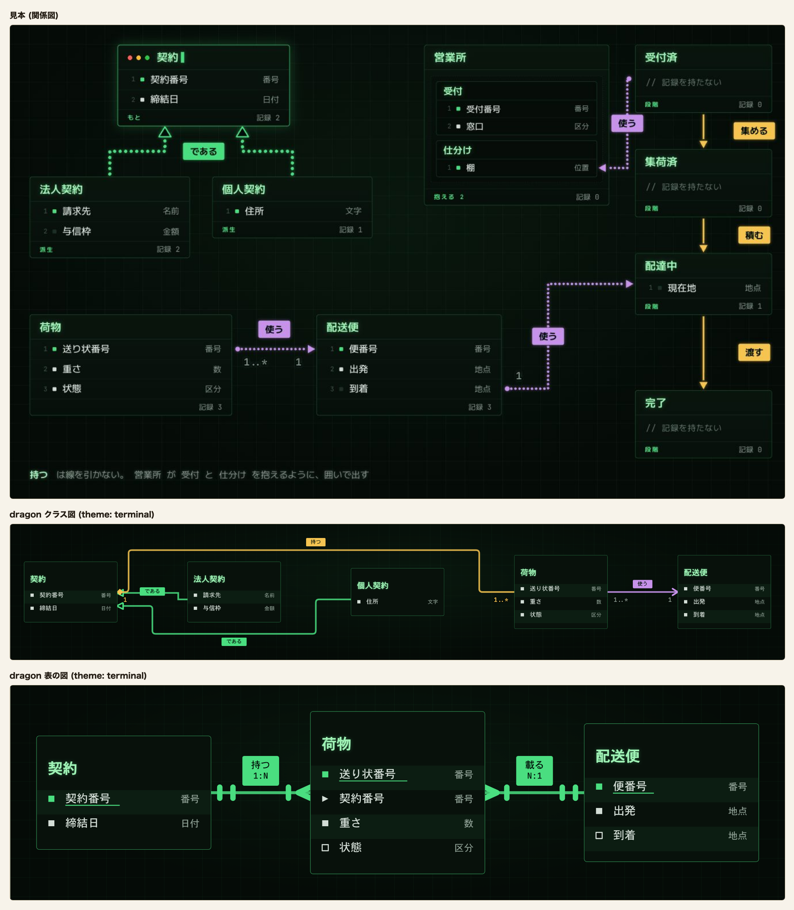
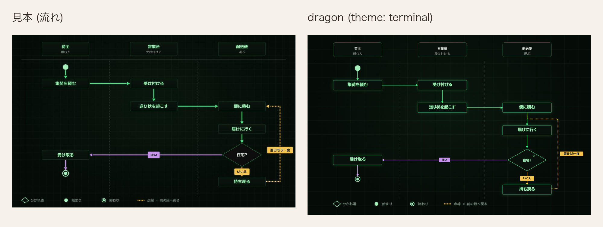
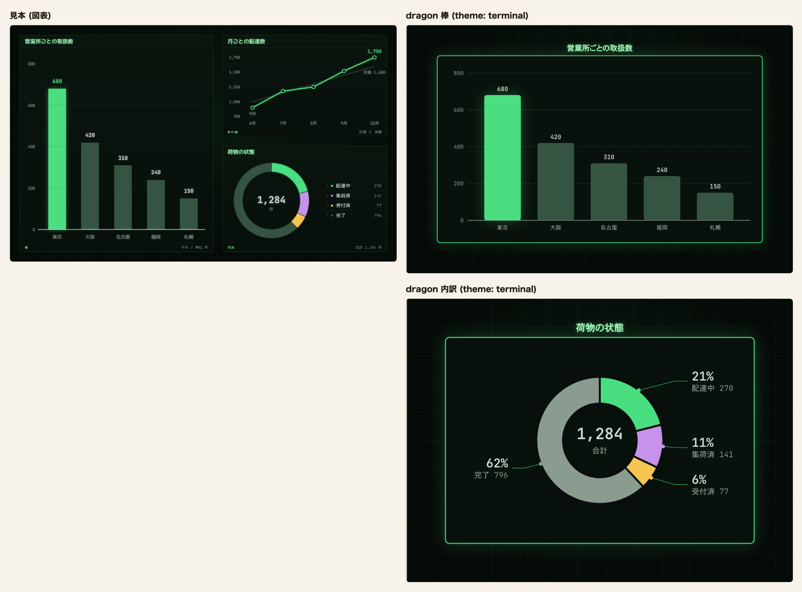

# 端末 (terminal)

記法の一番上に `theme: terminal` または `theme: 端末` と書く。`palette:` も `theme:` の別名として読む。

端末は地まで含めて 1 枚の絵として扱い、画面が暗い表示でも地と色を替えない。台と面がどちらも暗く、
同じ墨と薄が両方の上で字の下限を満たすため、字は 1 組で持つ。

## 値

| 役       | 値        |
| -------- | --------- |
| 台       | `#050b07` |
| 行の面   | `#08110b` |
| 縞       | `#0c1d12` |
| 枠       | `#339657` |
| 字       | `#d3ddd6` |
| 型名     | `#8a9b90` |
| 線       | `#4ade80` |
| 所有     | `#f5c451` |
| 向きだけ | `#c792ea` |

### 色以外の値

| 役           | 値                                                                                                       |
| ------------ | -------------------------------------------------------------------------------------------------------- |
| 地           | `#050b07`                                                                                                |
| 箱の面       | `#08110b`                                                                                                |
| 墨           | `#d3ddd6`。中身の字                                                                                      |
| 薄           | `#8a9b90`。型名と控えめな字、図表の系列 4                                                                |
| 淡           | `#355542`。単系列の主役でない棒。台との対比 2.39 のため字と系列色には使わない                            |
| 一           | `#4ade80`。主役の緑                                                                                      |
| 二           | `#c792ea`。返りと脇の紫                                                                                  |
| 三           | `#f5c451`。移りの黄                                                                                      |
| 題           | `#9ef0b4`。箱の名前と図の題                                                                              |
| 札の字       | `#03110a`。塗った札の上の字                                                                              |
| 濃二         | `#a896bd`。二と薄を半々に混ぜた色                                                                        |
| 濃三         | `#c0b070`。三と薄を半々に混ぜた色                                                                        |
| 箱の枠       | 通常は枠の 1、`data-cdl-active="true"` の箱は一の 1.5 と外光                                             |
| 枠の濃さ     | 1。通常の箱と強調の箱の両方。始まりと終わりの印、見せ方を持つ箱は除く                                    |
| 箱の角       | 6px                                                                                                      |
| 方眼         | 44px の目に一 5% の 1px の線                                                                             |
| 地の模様     | 一 6% の `radial-gradient(ellipse at 50% 40%, ..., transparent 70%)`                                     |
| 題の光       | 一 35% の `drop-shadow(0 0 4px ...)`                                                                     |
| 主役の外光   | 強調の箱は一 22% の `drop-shadow(0 0 12px ...)`、単系列の主役の棒は一 30% の `drop-shadow(0 0 12px ...)` |
| 札           | `accent` / `info` は一 `#4ade80`、`success` は二 `#c792ea`、`teal` / `error` / `warning` は三 `#f5c451` の面。`data-cdl-edge-role="main"` は一。字 `#03110a` は札の字。枠なし、角 4px。面の無い札の字は一 |
| 鍵           | 一。下線と同じ行の印に使う                                                                               |
| 日程の帯     | 縞。描き手の 0.55 の濃さで描く                                                                           |
| 単系列の棒   | `data-cdl-emphasis="primary"` の棒は一 `#4ade80` に一の光、それ以外は淡 `#355542`。濃さは 1              |
| 書体         | `--d-mono`。英数字は JetBrains Mono、和字は環境の書体                                                    |
| 字の幅       | 英数字を等幅 (`textMetrics: "monospace"`、半角 0.63em) で測る。記法の `theme: terminal` と見本帳の切替は同じ測り方になり、端末から他の意匠へ切り替えると比例の測り方へ戻る |
| 動き         | 打つ (下の「動き」)                                                                                      |
| 図表の系列色 | 1 = 一、2 = 二、3 = 三、4 = 薄、5 = 濃二、6 = 濃三                                                       |
| 日程の棒と漏斗の段   | 図表の系列色を色みの順に塗る。`accent` は 1、`teal` は 2、`success` は 3、`warning` は 4、`info` は 5、`error` は 6。濃さは 1。日程の帯は系列色のまま。帯の上の担当の字は面 `#08110b` |

描き手が札の `g` に置く `data-cdl-tone` から一・二・三を選ぶ。
`data-cdl-edge-role="main"` は色みにかかわらず一で塗る。
強調の有無では札の色を変えない。面を持たない札の字は一で描く。

## 動き

箱は左から 0.36s、`steps(14, end)` で打ち出す。線は箱を打ち終えた後から 0.3s、
`steps(12, end)` で同じ向きに打ち出す。実線と破線を保つため、どちらも左からの切り抜きで現す。

## 見送ったこと

- 主役の箱の題の前に置く窓の3つの丸 (赤・黄・緑) は、SVG の箱には題の前へ飾りを差し込む口 (`::before`) が無いため描かない。
- 主役の箱の題の後ろで点滅する入力の印 (`▋`) は、同じ理由で字の後ろへ足す口 (`::after`) も無いため描かない。
- 行の左に振る行番号は、同じ理由で行ごとに数を数える口が無いため描かない。
- 行を持たない箱に置く `// ` 注釈 (「// 記録を持たない」) は、同じ理由で描かない。
- 枠は見本の一 30% の半透明だと面の上で 1.99 となり箱の枠の下限 4.61 を割るため、一 65% の不透明な緑にした。
- 見本に行の縞は無く行の間に細線があった。行を追う目印のため、面に一を 6% 混ぜた縞を足した。
- 見本の内訳の 4 色目は淡だが、台との対比 2.39 で系列色の下限 3 を割るため薄にした。5 色目と 6 色目は見本に無いため濃二と濃三を足した。
- 見本は線を `stroke-dashoffset` で端から伸ばしていた。実線と破線を保つため、箱と同じ左からの切り抜きで現す。
- 見本は箱を 1 枚ずつ、行を 1 行ずつずらして出していた。段で同時に現れる物へ記法に無い順序を足さない。
- 見本の関係の線は丸い点の連なりだった。dragon が関係の種類を表す実線と破線をそのまま使う。
- 見本の題の光は `text-shadow` だった。SVG の字には `filter` の `drop-shadow` で写す。

## 見本と並べる

dragon のクラス図には、契約、法人契約、個人契約、荷物、配送便を並べる。
`relation: extends` の 2 本 (である) は一の線と白抜きの三角と一の札、`composes` (持つ) は三の線と三の札、
`associates` (使う) は二の線と二の札で描く。線の両端の数も線の色で描く。
5 つの箱は強調しないので、枠の緑と細い線で描く。

表の図では、`鍵` を書いた契約番号、送り状番号、便番号の行頭の印と名前の下線を一で描く。
`外` を書いた荷物の契約番号は行頭を山形にし、`条件` を書いた状態と到着には中空の印を置く。
行は 1 行おきに縞で塗る。関係の線は 1 種類なので一で、札も一で塗って札の字を置く。

比べた記法には縦列 (`lane:`) と始まり・終わりの印を書いていないので、dragon の流れ図は上から下へ 1 列に並ぶ。
`role: main` を書いた 5 本は一。「はい」 (`success`) は二、「いいえ」と「翌日もう一度」 (`error`) は三の線で、札もその色で塗る。
箱の名前は題の色で描く。

単系列の棒は、最も大きい東京を一と一の光、他を淡で塗る。
内訳は系列 1 から 4 を一・二・三・薄で塗る。見本の 4 色目の淡は台との対比が足りないため薄を使う。
図の題は題の色で板の上に置く。見本の折れ線 (月ごとの配達数) は比べていない。

## 検査

- `apps/playground-spa/src/lib/theme-matches-note.test.ts` は「値」の 9 行、題と札の字、一、図表の系列色、枠の濃さを CSS と突き合わせ、文字と系列色の対比を測る。
- `apps/playground-spa/tests/rendered-contrast.spec.ts` は固定の意匠を全図種へ当てた時の色、箱と線、文字の対比を明暗で調べる。
- `apps/playground-spa/tests/terminal-theme.spec.ts` は同じ全図種の検査に加え、固定の地、初期の動き、方眼、箱、題、書体、
  日程の帯、単系列の棒を調べる。札は強調の有無にかかわらず線の色みと一致し、字が面に収まることを調べる。
- `apps/playground-spa/tests/theme-appear.spec.ts` は箱と線が開いた時だけ動き、動きを減らす設定で止まることを調べる。
- `packages/dragon/test/palette-notation.test.ts` は `theme: terminal` / `theme: 端末` / `palette: terminal` / JSON の `theme` で `textMetrics` が `monospace` になり、他の意匠では載らないこと、等幅で測った箱が細い字の多い名前で広くなることを調べる。
- `apps/playground-spa/tests/palette-switch.spec.ts` は切替で端末を選んだ舞台の地が「台」と一致することを、配色を持たない図と表の図で調べる。また、端末を選ぶと図を測り直して生成りへ戻すと元に戻ること、英数字 24 字の名前の箱が生成りより広く取られて字が箱の面に収まることを調べる。
- `apps/playground-spa/src/lib/palette-switch.test.ts` は端末を選ぶと測り方が載り、外すと消え、未選択では元の図を返すことを調べる。
