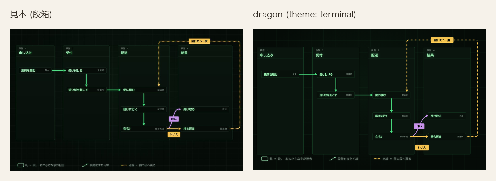
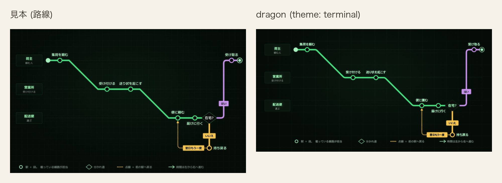
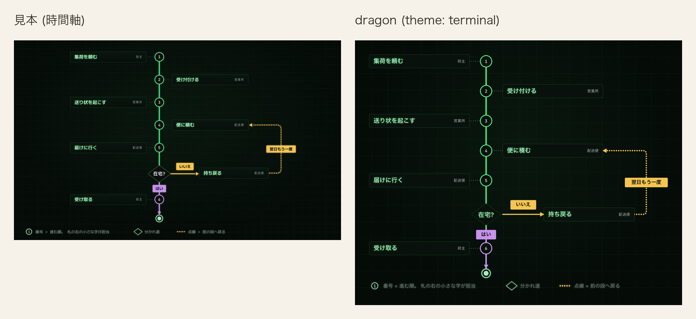
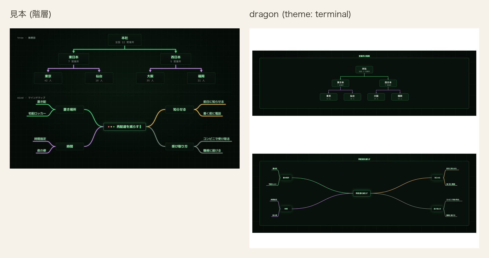
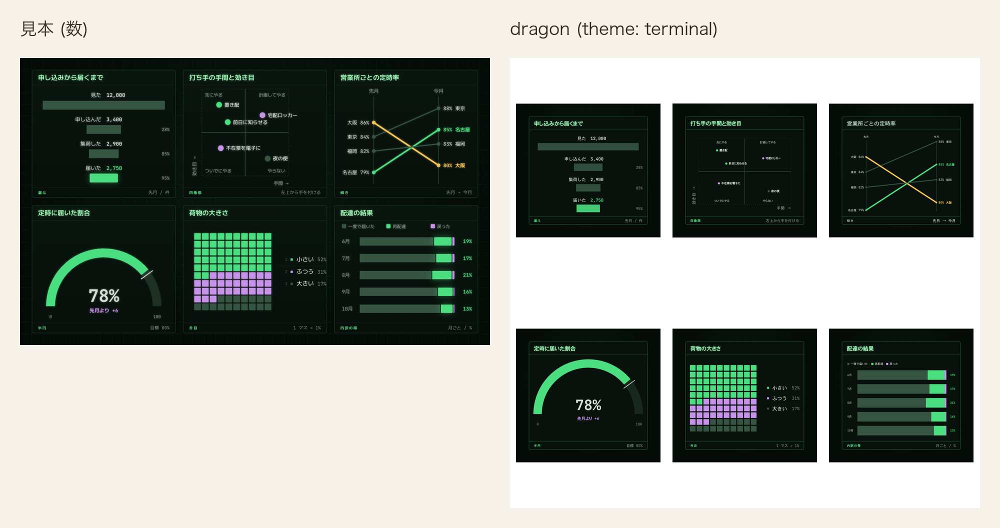
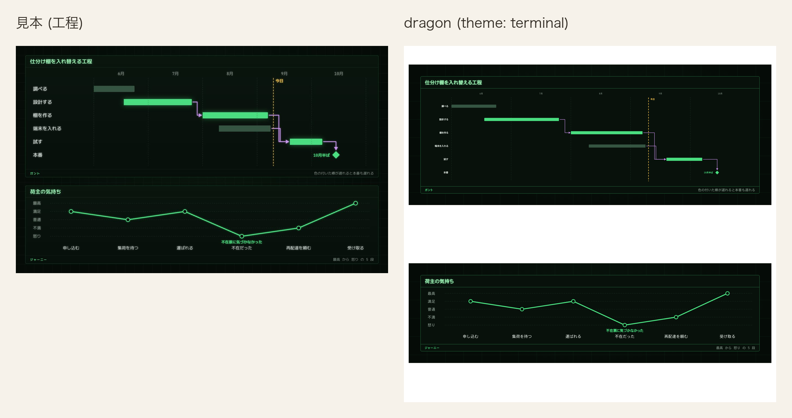

# 端末 (terminal)

記法の一番上に `theme: terminal` または `theme: 端末` と書く。`palette:` も `theme:` の別名として読む。

端末は地まで含めて 1 枚の絵として扱い、画面が暗い表示でも地と色を替えない。台と面がどちらも暗く、
同じ墨と薄が両方の上で字の下限を満たすため、字は 1 組で持つ。

## 値

| 役       | 値        |
| -------- | --------- |
| 台       | `#050b07` |
| 行の面   | `#08110b` |
| 縞       | `#0c1d12` |
| 枠       | `#339657` |
| 字       | `#d3ddd6` |
| 型名     | `#8a9b90` |
| 線       | `#4ade80` |
| 所有     | `#f5c451` |
| 向きだけ | `#c792ea` |

### 路線図の色

| 役 | 値 |
|---|---|
| 路線図の本線 | `#4ade80` |
| 路線図のはい | `#c792ea` |
| 路線図のいいえ | `#f5c451` |
| 路線図の枝札の字 | `#03110a` |
| 路線図の駅の面 | `#08110b` |
| 路線図の駅名 | `#a6f0bd` |
| 路線図の駅名の地 | `#050b07` |
| 路線図の始終点 | `#a6f0bd` |
| 路線図の案内線 | `#7f9186` |
| 路線図の名札の面 | `#0a150e` |
| 路線図の名札の枠 | `#4ade80` |
| 路線図の名札の名前 | `#9ef0b4` |
| 路線図の名札の補足 | `#8a9b90` |
| 路線図の菱形の面 | `#08110b` |
| 路線図の菱形の枠 | `#4ade80` |
| 路線図の菱形の字 | `#d3ddd6` |

名札の見本は `#0a150e` から `#070f0a` の勾配である。
描く側の名札は単色の SVG なので、上端の `#0a150e` を面に使う。

路線図の `#dragon-metro-terminal-glow` は、見本の SVG 全体の光と同じく `SourceGraphic` を標準偏差
3.5 でぼかし、alpha を .5 にして元の図の下へ重ねる。
線路の組、案内線、駅、始終点、分かれ道は、平行移動を持たない外箱へ
`filterUnits="userSpaceOnUse"` の `-3%` / `106%` の領域で当てる。
枝の札は同じ半透明の光を持つ別の filter とし、札自身の外接矩形を基準に左右 10%、上下 50% の余白を取る。
高さ 36 の札では上下に 18 を取り、標準偏差 3.5 の光を札の端で切らない。
名札は見本と同じ名前の光だけを保つ。

### 色以外の値

| 役           | 値                                                                                                       |
| ------------ | -------------------------------------------------------------------------------------------------------- |
| 地           | `#050b07`                                                                                                |
| 箱の面       | `#08110b`                                                                                                |
| 墨           | `#d3ddd6`。中身の字                                                                                      |
| 薄           | `#8a9b90`。型名と控えめな字、図表の系列 4                                                                |
| 淡           | `#355542`。単系列の主役でない棒。台との対比 2.39 のため字と系列色には使わない                            |
| 一           | `#4ade80`。主役の緑                                                                                      |
| 二           | `#c792ea`。返りと脇の紫                                                                                  |
| 三           | `#f5c451`。移りの黄                                                                                      |
| 題           | `#9ef0b4`。箱の名前と図の題                                                                              |
| 札の字       | `#03110a`。塗った札の上の字                                                                              |
| 印           | `#a6f0bd`。始まり・終わりの印と凡例の印。見本 `流れ-端末`                                               |
| 凡例の字     | `#7f9186`。見本 `流れ-端末`                                                                              |
| 濃二         | `#a896bd`。二と薄を半々に混ぜた色                                                                        |
| 濃三         | `#c0b070`。三と薄を半々に混ぜた色                                                                        |
| 箱の枠       | 通常は枠の 1、`data-cdl-active="true"` の箱は一の 1.5 と外光                                             |
| 枠の濃さ     | 1。通常の箱と強調の箱の両方。始まりと終わりの印、見せ方を持つ箱は除く                                    |
| 路線図の線の濃さ | 1。見本の線路は透かさない                                                                               |
| 箱の角       | 6px                                                                                                      |
| 方眼         | 44px の目に一 5% の 1px の線                                                                             |
| 地の模様     | 一 6% の `radial-gradient(ellipse at 50% 40%, ..., transparent 70%)`                                     |
| 題の光       | 一 35% の `drop-shadow(0 0 4px ...)`                                                                     |
| 主役の外光   | 強調の箱は一 22% の `drop-shadow(0 0 12px ...)`、単系列の主役の棒は一 30% の `drop-shadow(0 0 12px ...)` |
| 札           | `accent` / `info` は一 `#4ade80`、`success` は二 `#c792ea`、`teal` / `error` / `warning` は三 `#f5c451` の面。`data-cdl-edge-role="main"` は一。字 `#03110a` は札の字。枠なし、角 4px。面の無い札の字は一 |
| 時間軸の線の札 | success 面 `#c792ea`、error 面 `#f5c451`、success 字 `#03110a`、error 字 `#03110a`、success 枠 `none`、error 枠 `none`、枠の太さ 0、角 4px、高さ 40px、字 21px、字の太さ 700 |
| 鍵           | 一。下線と同じ行の印に使う                                                                               |
| 日程の帯     | 縞。描き手の 0.55 の濃さで描く                                                                           |
| 単系列の棒   | `data-cdl-emphasis="primary"` の棒は一 `#4ade80` に一の光、それ以外は淡 `#355542`。濃さは 1              |
| 書体         | `--d-mono`。英数字は JetBrains Mono、和字は環境の書体                                                    |
| 字の幅       | 英数字を等幅 (`textMetrics: "monospace"`、半角 0.63em) で測る。記法の `theme: terminal` と見本帳の切替は同じ測り方になり、端末から他の意匠へ切り替えると比例の測り方へ戻る |
| 動き         | 打つ (下の「動き」)                                                                                      |
| 図表の系列色 | 1 = 一、2 = 二、3 = 三、4 = 薄、5 = 濃二、6 = 濃三                                                       |
| 発想の枝 | 4 本を系列 1 `#4ade80`、2 `#c792ea`、3 `#f5c451`、4 `#8a9b90` で描く。葉の下線は同じ系列の枝と同色。枝箱の枠は枠の色 1 色 |
| 階層の木 | 枝箱の枠は枠の色 1 色。左帯と分岐点の丸は描かない |
| ジャーニー | 段の帯と縦区切りは描かない。主線は塗らず系列 1 の線だけ、点は地を残した一重円にし、内側の点は描かない。縦軸の段名は `#8a9b90` の 1 色 |
| 四象限 | 区画の地は塗らず、左上は系列 1、右上と左下は系列 2、右下は淡 `#355542`。区画名は型名、十字と外枠は `4 4` の点線 |
| 折れ線 | 線と点を系列 1 の緑 `#4ade80` で描く |
| 傾き図 | 名古屋 (`accent`) は緑 `#4ade80`、大阪 (`error`) は黄 `#f5c451`、tone の無い東京と福岡は薄 `#8a9b90` |
| 日程の棒と漏斗の段   | 図表の系列色を色みの順に塗る。`accent` は 1、`teal` は 2、`success` は 3、`warning` は 4、`info` は 5、`error` は 6。濃さは 1。日程の帯は系列色のまま。帯の上の担当の字は面 `#08110b` |
| 日程の帯の角 | 2px |
| 段階の列         | 面 `#0a150e`、枠 `#287544` の 1、影なし。列の角は 6px、札の角は 5px |
| 段階の見出し     | 番号 `#8a9b90`、名前 `#9ef0b4` に一 35% の `0 0 10px` の光 |
| 札の右の字       | `#8a9b90` |
| 段の箱の線の札   | 線は主役と枝が 5、戻る点線が 6 の `0 9.6`、三角の矢じりが 17 × 19。はいは二 `#c792ea`、いいえ・翌日もう一度は三 `#f5c451` の面。字は台 `#050b07` の太さ 700、角 4px、枠なし |
| 段の箱の凡例     | 「札 = 段。 右の小さな字が担当」は角丸枠、「段階をまたぐ線」は曲線、「点線 = 前の段へ戻る」は丸い点線。枠と曲線は `#a6f0bd`、点線は `#f5c451`、字は `#7f9186` |

宅配の見本は、棒・円・半円・升目・内訳帯に `tone` を書かず、系列色順に任せる。発想の枝は最初の 3 本を系列 1 から 3、4 本目を見本の薄い字の色にし、折れ線の線と点は系列 1 に固定する。日程だけは設計・棚・試験を `accent`、調査・端末を `info` とし、`ticks` で 6 月から 10 月を明示して設計を含む帯の端を見本の月内位置に書く。

描き手が札の `g` に置く `data-cdl-tone` から一・二・三を選ぶ。
`data-cdl-edge-role="main"` は色みにかかわらず一で塗る。
強調の有無では札の色を変えない。面を持たない札の字は一で描く。

## 動き

箱は左から 0.36s、`steps(14, end)` で打ち出す。線は箱を打ち終えた後から 0.3s、
`steps(12, end)` で同じ向きに打ち出す。実線と破線を保つため、どちらも左からの切り抜きで現す。

## 見送ったこと

- 主役の箱の題の前に置く窓の3つの丸 (赤・黄・緑) は、SVG の箱には題の前へ飾りを差し込む口 (`::before`) が無いため描かない。
- 主役の箱の題の後ろで点滅する入力の印 (`▋`) は、同じ理由で字の後ろへ足す口 (`::after`) も無いため描かない。
- 行の左に振る行番号は、同じ理由で行ごとに数を数える口が無いため描かない。
- 行を持たない箱に置く `// ` 注釈 (「// 記録を持たない」) は、同じ理由で描かない。
- 枠は見本の一 30% の半透明だと面の上で 1.99 となり箱の枠の下限 4.61 を割るため、一 65% の不透明な緑にした。
- 見本に行の縞は無く行の間に細線があった。行を追う目印のため、面に一を 6% 混ぜた縞を足した。
- 見本の内訳の 4 色目は淡だが、台との対比 2.39 で系列色の下限 3 を割るため薄にした。5 色目と 6 色目は見本に無いため濃二と濃三を足した。
- 見本は線を `stroke-dashoffset` で端から伸ばしていた。実線と破線を保つため、箱と同じ左からの切り抜きで現す。
- 見本は箱を 1 枚ずつ、行を 1 行ずつずらして出していた。段で同時に現れる物へ記法に無い順序を足さない。
- 見本の関係の線は丸い点の連なりだった。dragon が関係の種類を表す実線と破線をそのまま使う。
- 見本の題の光は `text-shadow` だった。SVG の字には `filter` の `drop-shadow` で写す。

## 見本と並べる

[12 図種 × 7 意匠の見本を開く](../proposal/index.html)

dragon のクラス図には、契約、法人契約、個人契約、荷物、配送便を並べる。
`relation: extends` の 2 本 (である) は一の線と白抜きの三角と一の札、`composes` (持つ) は三の線と三の札、
`associates` (使う) は二の線と二の札で描く。線の両端の数も線の色で描く。
5 つの箱は強調しないので、枠の緑と細い線で描く。

表の図では、`鍵` を書いた契約番号、送り状番号、便番号の行頭の印と名前の下線を一で描く。
`外` を書いた荷物の契約番号は行頭を山形にし、`条件` を書いた状態と到着には中空の印を置く。
行は 1 行おきに縞で塗る。関係の線は 1 種類なので一で、札も一で塗って札の字を置く。

右は、ひな形「荷物を届けるフローチャート」の最後の段を描き終えた姿を撮り、見本と並べた。
荷主・営業所・配送便の 3 つの縦列に札・菱形・始まりと終わりの印を置く。主役の道筋は一、
「はい」 (`success`) は二、「いいえ」と「翌日もう一度」 (`error`) は三の線で、札もその色で塗る。
箱の名前は題の色で描く。

右は、ひな形「荷物を届ける段の箱」の最後の段を描き終えた姿を撮り、見本と並べた。
段階の列の端末面と枠、見出しの光、担当の字、線の札を見本の値へ揃えた。
列 3 と列 4 の間、「翌日もう一度」が札の上辺から出る位置、「いいえ」の札の下端、見出しの名前の字を見本へ揃えた。
一方、「いいえ」の札の上端は線の 59 下 (見本は 24)、戻る線は列の上端の 50 上 (見本は 34)、下りる位置は「便に積む」の右端から 24 (見本は 60) のまま残る。これらは cdl が固定値で描き、dragon の記法に間隔の欄がないためである。
凡例の字も見本と同じ 21 にした。

右は、ひな形「荷物を届ける路線図」の最後の段を描き終えた姿を撮り、見本と並べた。
凡例の字は見本と同じ 21 にした。

右は、ひな形「荷物を届ける時間軸」の最後の段を描き終えた姿を撮り、1800 幅の見本と並べた。

dragon は軸と番号の縁を一の `--er-line`、「はい」を二の `--er-link`、終わりの印を舞台固有の `--timeline-end-ink` (`#a6f0bd`) で描く。
線の札は高さ 40・角 4・21 の太字とし、「はい」を二 `#c792ea`、他の 2 枚を三 `#f5c451` の面にして、字は札の字 `#03110a` で描く。
戻る線は太さ 6・丸い線端・`0 9.6` の点列とし、軸と「はい」は 6、「いいえ」は 5、補助線は 2、番号の縁は 4、終わりの外輪は 3.5 で描く。
図の下には、番号・分かれ道・戻る点線を説明する凡例を見本と同じ順、21 の字で描く。
札の題は 25px・700、分かれ道は 124 × 92、「在宅?」は 26px に揃えた。「いいえ」の札の下端は横線から 20 離している。
分かれ道の前後は意匠に依らず 142.5 ずつとし、和を見本と同じ 285 にした。題・「在宅?」・線の札・凡例の語は本文書体、数は JetBrains Mono のまま描く。
札と軸の間は見本と同じ 70、丸 6 と終わりの印の間も見本と同じ 105 に揃えた。
「持ち戻る」は軸から見本の 220 に対して 242 離す。cdl が札と箱の間を 32 空けるため、「いいえ」の札を線の上 20 に置くのに要る。担当の位置は `cardene777/cdl#1032`、残る線上の札の押し出しは `cardene777/cdl#1039` に対応する。

単系列の棒は、最も大きい東京を一と一の光、他を淡で塗る。
内訳は系列 1 から 4 を一・二・三・薄で塗る。見本の 4 色目の淡は台との対比が足りないため薄を使う。
図の題は題の色で板の上に置き、足の右の注記は地に沈まない `#7f9186`、折れ線には 5 か月の配達実績を載せる。

営業所の木と再配達を減らす枝を上下に置き、端末の細線と光る字を比べる。

6 種の数の図を 3 列 2 段に並べ、暗い台での一・二・三・薄の見分けを比べる。

仕分け棚の工程と荷主の気持ちを上下に置き、時間軸と感情の光り方を比べる。

## 検査

- `apps/playground-spa/src/lib/theme-matches-note.test.ts` は「値」の 9 行、題と札の字、一、図表の系列色、枠の濃さ、路線図の線の濃さを CSS と突き合わせ、文字と系列色の対比を測る。
- `apps/playground-spa/tests/rendered-contrast.spec.ts` は固定の意匠を全図種へ当てた時の色、箱と線、文字の対比を明暗で調べる。
- `apps/playground-spa/tests/terminal-theme.spec.ts` は同じ全図種の検査に加え、固定の地、初期の動き、方眼、箱、題、書体、
  日程の帯、単系列の棒を調べる。札は強調の有無にかかわらず線の色みと一致し、字が面に収まることを調べる。
- `apps/playground-spa/tests/theme-appear.spec.ts` は箱と線が開いた時だけ動き、動きを減らす設定で止まることを調べる。
- `packages/dragon/test/palette-notation.test.ts` は `theme: terminal` / `theme: 端末` / `palette: terminal` / JSON の `theme` で `textMetrics` が `monospace` になり、他の意匠では載らないこと、等幅で測った箱が細い字の多い名前で広くなることを調べる。
- `apps/playground-spa/tests/palette-switch.spec.ts` は切替で端末を選んだ舞台の地が「台」と一致することを、配色を持たない図と表の図で調べる。また、端末を選ぶと図を測り直して生成りへ戻すと元に戻ること、英数字 24 字の名前の箱が生成りより広く取られて字が箱の面に収まることを調べる。
- `apps/playground-spa/src/lib/palette-switch.test.ts` は端末を選ぶと測り方が載り、外すと消え、未選択では元の図を返すことを調べる。

## 流れ図

固定の流れ図は、主役線を一 `#4ade80`・太さ 5、戻る線を三 `#f5c451`・太さ 6・`0 9.6` の
丸い点列で描く。終わりは `#a6f0bd` の半径 19・縁 3.5 の輪と半径 10 の芯にする。
「はい」は `#c792ea`、他の 2 枚は `#f5c451` の面へ `#03110a` の字を置き、角を 4 にする。
分かれ道の字は 26・700。戻り線の残る差は次の通り。`side` を書かない形と `top` は、持ち戻るの上
（「いいえ」の線の左隣）から出て、「いいえ」の線と「便に積む → 届けに行く」の線を `A 11 11` の
跳ね越しで横切り、便に積むの下へ入る。採用した `bottom` は持ち戻るの下端から出て札の背後を上がり、
右へ折れて「便に積む → 届けに行く」の線と同じ x に重なって進み、便に積むの上端で終わる。札を見た目で
貫かず別の線も横切らない形はこれだけだが、画面では持ち戻るの下端に点が 1 つのぞき、便に積むへ入る
矢じりは札に隠れる。見本の右辺から出て右辺へ入る経路との差が残る。光っていない分かれ道の枠は、
見本の一 `#4ade80` を半分の濃さにした値では実効の対比が 3.49:1 となり、箱の枠の下限 4.61 を割る。
そのため通常の箱と同じ枠 `#339657`・太さ 1 に戻す。見本と並べる最後の段では全ての箱が光るため、
分かれ道も強調の一の枠と太さ 1.5 で描く。
